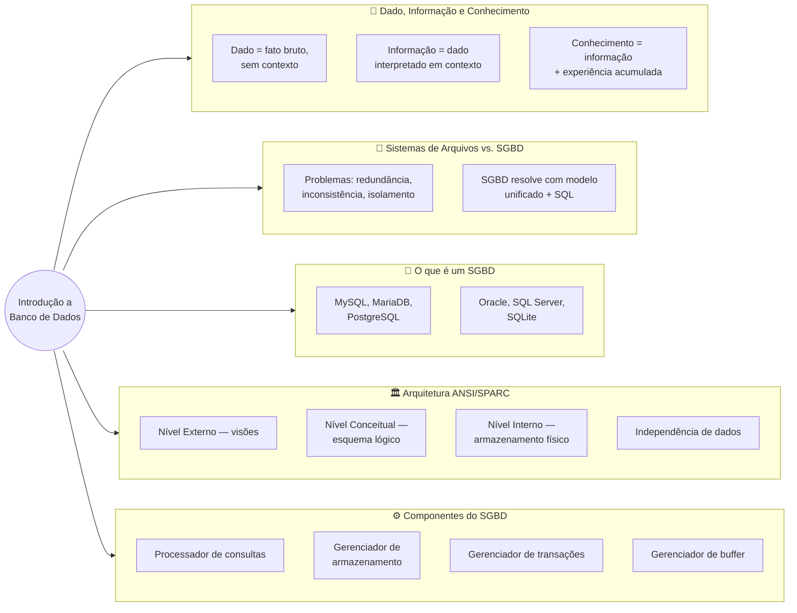
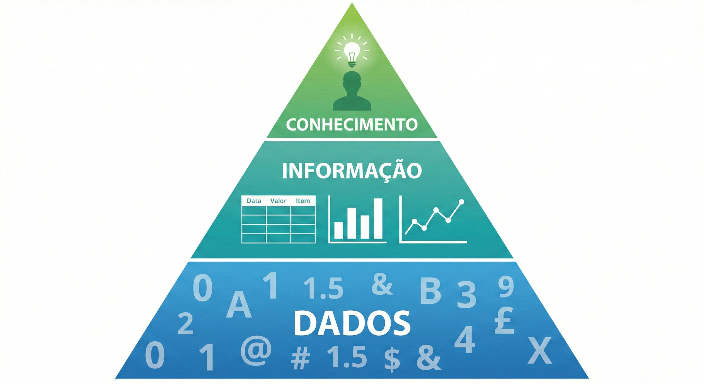
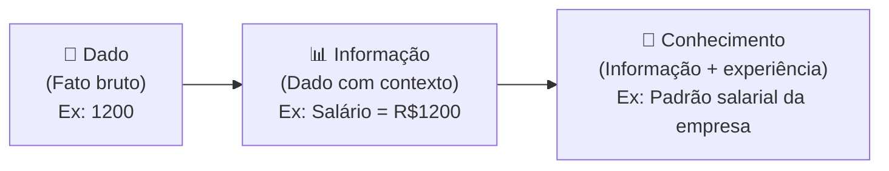
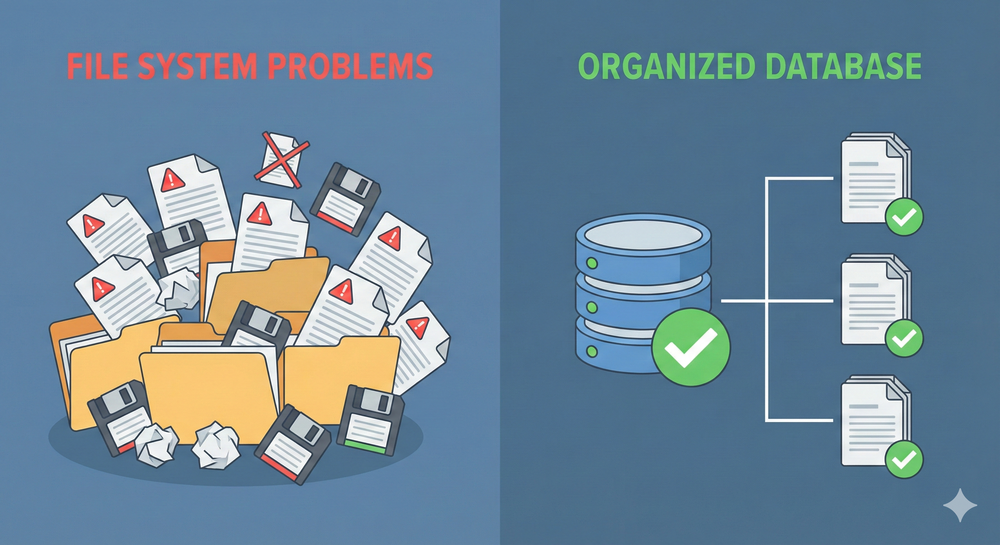
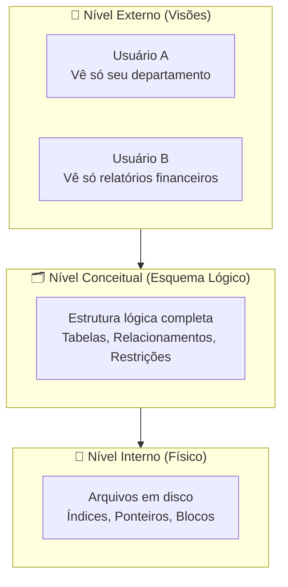
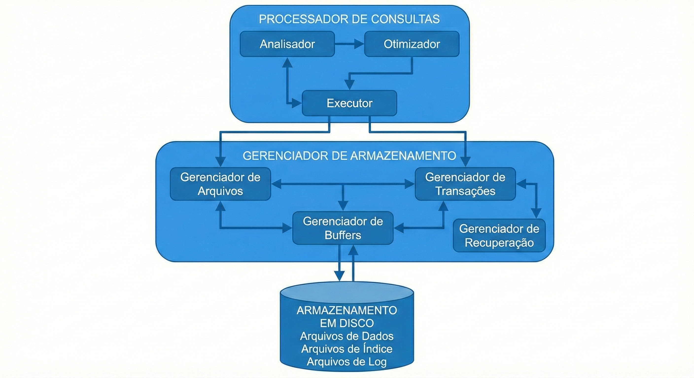

# Aula 01 — Introdução a Banco de Dados

**Disciplina:** Banco de Dados e Aplicações  
**Professor:** Ronan Adriel Zenatti · ronan.zenatti@cps.sp.gov.br   
**Fatec Jahu — 2º Semestre/2026**

---

## 🎯 Objetivos da Aula

Ao final desta aula você deverá ser capaz de:
- Diferenciar Sistemas de Arquivos de Sistemas de Gerenciamento de Banco de Dados (SGBD)
- Compreender a diferença entre Dado, Informação e Conhecimento
- Descrever a arquitetura de um SGBD

---

## 🗺️ Mapa Mental da Aula

---

## 1. Dado, Informação e Conhecimento

Antes de estudar bancos de dados, precisamos entender o que, de fato, estamos gerenciando.

Um **dado** é um fato bruto, sem contexto — por exemplo, o número `1200`. Isolado, ele não diz nada. Quando contextualizamos esse número como "salário de R$ 1.200,00 de um funcionário chamado João", temos uma **informação** — algo que pode ser interpretado e utilizado para tomar decisões. O **conhecimento** surge quando acumulamos e relacionamos informações ao longo do tempo, criando padrões e compreensões mais profundas — como saber que funcionários com salários nessa faixa tendem a pedir reajuste anualmente.

!!! example "🔍 Checkpoint 1 — Dado, Informação e Conhecimento: app de corrida"
    Um aplicativo de corrida de rua registra, a cada treino, a sequência bruta de
    coordenadas de GPS captadas pelo celular do usuário a cada segundo. A partir
    dessas coordenadas, o app calcula e exibe a distância total percorrida no treino
    (ex.: "5,2 km"). Depois de meses de uso, o app percebe um padrão no histórico do
    usuário — toda vez que ele corre mais de 8 km em um treino, o ritmo médio das
    corridas seguintes melhora — e passa a sugerir ajustes automáticos no plano de
    treino com base nisso. Classifique cada um dos três elementos do cenário (a
    sequência bruta de coordenadas, a distância exibida, o padrão identificado) como
    dado, informação ou conhecimento, justificando cada classificação.

    🔑 Resolução no [Gabarito da Aula 01](Aula_01_Gabarito.md#checkpoint-1) — tente
    resolver antes de conferir.

---

## 2. Sistemas de Arquivos vs. SGBDs

Por muitos anos, os dados foram armazenados em **sistemas de arquivos** convencionais — como planilhas, arquivos `.txt` ou arquivos binários gerenciados pelos próprios programas. Esse modelo tem limitações sérias.

| Problema no Sistema de Arquivos | Como o SGBD Resolve |
|---|---|
| **Redundância de dados** — mesma informação em vários arquivos | Dado armazenado uma única vez, compartilhado |
| **Inconsistência** — versões diferentes da mesma informação | Restrições de integridade garantem consistência |
| **Dificuldade de acesso** — necessário programar buscas | Linguagem de consulta padronizada (SQL) |
| **Isolamento de dados** — formatos proprietários por aplicação | Modelo unificado acessível por múltiplas aplicações |
| **Falta de controle de acesso** | Sistema de permissões e usuários |
| **Problemas de concorrência** | Controle de transações e bloqueios |

!!! example "🔍 Checkpoint 2 — Sistemas de Arquivos: rede de clínicas populares"
    Uma rede com três clínicas populares ainda organiza o cadastro de pacientes em
    planilhas separadas — uma por unidade. Quando um paciente é atendido em mais de
    uma unidade, seus dados (nome, telefone, histórico de alergias) são digitados de
    novo em cada planilha, às vezes com pequenas diferenças de grafia entre elas.
    Além disso, duas recepcionistas já tentaram editar a mesma planilha ao mesmo
    tempo pela rede local, e uma delas perdeu as alterações. Identifique, entre os
    problemas listados na tabela desta seção, quais aparecem neste cenário e explique
    brevemente como um SGBD resolveria cada um.

    🔑 Resolução no [Gabarito da Aula 01](Aula_01_Gabarito.md#checkpoint-2) — tente
    resolver antes de conferir.

---

## 3. O que é um SGBD?

Um **Sistema de Gerenciamento de Banco de Dados (SGBD)** é um software que serve de intermediário entre o usuário/aplicação e os dados fisicamente armazenados. Ele oferece uma interface padronizada para criar, consultar, atualizar e remover dados, garantindo ao mesmo tempo segurança, integridade e eficiência.

Exemplos de SGBDs amplamente utilizados: **MySQL**, **MariaDB**, **PostgreSQL**, **Oracle**, **SQL Server** e **SQLite**.

---

## 4. Arquitetura de um SGBD (3 Níveis — ANSI/SPARC)

A arquitetura padrão de um SGBD é organizada em três níveis independentes, o que permite que a aplicação seja protegida de mudanças físicas no armazenamento dos dados:

O **nível externo** é o que cada usuário enxerga — uma visão personalizada dos dados. O **nível conceitual** descreve toda a estrutura lógica do banco, independente de como os dados estão fisicamente armazenados. O **nível interno** cuida dos detalhes de armazenamento em disco, como índices e blocos de dados. Essa separação é chamada de **independência de dados**.

!!! example "🔍 Checkpoint 3 — Arquitetura ANSI/SPARC: sistema de matrícula acadêmica"
    Em um sistema de matrícula de uma faculdade: (a) um aluno acessa o portal e vê
    apenas as disciplinas do seu próprio curso, já matriculadas ou não; (b) o
    administrador do sistema decide adicionar uma nova coluna `situacao_financeira`
    à estrutura lógica que descreve o aluno, afetando todas as visões que dependem
    dela; (c) o time de infraestrutura migra os arquivos de dados para um novo
    tipo de disco (SSD NVMe) sem que nenhuma consulta SQL precise ser reescrita.
    Associe cada uma das três situações (a, b, c) ao nível da arquitetura ANSI/SPARC
    (externo, conceitual ou interno) em que ela ocorre, justificando.

    🔑 Resolução no [Gabarito da Aula 01](Aula_01_Gabarito.md#checkpoint-3) — tente
    resolver antes de conferir.

---

## 5. Componentes de um SGBD

Os principais componentes internos de um SGBD são o **processador de consultas** (que interpreta e otimiza comandos SQL), o **gerenciador de armazenamento** (que controla o acesso físico aos dados), o **gerenciador de transações** (que garante atomicidade e controle de concorrência) e o **gerenciador de buffer** (que mantém dados em memória para melhorar o desempenho).

!!! example "🔍 Checkpoint 4 — Componentes do SGBD: consulta em um app de delivery"
    Um usuário abre o app de delivery e pesquisa por "pizzaria perto de mim". Nos
    bastidores: (1) o SGBD recebe o `SELECT` gerado pela busca e decide o plano mais
    eficiente para executá-lo; (2) o resultado (lista de pizzarias) precisa ser lido
    dos arquivos onde os dados dos restaurantes estão gravados em disco; (3) ao mesmo
    tempo, o pedido de outro usuário está sendo confirmado, e o SGBD garante que as
    duas operações não causem inconsistência uma na outra; (4) para não reler o disco
    a cada busca repetida, os dados das pizzarias mais pesquisadas ficam guardados
    temporariamente em memória. Associe cada uma das quatro etapas (1 a 4) ao
    componente do SGBD responsável por ela.

    🔑 Resolução no [Gabarito da Aula 01](Aula_01_Gabarito.md#checkpoint-4) — tente
    resolver antes de conferir.

---

> 📐 **Sobre convenções de nomenclatura:** a partir da Aula 02, quando começarmos a
> modelar entidades e atributos de verdade, esta disciplina passa a seguir
> convenções formais de nomenclatura — a primeira delas é a **Regra 1 (snake_case:**
> palavras separadas por underline, nunca por espaço ou `camelCase`**)** e a **Regra
> 2 (sempre minúsculas para nomes criados por você — tabelas, colunas, entidades)**.
> Outras regras (nomenclatura de chave primária e estrangeira, tipos de dados,
> constraints) chegam progressivamente ao longo do semestre — chave primária e
> estrangeira já na Aula 03, tipos de dados exatos e constraints culminando na
> Aula 06 — SQL DDL. Essas regras não são frescura estética: elas tornam o modelo e o código
> legíveis e previsíveis para qualquer pessoa da turma, inclusive você mesmo(a)
> daqui a alguns meses.

---

## 🃏 Flashcards de Revisão

??? question "Qual a diferença entre dado e informação?"
    Dado é um fato bruto, sem contexto — como o número `1200` isolado. Informação é o dado interpretado dentro de um contexto que permite tomar decisões — como saber que `1200` é o salário de um funcionário específico.

??? question "Cite três problemas de um sistema de arquivos convencional que um SGBD resolve."
    Redundância de dados, inconsistência e dificuldade de acesso são três exemplos — além de isolamento de dados, falta de controle de acesso e problemas de concorrência.

??? question "O que é um SGBD, em uma frase?"
    É um software que serve de intermediário entre o usuário/aplicação e os dados fisicamente armazenados, oferecendo uma interface padronizada com segurança, integridade e eficiência.

??? question "Quais são os três níveis da arquitetura ANSI/SPARC e o que cada um faz?"
    Nível Externo (visões personalizadas por usuário), Nível Conceitual (esquema lógico completo do banco) e Nível Interno (armazenamento físico em disco). A separação entre eles garante a independência de dados.

??? question "O que garante a 'independência de dados' na arquitetura em três níveis?"
    A separação entre os níveis externo, conceitual e interno — ela protege a aplicação de mudanças no armazenamento físico, já que cada nível só se comunica com o nível adjacente.

??? question "Cite os quatro componentes internos principais de um SGBD."
    Processador de consultas (interpreta e otimiza SQL), gerenciador de armazenamento (acesso físico aos dados), gerenciador de transações (atomicidade e concorrência) e gerenciador de buffer (dados em memória para desempenho).

---

## ✅ Quiz de Fixação

<quiz>
Qual das alternativas melhor define "informação"?
- [ ] Um fato bruto sem interpretação
- [x] Um dado interpretado dentro de um contexto, útil para tomar decisões
- [ ] Um padrão acumulado ao longo de vários anos de experiência
- [ ] Um tipo de dado armazenado exclusivamente em bancos relacionais

Isso mesmo — informação é o dado contextualizado. Conhecimento vai um passo além, quando acumulamos e relacionamos informações ao longo do tempo.
</quiz>

<quiz>
No modelo ANSI/SPARC de três níveis, qual nível é responsável por esconder os detalhes de armazenamento físico (índices, blocos em disco) do restante do sistema?
- [ ] Nível Externo
- [ ] Nível Conceitual
- [x] Nível Interno
- [ ] Nível de Aplicação

O nível interno cuida do armazenamento físico. É a separação entre os três níveis que garante a independência de dados.
</quiz>

<quiz>
Quais destes são problemas típicos de um sistema de arquivos que um SGBD resolve? (selecione todas as corretas)
- [x] Redundância de dados
- [x] Dificuldade de controle de acesso concorrente
- [ ] Padronização excessiva da linguagem de consulta
- [x] Isolamento de dados entre aplicações diferentes

Sistemas de arquivos sofrem justamente com redundância, isolamento de dados e falta de controle de concorrência — problemas que o SGBD resolve com um modelo unificado e uma linguagem de consulta padronizada (SQL).
</quiz>

<quiz>
Qual componente interno de um SGBD é responsável por interpretar e otimizar os comandos SQL recebidos?
- [ ] Gerenciador de buffer
- [x] Processador de consultas
- [ ] Gerenciador de transações
- [ ] Gerenciador de armazenamento

O processador de consultas interpreta e otimiza os comandos SQL antes de executá-los.
</quiz>

<quiz>
Qual destes NÃO é um exemplo de SGBD amplamente utilizado no mercado?
- [ ] PostgreSQL
- [ ] Oracle
- [x] Microsoft Excel
- [ ] SQL Server

Excel é uma planilha eletrônica — um exemplo clássico de sistema de arquivos, não um SGBD, já que não oferece controle de concorrência, integridade referencial nem uma linguagem de consulta padronizada como o SQL.
</quiz>

---

## 📝 Resumo

Nesta aula aprendemos que dados são fatos brutos que se transformam em informação quando contextualizados. Vimos que sistemas de arquivos apresentam problemas sérios de redundância, inconsistência e dificuldade de acesso que os SGBDs resolvem de forma elegante. Entendemos também que a arquitetura em três níveis (externo, conceitual e interno) é o alicerce que garante independência entre a aplicação e o armazenamento físico.

---

📄 **[Ver gabarito dos Checkpoints →](Aula_01_Gabarito.md)**

> Tente resolver os Checkpoints antes de conferir — a comparação com o gabarito rende muito mais quando você já tentou construir sua própria resposta primeiro.

---

## 🏆 Conquista da Aula

!!! success "Selo desbloqueado: 🧭 Explorador(a) de Dados"
    Você deu o primeiro passo na Trilha do(a) Arquiteto(a) de Dados: aprendeu a diferenciar dado de informação e entendeu por que os SGBDs substituíram os antigos sistemas de arquivos. A próxima parada é desenhar o mapa do território — o Modelo Entidade-Relacionamento.

---

## 🔗 Próxima Aula

➡️ [Aula 02 — Modelagem Conceitual: Entidades e Atributos](Aula_02_Modelagem_Entidades.md)

---

*Fatec Jahu · IBD951 · Prof. Ronan Adriel Zenatti · 2026*
