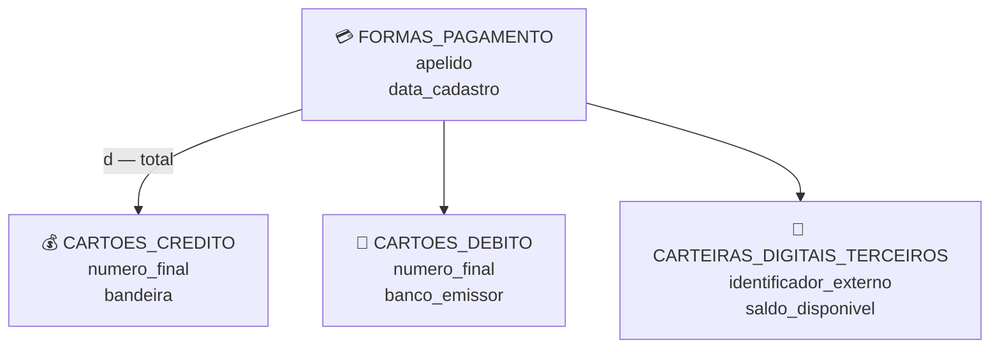
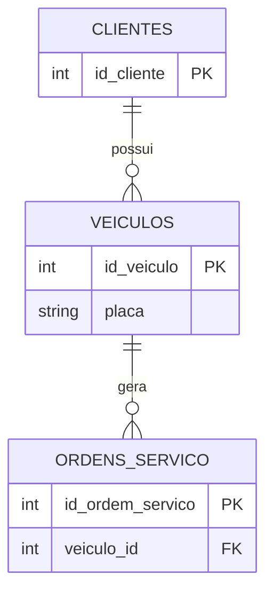
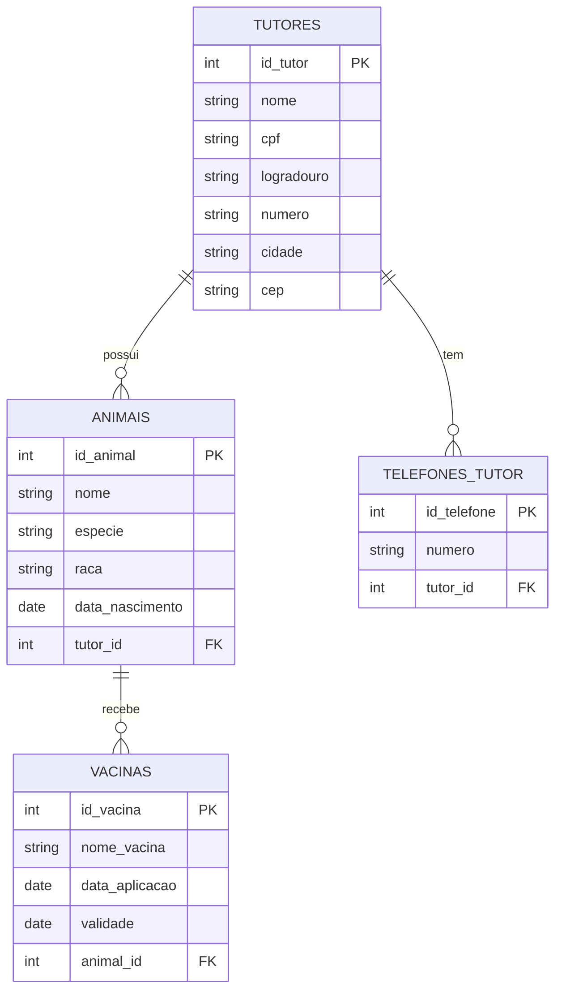
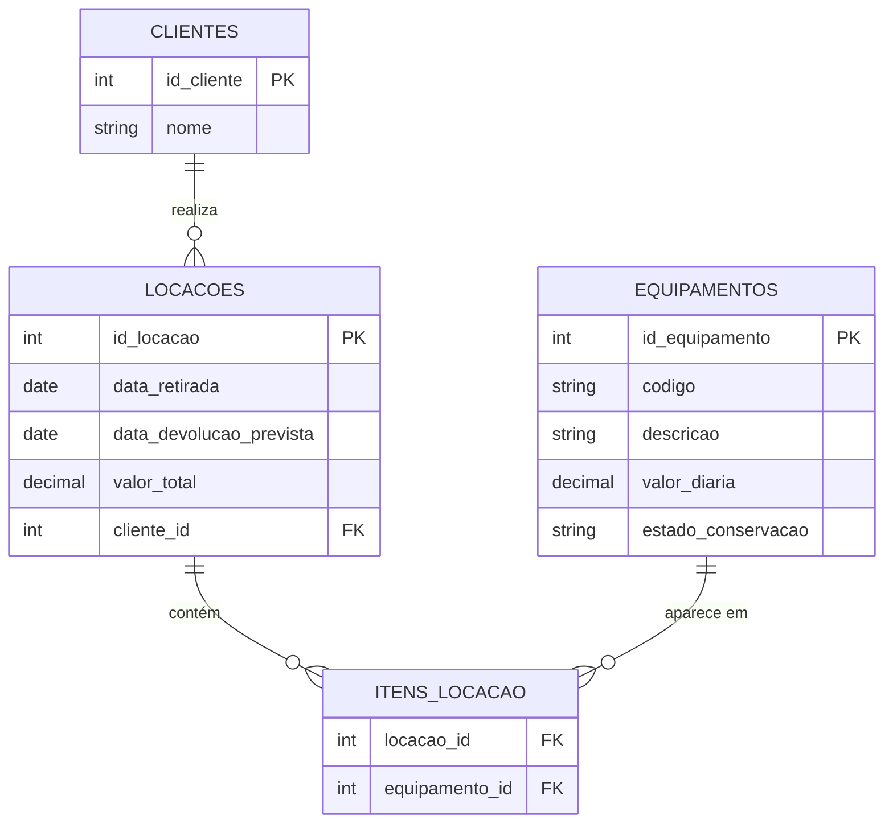
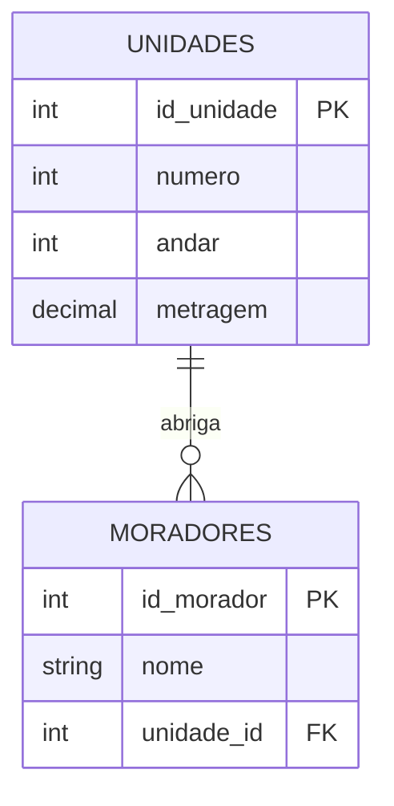
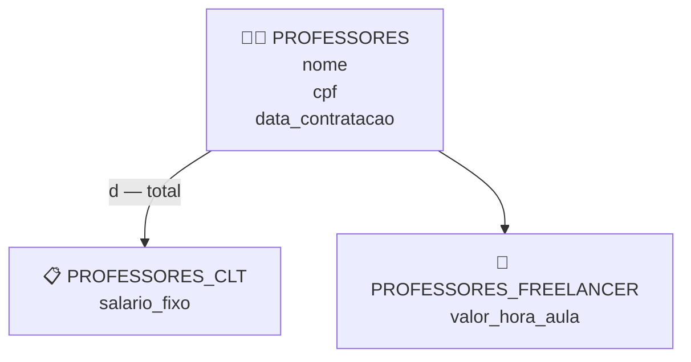
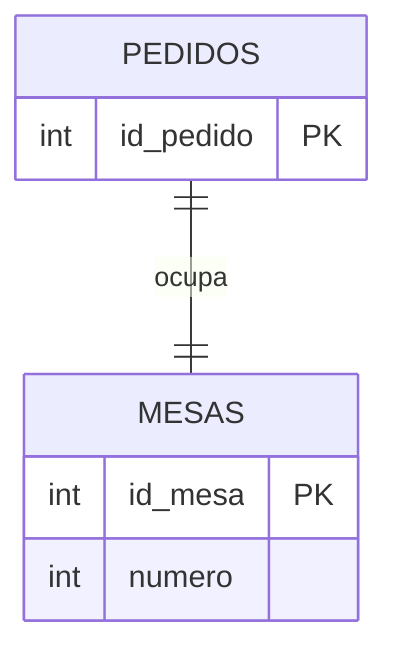

<!--
GABARITO — não faz parte do fluxo principal da aula e fica fora do `nav` do
mkdocs.yml de propósito. É acessível só pelos links dentro de Aula_02_Modelagem_Entidades.md.
-->

# Gabarito — Aula 02 — Modelagem Conceitual: Entidades e Atributos

**Disciplina:** Banco de Dados e Aplicações  
**Professor:** Ronan Adriel Zenatti · ronan.zenatti@cps.sp.gov.br   
**Fatec Jahu — 2º Semestre/2026**

---

!!! warning "Antes de conferir"
    Este gabarito mostra **uma** solução correta possível para cada Checkpoint e Exercício — em modelagem conceitual, mais de uma resposta pode estar certa dependendo das suposições feitas sobre o negócio. O que importa é o raciocínio: se sua resposta divergir, releia as [quatro perguntas-chave da seção 7](Aula_02_Modelagem_Entidades.md#7-passo-a-passo-do-cupom-fiscal-as-entidades) e confira se ela também se sustenta. Resolver os Checkpoints e Exercícios antes de conferir aqui rende muito mais do que ler a resposta primeiro.

---

## Checkpoint 1 — Entidades: academia de ginástica {: #checkpoint-1 }

**Resposta:**

| Entidade | Classificação | Justificativa |
|---|---|---|
| `ALUNOS` | Forte | Existe de forma independente — um aluno é cadastrado no sistema com seus próprios dados, mesmo antes de escolher um plano. |
| `PLANOS` | Forte | Existe independentemente de qualquer aluno — a academia cadastra seus planos (mensal, trimestral, anual) antes mesmo de ter alunos matriculados neles. |
| `AVALIACOES_FISICAS` | Fraca | Só existe em função de um `ALUNOS` — o enunciado deixa explícito que, sem o aluno, o registro de avaliação perde sentido, exatamente como `DEPENDENTES` em relação a `FUNCIONARIOS` na Seção 2. |

---

## Checkpoint 2 — Atributos: cadastro de imóvel para aluguel {: #checkpoint-2 }

**Resposta:**

| Atributo | Classificação | Justificativa |
|---|---|---|
| `codigo_anuncio` | Chave (identificador) | Identifica unicamente cada anúncio — não se repete entre instâncias. |
| `endereco_completo` | Composto | Pode ser dividido em partes com significado próprio: rua, número, bairro, cidade e CEP. |
| `valor_aluguel` | Simples | Não se subdivide — é um único valor monetário. |
| `valor_condominio` | Simples | Mesma lógica de `valor_aluguel`. |
| `valor_total_mensal` | Derivado | Seu valor é calculado a partir de `valor_aluguel` + `valor_condominio` — não precisa ser armazenado. |
| `comodidades` | Multivalorado | O anunciante pode marcar quantas quiser (piscina, churrasqueira, vaga, portaria 24h) para o mesmo imóvel. |

---

## Checkpoint 3 — Generalização/Especialização: carteira digital de pagamentos {: #checkpoint-3 }

**Resposta:**

Superclasse `FORMAS_PAGAMENTO` com os atributos comuns `apelido` e `data_cadastro`. Subclasses `CARTOES_CREDITO` (`numero_final`, `bandeira`), `CARTOES_DEBITO` (`numero_final`, `banco_emissor`) e `CARTEIRAS_DIGITAIS_TERCEIROS` (`identificador_externo`, `saldo_disponivel`).

A especialização é **total** (o enunciado diz que o app não permite cadastrar uma forma de pagamento "sem tipo definido" — toda instância pertence a uma subclasse) e **disjunta** (uma forma de pagamento é sempre exatamente um dos três tipos, nunca mais de um ao mesmo tempo) — o mesmo padrão do Exemplo 3 (`CONTAS_FISICAS`/`CONTAS_JURIDICAS`) da seção 4.4.

---

## Checkpoint 4 — Encontre o erro: sistema de oficina mecânica {: #checkpoint-4 }

**Resposta:**

**Erro cometido:** 6.1 — Confundir atributo com entidade. `PLACAS_VEICULO` não tem vida própria: ela só descreve `VEICULOS` (uma placa não existe nem faz sentido fora do contexto de um veículo específico), e a relação 1-para-1 entre `VEICULOS` e `PLACAS_VEICULO` é exatamente o sintoma apontado na Seção 6.1 — uma entidade sem atributos próprios relevantes, sempre 1-para-1 com outra. O argumento "é um dado importante" não justifica virar entidade — importância do dado não é o critério; vida própria é.

**Correção:** `placa` deve ser um atributo simples de `VEICULOS`, não uma entidade separada.

---

## Exercício 1 — Clínica Veterinária

**Raciocínio:** `TUTORES` e `ANIMAIS` têm existência independente e atributos próprios ricos — são entidades fortes, com `ANIMAIS` associado a um `TUTORES`. `VACINAS` só faz sentido se houver um animal vacinado, e um animal pode ter várias vacinas ao longo do tempo — é entidade fraca. `telefone` do tutor é multivalorado (várias pessoas têm mais de um número).

**Classificação dos atributos:** `endereco` do tutor é composto; `telefone` é multivalorado (por isso virou tabela própria, mesmo raciocínio do atributo multivalorado da seção 6.4); `cpf`, `nome`, `data_nascimento` são simples; `id_tutor`/`id_animal`/`id_vacina` são identificadores.

---

## Exercício 2 — Locadora de Equipamentos

**Raciocínio:** `CLIENTES` e `EQUIPAMENTOS` são entidades fortes e independentes — um equipamento existe no catálogo mesmo sem estar locado no momento. `LOCACOES` representa o "guarda-chuva" de uma retirada (data, cliente). Como uma locação pode incluir vários equipamentos, e um equipamento pode aparecer em várias locações ao longo do tempo, a relação entre eles precisa de uma **entidade associativa** — `ITENS_LOCACAO` — para guardar o que é específico daquele encontro (nada impede o mesmo equipamento de ter, por exemplo, uma condição de conservação registrada diferente a cada retirada).

**Ponto de atenção:** é o mesmo padrão do `ITENS_CUPOM` da seção 7 — sempre que uma relação N-para-N carrega uma lista de itens de um lado ("uma locação tem vários equipamentos, um equipamento aparece em várias locações"), o sinal é de entidade associativa.

---

## Exercício 3 — Entidade fraca

**Raciocínio:** `UNIDADES` (apartamento) existe de forma independente — tem número, andar e metragem próprios, e continua existindo mesmo sem moradores cadastrados (um apartamento vazio ainda é uma unidade do condomínio). `MORADORES`, por outro lado, é explicitamente descrito como "não faz sentido cadastrar um morador sem vincular a uma unidade" — é a própria definição de entidade fraca do início da aula (seção 2).

**`UNIDADES` = entidade forte. `MORADORES` = entidade fraca**, exatamente pelo mesmo motivo que `DEPENDENTES` era fraco em relação a `FUNCIONARIOS` no exemplo da seção 2.

---

## Exercício 4 — Generalização e Especialização

**Raciocínio:** `nome`, `cpf` e `data_contratacao` são comuns a todo professor — ficam na superclasse `PROFESSORES`. `salario_fixo` só existe para quem é CLT; `valor_hora_aula` só existe para quem é Freelancer — são atributos exclusivos de cada subclasse. O enunciado diz "um professor é sempre um dos dois tipos, nunca os dois ao mesmo tempo": isso é **especialização total** (todo professor pertence a uma subclasse) **e disjunta** (nunca as duas ao mesmo tempo) — o mesmo padrão do exemplo `CONTAS_FISICAS`/`CONTAS_JURIDICAS` da seção 4.4.

---

## Exercício 5 — Encontre o erro

**Erro cometido:** 6.1 — Confundir atributo com entidade. `NUMEROS_MESA` não tem vida própria: ele só descreve `MESAS` (um número de mesa não existe nem faz sentido fora do contexto de uma mesa específica), e a relação 1-para-1 entre `MESAS` e `NUMEROS_MESA` é o sintoma clássico apontado na seção 6.1 ("entidade sem atributos próprios relevantes, sempre 1-para-1 com outra").

**Correção:** `numero` deve ser um atributo simples de `MESAS`, não uma entidade separada.

---

## 🔗 Voltar

⬅️ [Aula 02 — Modelagem Conceitual: Entidades e Atributos](Aula_02_Modelagem_Entidades.md)

---

*Fatec Jahu · IBD951 · Prof. Ronan Adriel Zenatti · 2026*
