# Aula 02 — Modelagem Conceitual: Entidades e Atributos

**Disciplina:** Banco de Dados e Aplicações <br>
**Professor:** Ronan Adriel Zenatti · ronan.zenatti@cps.sp.gov.br  <br>
**Fatec Jahu — 2º Semestre/2026**

---

## 🎯 Objetivos da Aula

Ao final desta aula você deverá ser capaz de:
- Compreender o que é modelagem conceitual e sua importância
- Identificar entidades e seus atributos no mundo real
- Representar graficamente entidades e atributos no Diagrama ER
- Reconhecer relacionamentos de herança usando generalização e especialização

---

## 🗺️ Mapa Mental da Aula

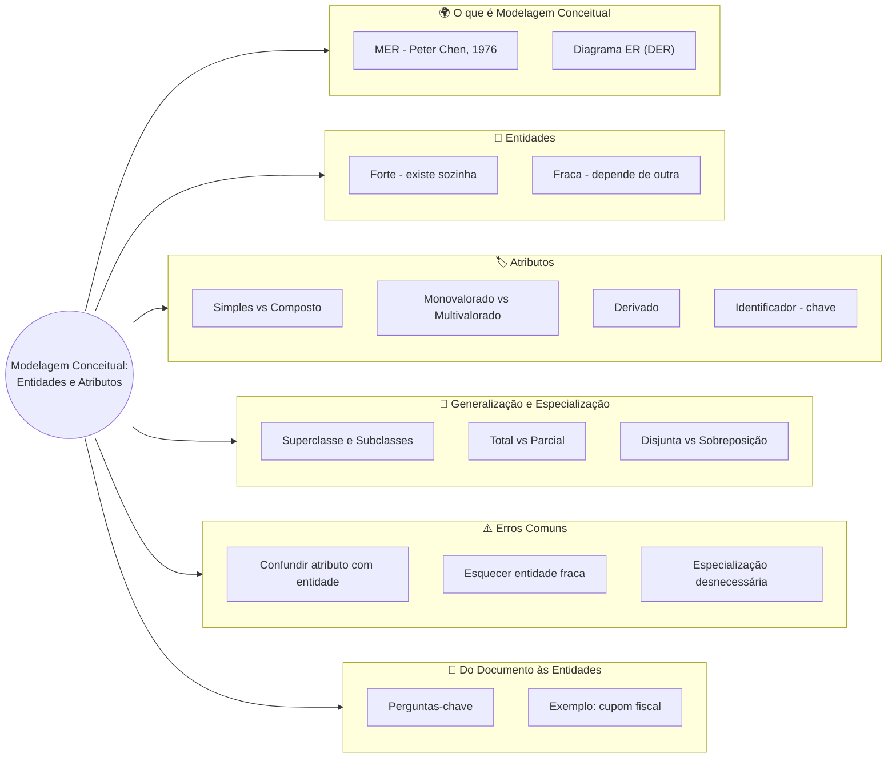

---

## 1. O que é Modelagem Conceitual?

Antes de criar qualquer tabela ou escrever qualquer linha de SQL, precisamos **entender o negócio**. A modelagem conceitual é exatamente isso: uma etapa de análise em que traduzimos o mundo real — com suas regras, objetos e relacionamentos — para uma representação formal, independente de qualquer tecnologia.

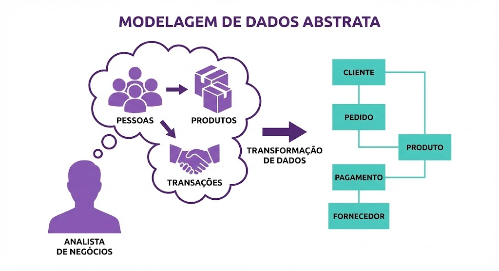

Pense na modelagem como a planta baixa de uma casa: o arquiteto não começa construindo paredes, mas sim desenhando o projeto. Da mesma forma, um bom banco de dados começa com um bom modelo conceitual.

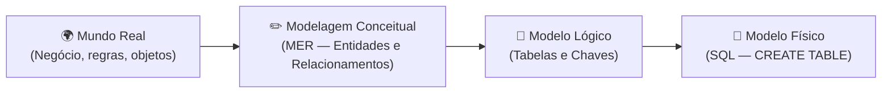

O **Modelo Entidade-Relacionamento (MER)**, proposto por Peter Chen em 1976, é o padrão mais utilizado para a modelagem conceitual. Sua representação gráfica é chamada de **Diagrama ER (DER)**.

---

## 2. Entidades

Uma **entidade** representa um objeto do mundo real sobre o qual desejamos armazenar informações. Ela pode ser uma pessoa, um lugar, um evento, um conceito ou qualquer coisa que tenha existência própria e seja relevante para o sistema.

Exemplos de entidades em sistemas reais: `CLIENTE`, `PRODUTO`, `PEDIDO`, `FUNCIONÁRIO`, `DEPARTAMENTO`, `CURSO`, `ALUNO`.

Existem dois tipos fundamentais de entidades que precisamos distinguir desde o início. Uma **entidade forte** existe de forma independente — um `CLIENTE` existe sozinho, sem depender de nenhum outro objeto. Já uma **entidade fraca** só existe em função de outra entidade — por exemplo, um `DEPENDENTE` só faz sentido existir porque há um `FUNCIONÁRIO` ao qual ele pertence.

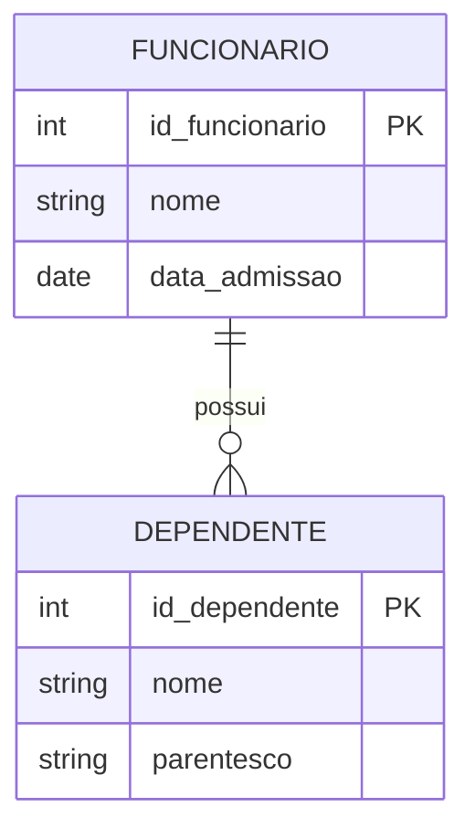

No diagrama acima, `FUNCIONARIO` é uma entidade forte e `DEPENDENTE` é uma entidade fraca, pois não faria sentido registrar um dependente sem um funcionário associado.

> 🧭 **Sobre os rótulos `int`, `string`, `date` no diagrama:** você deve ter notado que cada atributo, além do nome, tem uma palavra ao lado (`int`, `string`, `date`...). Esses são **tipos de dados genéricos** — só indicam, de forma informal, se o atributo guarda um número, um texto ou uma data, para deixar o diagrama mais completo e legível. Neste momento **não precisamos escolher o tipo de dado exato** que o banco vai usar (isso é assunto da Aula 4 — Modelo Lógico, quando decidiremos entre `INT`, `VARCHAR(100)`, `DECIMAL(10,2)` etc., já na sintaxe que o SQL entende). Por enquanto, o que importa é identificar **o que é um atributo** — a formalização de "como escrever isso no banco de dados" vem depois.

---

## 3. Atributos

Os **atributos** são as características ou propriedades que descrevem uma entidade. Se `CLIENTE` é a entidade, então `nome`, `cpf`, `email` e `data_nascimento` são seus atributos.

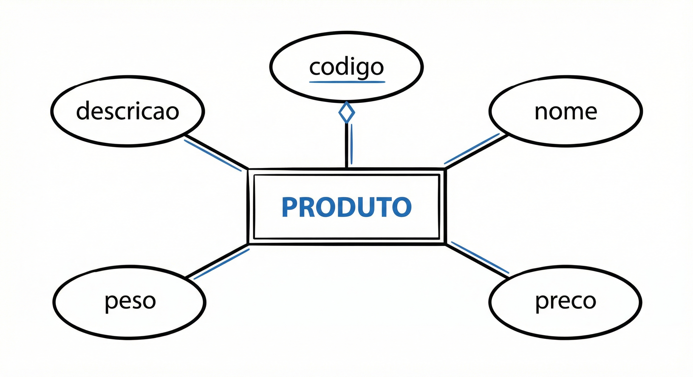

### 3.1 Classificação dos Atributos

Os atributos se classificam de diversas formas, e conhecer essa classificação é fundamental para construir modelos precisos.

O **atributo simples** (ou atômico) não pode ser subdividido — por exemplo, `cpf` ou `salario`. Já o **atributo composto** pode ser decomposto em partes menores com significado próprio — `endereco` pode ser dividido em `logradouro`, `numero`, `bairro`, `cidade` e `cep`.

O **atributo monovalorado** armazena um único valor por vez — como `data_nascimento`, que para uma pessoa só pode ter um valor. O **atributo multivalorado** pode ter vários valores — como `telefone`, pois uma pessoa pode ter vários números de contato.

O **atributo derivado** tem seu valor calculado a partir de outro atributo — `idade` pode ser derivado de `data_nascimento` e da data atual. Por isso, geralmente não precisamos armazená-lo.

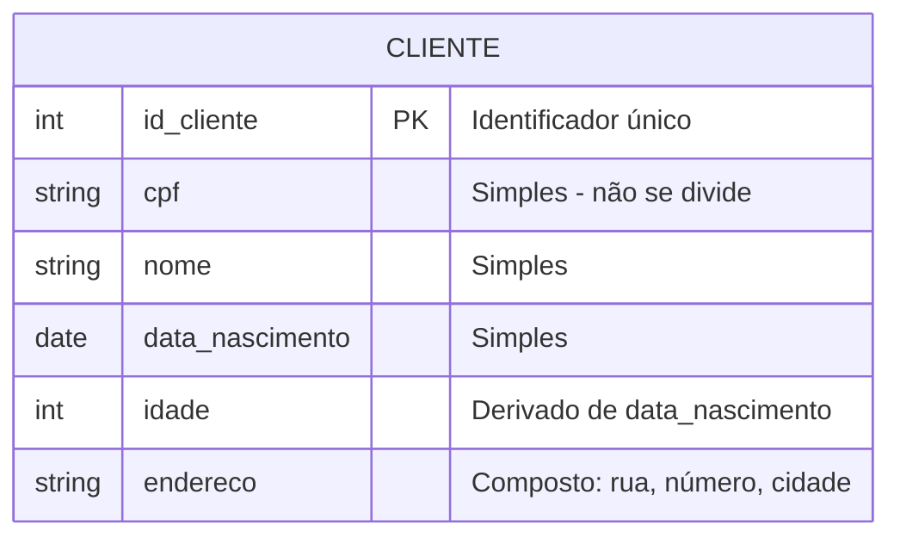

### 3.2 Atributo Identificador (Chave)

O **atributo identificador** (ou chave) é aquele que distingue de forma única cada ocorrência de uma entidade. Na notação ER clássica, ele é sublinhado. Exemplos: `cpf` em `PESSOA`, `codigo` em `PRODUTO`, `matricula` em `ALUNO`.

É fundamental que o atributo chave seja **único** (não pode se repetir entre instâncias) e **não nulo** (toda instância precisa ter um valor para ele).

---

## 4. Generalização e Especialização

Até aqui, todas as entidades que modelamos são independentes umas das outras — cada uma com seus próprios atributos, sem nenhuma relação de "herança" entre elas. Mas o mundo real frequentemente nos apresenta situações diferentes: objetos que **compartilham características comuns** mas também possuem **propriedades próprias** que os distinguem entre si.

É exatamente para modelar essas situações que o MER oferece o conceito de **Generalização e Especialização** — um dos mecanismos mais poderosos e, ao mesmo tempo, mais mal compreendidos da modelagem conceitual.

### 4.1 O Problema que Motivou o Conceito

Imagine que você está modelando o sistema de uma concessionária. Ela trabalha com **carros**, **motos** e **caminhões**. Todos eles têm `placa`, `ano_fabricacao`, `cor` e `preco`. Mas:

- **Carros** têm `numero_portas` e `tipo_cambio`
- **Motos** têm `cilindradas` e `tipo_guidao`
- **Caminhões** têm `capacidade_carga` e `numero_eixos`

Como modelar isso? Existem duas abordagens ingênuas e uma correta:

❌ **Abordagem 1 — Uma tabela só:** criar uma única tabela `VEICULO` com todos os atributos de todos os tipos. Resultado: linhas de carro com `cilindradas` nulas, linhas de moto com `numero_eixos` nulos. Desperdício, confusão e impossibilidade de aplicar restrições corretas.

❌ **Abordagem 2 — Tabelas totalmente separadas:** criar três tabelas completamente separadas, duplicando `placa`, `ano_fabricacao`, `cor` e `preco` em todas elas. Resultado: redundância, risco de inconsistência e violação das formas normais.

✅ **Abordagem correta — Generalização e Especialização:** criar uma entidade genérica `VEICULO` com os atributos comuns, e entidades especializadas `CARRO`, `MOTO` e `CAMINHAO` com apenas seus atributos exclusivos, herdando tudo que está em `VEICULO`.

### 4.2 Os Conceitos

A **generalização** é o processo de subir na hierarquia: observamos entidades com características semelhantes e abstraímos uma entidade mais geral que as representa. É um processo de abstração — do específico para o geral.

A **especialização** é o processo inverso, de descer na hierarquia: partindo de uma entidade geral, identificamos subgrupos com características ou comportamentos próprios e criamos entidades mais específicas para eles. É um processo de refinamento — do geral para o específico.

Na prática, os dois processos andam juntos: você tanto pode identificar `CARRO` e `MOTO` e depois generalizar para `VEICULO` (generalização), quanto partir de `VEICULO` e perceber que há subtipos com necessidades diferentes (especialização). O resultado no diagrama é o mesmo.

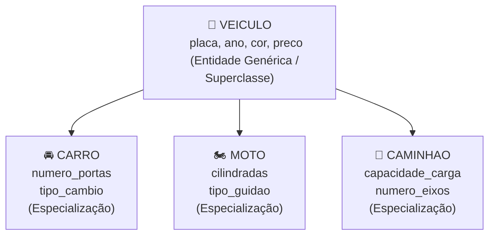

A entidade no topo da hierarquia é chamada de **superclasse** (ou entidade genérica). As entidades derivadas são chamadas de **subclasses** (ou entidades especializadas). As subclasses **herdam** todos os atributos e relacionamentos da superclasse — e acrescentam apenas o que é exclusivo delas.

### 4.3 Restrições da Especialização

A especialização não é uma estrutura livre — ela possui duas restrições importantes que precisam ser definidas no modelo:

**Restrição de participação (totalidade):**

- **Total:** toda instância da superclasse **obrigatoriamente** pertence a pelo menos uma subclasse. Não pode existir um `FUNCIONARIO` que não seja nem `HORISTA` nem `MENSALISTA`. Representado com linha dupla ou a palavra *"total"* no diagrama.
- **Parcial:** uma instância da superclasse **pode** não pertencer a nenhuma subclasse. Um `ANIMAL` pode ser genérico, sem se enquadrar em nenhuma especialização específica do modelo. Representado com linha simples ou a palavra *"parcial"*.

**Restrição de disjunção (sobreposição):**

- **Disjunta:** uma instância da superclasse pertence a **no máximo uma** subclasse. Um `VEÍCULO` é carro, moto **ou** caminhão — nunca dois ao mesmo tempo. Representado com a letra **d** no diagrama.
- **Sobreposição:** uma instância da superclasse pode pertencer a **mais de uma** subclasse simultaneamente. Um `PROFISSIONAL` pode ser ao mesmo tempo `MÉDICO` e `PROFESSOR` (médico que dá aulas). Representado com a letra **o** no diagrama.

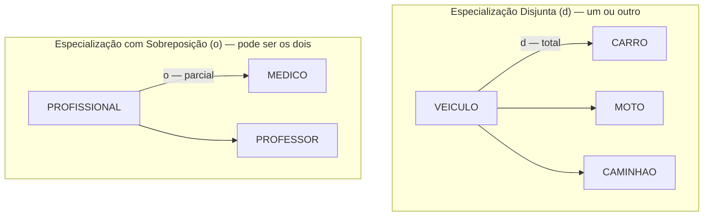

### 4.4 Exemplos Completos

**Exemplo 1 — Sistema Hospitalar: Pessoa → Paciente / Médico / Funcionário**

Um hospital trabalha com diferentes tipos de pessoas: pacientes, médicos e outros funcionários administrativos. Todos têm `nome`, `cpf` e `data_nascimento` em comum. Mas:

- **Paciente** tem `convenio` e `data_internacao`
- **Médico** tem `crm` e `especialidade`
- **Funcionario** tem `cargo` e `salario`

Além disso, um médico **também é funcionário** do hospital — o que configura uma especialização com **sobreposição**: a mesma pessoa pode ser ao mesmo tempo `MEDICO` e `FUNCIONARIO`.

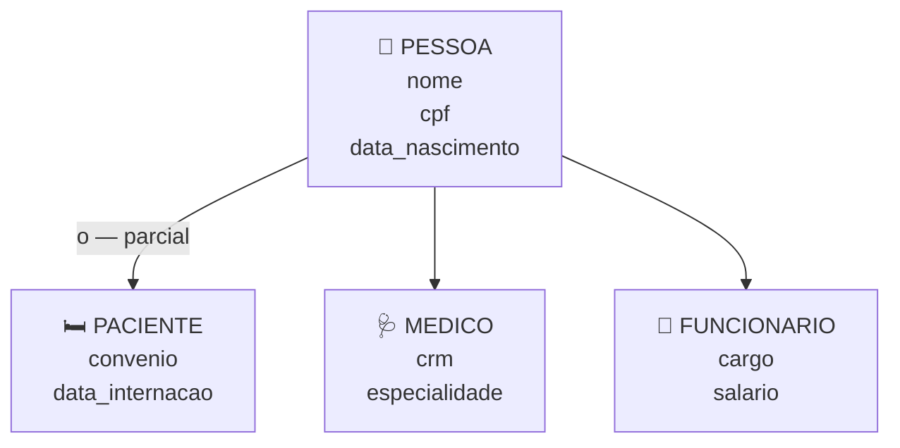

A especialização é **parcial** (uma pessoa pode ser cadastrada sem ser nenhum dos três tipos — ex: um visitante) e **com sobreposição** (um médico é também um funcionário).

---

**Exemplo 2 — Plataforma de Conteúdo: Conteúdo → Artigo / Vídeo / Podcast**

Uma plataforma de mídia armazena diferentes tipos de conteúdo. Todos os conteúdos têm `titulo`, `data_publicacao` e `autor`. Mas cada tipo tem características próprias:

- **Artigo** tem `numero_palavras` e `formato` (HTML, Markdown)
- **Vídeo** tem `duracao_segundos` e `resolucao`
- **Podcast** tem `duracao_segundos` e `temporada`

Todo conteúdo **obrigatoriamente** é de um tipo específico — não existe conteúdo "genérico" sem tipo definido. A especialização é, portanto, **total** e **disjunta** (um conteúdo é exatamente um dos três tipos).

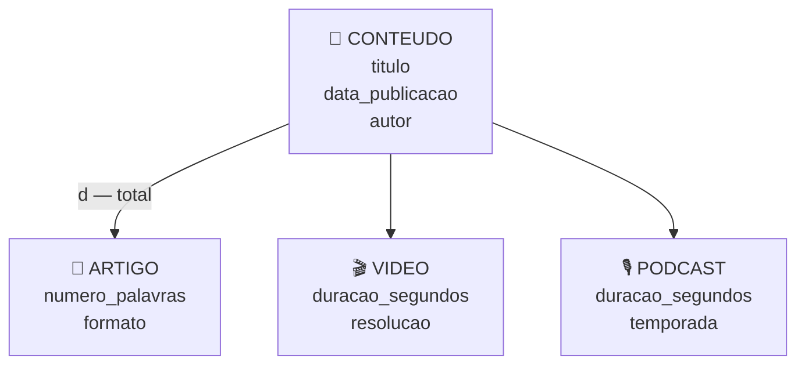

---

**Exemplo 3 — E-commerce: Conta → Conta Física / Conta Jurídica**

Uma loja virtual permite cadastro tanto de pessoas físicas quanto jurídicas. Toda conta tem `email`, `senha` e `data_cadastro`. Mas:

- **Conta Física** (pessoa física) tem `cpf` e `data_nascimento`
- **Conta Jurídica** (empresa) tem `cnpj` e `razao_social`

Uma conta é sempre de um tipo ou do outro — nunca os dois. Especialização **total** e **disjunta**.

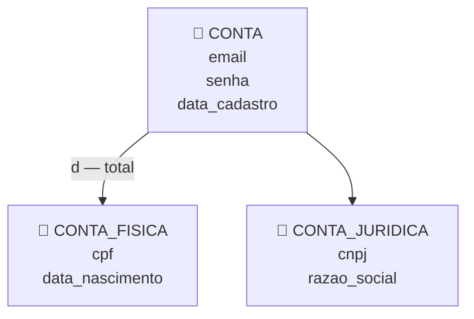

### 4.5 Resumo: Quando Usar Generalização/Especialização?

Use quando você encontrar uma ou mais das seguintes situações no levantamento de requisitos:

| Sinal no enunciado | O que indica |
|---|---|
| *"Existem dois tipos de X…"* | Provável especialização |
| *"Todo X é também um Y, mas tem características adicionais…"* | Hierarquia de herança |
| *"X pode ser A, B ou C"* | Especialização disjunta |
| *"X pode ser A e B ao mesmo tempo"* | Especialização com sobreposição |
| *"Alguns campos só se aplicam a certos tipos de X"* | Atributos exclusivos de subclasse |

> 💡 **Atenção:** generalização/especialização **não é** o mesmo que um relacionamento comum. A seta que conecta superclasse e subclasse representa **herança de atributos**, não uma associação entre entidades distintas. A subclasse é uma especialização da mesma entidade, não uma entidade diferente relacionada a ela.

---

## 5. Exemplo Completo: Sistema de Biblioteca

Vamos praticar identificando entidades e atributos em um contexto real. Em um sistema de biblioteca, o enunciado pode ser:

*"A biblioteca possui livros, cada um com título, ISBN, ano de publicação e número de páginas. Os livros podem ter vários autores. Os membros da biblioteca são cadastrados com nome, CPF e data de nascimento."*

A partir desse texto, identificamos as seguintes entidades e seus atributos:

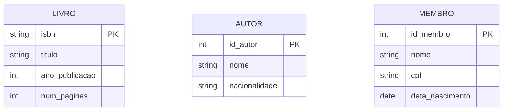

---

## 6. Erros Comuns na Modelagem Conceitual

Quem está começando a modelar tende a cometer os mesmos tropeços. Conhecê-los de antemão evita horas de retrabalho — e ajuda a "ler" um enunciado com mais confiança.

### 6.1 Confundir atributo com entidade

Este é o erro mais frequente. A regra prática: se a informação **só faz sentido descrevendo outra coisa** e não tem vida própria, é atributo. Se ela **tem existência independente**, pode ser relacionada a mais de uma outra entidade, ou possui vários atributos próprios que também precisam ser armazenados, é entidade.

❌ **Errado:** modelar `ENDERECO` como uma entidade separada de `CLIENTE`, ligada por um relacionamento, quando na prática cada cliente tem só um endereço e o sistema nunca precisa consultar endereços de forma independente.

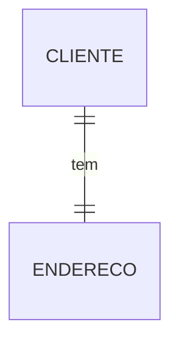

✅ **Certo (na maioria dos casos):** `endereco` como atributo composto de `CLIENTE` (`logradouro`, `numero`, `bairro`, `cidade`, `cep`) — a menos que o negócio realmente precise de múltiplos endereços por cliente ou consultas independentes sobre endereços, caso em que promovê-lo a entidade passa a se justificar.

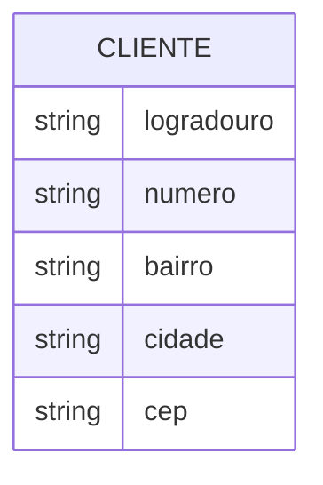

### 6.2 Confundir relacionamento com entidade

O erro oposto também acontece: transformar em entidade algo que é, na verdade, a **associação entre duas entidades**.

❌ **Errado:** criar uma entidade `MATRICULA` isolada, sem perceber que ela só existe como o encontro entre `ALUNO` e `CURSO`.

✅ **Certo:** `MATRICULA` deve ser modelada como o **relacionamento** entre `ALUNO` e `CURSO` — que pode, sim, virar uma entidade associativa quando tem atributos próprios (`data_matricula`, `situacao`), mas continua representando a ligação entre as duas, não um terceiro objeto solto.

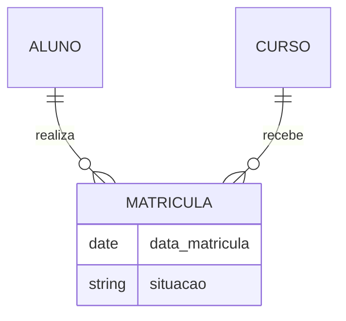

### 6.3 Esquecer de identificar entidades fracas

É comum modelar tudo como entidade forte por hábito, sem parar para perguntar "isso existe sozinho, ou só faz sentido por causa de outra entidade?". Esquecer essa pergunta leva a modelos que permitem, por exemplo, cadastrar um `DEPENDENTE` sem nenhum `FUNCIONARIO` associado — uma inconsistência que o modelo deveria impedir desde o desenho conceitual.

### 6.4 Modelar atributo multivalorado como um único campo

Ainda na fase conceitual, é comum já cometer o erro que a 1ª Forma Normal (assunto de uma aula futura) vai cobrar de volta: tratar `telefones` como um único campo de texto (`"11 99999-0000, 11 98888-1111"`) em vez de reconhecer que é um **atributo multivalorado**. Marcar isso corretamente já na modelagem conceitual poupa retrabalho na hora de desenhar o modelo lógico.

### 6.5 Usar generalização/especialização sem necessidade real

Nem toda diferença entre instâncias de uma entidade justifica criar subclasses. Se `CLIENTE` só varia entre "pessoa física" e "pessoa jurídica" em dois campos (`cpf` vs `cnpj`), pode valer a pena — mas criar uma hierarquia de especialização para diferenças triviais (ex: só porque um campo é opcional para alguns registros) é over-engineering: complica o modelo sem ganho real. Volte à tabela da seção 4.5 para checar se o sinal realmente está lá no enunciado.

### Resumo dos Erros Comuns

| Erro | Sintoma | Como evitar |
|---|---|---|
| Atributo virou entidade | Entidade sem atributos próprios relevantes, sempre 1-para-1 com outra | Pergunte: "isso tem vida própria ou só descreve outra coisa?" |
| Relacionamento virou entidade solta | Entidade que só existe quando duas outras se encontram | Pergunte: "isso é o encontro de duas entidades, ou um terceiro objeto?" |
| Entidade fraca tratada como forte | Modelo permite cadastro "órfão", sem a entidade da qual deveria depender | Pergunte: "isso existe sozinho, sem a outra entidade?" |
| Atributo multivalorado em campo único | Um campo de texto guardando vários valores separados por vírgula | Pergunte: "essa informação pode se repetir para a mesma instância?" |
| Especialização sem necessidade | Subclasses criadas para diferenças triviais | Confira a tabela de sinais da seção 4.5 antes de especializar |

---

## 7. Passo a Passo: Do Cupom Fiscal às Entidades

A melhor forma de fixar a diferença entre entidade e atributo é praticar com um documento real. Vamos pegar um cupom fiscal de supermercado — algo que todo mundo já teve nas mãos — e transformá-lo em um modelo conceitual, pergunta por pergunta.

### O documento

```text
SUPERMERCADO BOM PREÇO LTDA
CNPJ: 12.345.678/0001-90
Rua das Palmeiras, 500 - Jahu/SP

CUPOM FISCAL ELETRÔNICO - SAT
Data: 12/08/2026        Hora: 14:32:07

ITEM  DESCRIÇÃO                QTD   UN.   VL.UNIT   VL.TOTAL
001   ARROZ TIPO 1 5KG          1     UN     24,90      24,90
002   FEIJAO CARIOCA 1KG        2     UN      8,50      17,00
003   REFRIGERANTE 2L           3     UN      7,90      23,70
004   SABONETE LUX 90G          6     UN      2,30      13,80

VALOR TOTAL R$: 79,40
FORMA PAGAMENTO: CARTAO DE CREDITO
BANDEIRA: VISA

Operador: MARIA SOUZA          CAIXA: 03
```

### Passo 1 — Liste tudo que aparece no documento, sem julgar ainda

Antes de decidir o que é entidade e o que é atributo, faça um brainstorm cru. Do cupom acima: nome da loja, CNPJ, endereço da loja, data, hora, número/descrição/quantidade/valor unitário/valor total de cada item, valor total do cupom, forma de pagamento, bandeira do cartão, nome do operador, número do caixa.

### Passo 2 — As quatro perguntas-chave

Para cada item da lista, faça estas perguntas nesta ordem:

1. **"Essa informação se repete várias vezes dentro do mesmo documento, com valores diferentes a cada repetição?"** Se sim, é forte sinal de que estamos diante de uma **entidade** (ou de uma entidade fraca/associativa) — porque uma linha de atributo simples não repete dentro do mesmo registro.
2. **"Essa informação teria sentido e poderia ser consultada mesmo sem este cupom específico existir?"** Se sim (ex: o produto continua existindo mesmo que este cupom seja cancelado), é sinal de **entidade independente**. Se a informação só existe *dentro* deste documento e morre com ele, é mais provável que seja **atributo**.
3. **"Essa informação está apenas descrevendo/qualificando outra coisa específica?"** Se sim (ex: o CNPJ descreve a loja, a data descreve o cupom), é **atributo** daquilo que ela descreve.
4. **"Essa informação é o resultado do encontro entre duas outras entidades (ex: quanto de um produto foi levado, em uma compra específica)?"** Se sim, é atributo de uma **entidade associativa** (o "item do cupom"), não da entidade produto nem da entidade cupom isoladamente.

### Passo 3 — Aplique as perguntas, item por item

| Elemento do documento | Pergunta que se aplica | Conclusão |
|---|---|---|
| Nome da loja, CNPJ, endereço da loja | Descreve quem emitiu o cupom (pergunta 3); é sempre a mesma loja em todos os cupons deste sistema | Atributos de uma entidade `LOJA` (ou atributos fixos do emissor, se o sistema só atende uma loja) |
| Data, hora, valor total, forma de pagamento, bandeira | Descrevem o cupom em si, não se repetem dentro dele (pergunta 3) | Atributos da entidade `CUPOM_FISCAL` |
| Linha de item (código, descrição, qtd, vl. unitário, vl. total) | Se repete várias vezes no mesmo cupom, cada vez com valores diferentes (pergunta 1) | Sinaliza duas coisas distintas — veja o Passo 4 |
| Descrição e valor unitário do produto | Continuariam existindo/fazendo sentido mesmo em outro cupom, outro dia (pergunta 2) | Atributos da entidade `PRODUTO`, independente do cupom |
| Quantidade e valor total daquele item específico | É o resultado do encontro entre um `CUPOM_FISCAL` e um `PRODUTO` (pergunta 4) | Atributos da entidade associativa `ITEM_CUPOM` |
| Nome do operador, número do caixa | Descreve quem realizou a venda (pergunta 3) — mas repare: poderia também virar entidade `OPERADOR` se o sistema precisar consultar todas as vendas de um operador ao longo do tempo | Depende da necessidade do negócio — comece como atributo simples do cupom; promova a entidade só se surgir a necessidade real (mesmo raciocínio da seção 6.5, para não repetir o erro comum de especializar/entidar sem necessidade) |

### Passo 4 — Monte o modelo

Juntando as conclusões do Passo 3, chegamos a três entidades: `CUPOM_FISCAL` (forte), `PRODUTO` (forte, independente) e `ITEM_CUPOM` (fraca/associativa, só existe pela combinação de um cupom com um produto).

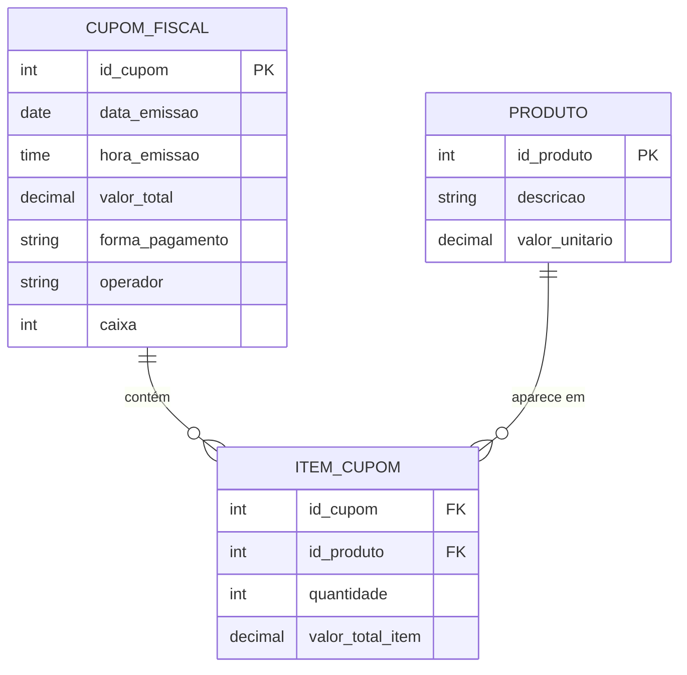

Note que resistimos à tentação de transformar `OPERADOR` automaticamente em entidade só porque ele tem um rótulo próprio no documento — é exatamente o Erro Comum 6.1 que vimos acima. A decisão de promovê-lo a entidade fica reservada para quando o negócio realmente precisar (por exemplo, um relatório de vendas por operador).

> 💡 **Pratique em casa:** pegue qualquer outro documento real (um boleto, uma nota fiscal de serviço, um formulário de matrícula) e refaça os quatro passos. É o mesmo raciocínio, sempre.

---

## 🃏 Flashcards de Revisão

??? question "Qual a diferença entre entidade forte e entidade fraca?"
    Entidade forte existe de forma independente (ex: `CLIENTE`). Entidade fraca só existe em função de outra entidade (ex: `DEPENDENTE` só faz sentido se houver um `FUNCIONARIO`).

??? question "Qual a diferença entre atributo simples e atributo composto?"
    Atributo simples não pode ser subdividido (ex: `cpf`). Atributo composto pode ser decomposto em partes com significado próprio (ex: `endereco` em `logradouro`, `numero`, `cidade`, `cep`).

??? question "Qual a diferença entre atributo monovalorado e multivalorado?"
    Monovalorado armazena um único valor por vez (ex: `data_nascimento`). Multivalorado pode ter vários valores para a mesma instância (ex: `telefone`, já que uma pessoa pode ter vários números).

??? question "O que é um atributo derivado? Dê um exemplo."
    É um atributo cujo valor é calculado a partir de outro atributo, então geralmente não precisa ser armazenado. Exemplo: `idade`, derivado de `data_nascimento` e da data atual.

??? question "O que precisa ser verdade para um atributo servir como identificador (chave) de uma entidade?"
    Ele precisa ser único (não se repete entre instâncias) e não nulo (toda instância precisa ter um valor para ele).

??? question "Qual a diferença entre generalização e especialização?"
    Generalização é o processo de abstrair uma entidade mais geral a partir de entidades específicas (do específico para o geral). Especialização é o processo inverso: partir de uma entidade geral e identificar subtipos com características próprias (do geral para o específico). O resultado no diagrama é o mesmo.

??? question "O que diferencia uma especialização total de uma parcial?"
    Na especialização total, toda instância da superclasse obrigatoriamente pertence a pelo menos uma subclasse. Na parcial, uma instância pode não pertencer a nenhuma subclasse.

??? question "O que diferencia uma especialização disjunta de uma com sobreposição?"
    Na disjunta, uma instância pertence a no máximo uma subclasse (ex: um veículo é carro OU moto OU caminhão). Na sobreposição, uma instância pode pertencer a mais de uma subclasse ao mesmo tempo (ex: um médico que também é professor).

??? question "Qual é o erro mais comum ao decidir entre modelar algo como entidade ou como atributo?"
    Confundir os dois: transformar em entidade separada algo que só descreve outra coisa e não tem vida própria (deveria ser atributo), ou o contrário — deixar como atributo algo que tem existência independente e deveria ser entidade.

---

## ✅ Quiz de Fixação

<quiz>
Qual das alternativas é um exemplo de entidade fraca?
- [ ] CLIENTE, pois todo sistema precisa de clientes
- [x] DEPENDENTE, pois só existe em função de um FUNCIONARIO
- [ ] PRODUTO, pois tem muitos atributos
- [ ] CATEGORIA, pois é usada para classificar produtos

DEPENDENTE não existe sozinho: não faz sentido cadastrar um dependente sem um funcionário ao qual ele pertence. Isso é a marca registrada de uma entidade fraca.
</quiz>

<quiz>
O atributo "telefone" de uma pessoa, que pode ter vários números cadastrados, é classificado como:
- [ ] Simples e monovalorado
- [ ] Composto e monovalorado
- [x] Simples e multivalorado
- [ ] Derivado

"Telefone" não se divide em partes menores com significado próprio (por isso é simples), mas pode ter vários valores para a mesma pessoa (por isso é multivalorado).
</quiz>

<quiz>
Em uma especialização de VEICULO em CARRO, MOTO e CAMINHAO, onde todo veículo cadastrado é obrigatoriamente um dos três tipos e nunca mais de um ao mesmo tempo, essa especialização é: (selecione todas as corretas)
- [x] Total
- [ ] Parcial
- [x] Disjunta
- [ ] Com sobreposição

É total porque todo veículo obrigatoriamente pertence a uma subclasse (não existe veículo "sem tipo"), e é disjunta porque cada veículo pertence a no máximo uma subclasse por vez.
</quiz>

<quiz>
Ao modelar um sistema de matrículas escolares, qual é o erro descrito na seção "Erros Comuns" ao se criar uma entidade MATRICULA totalmente solta, sem ligá-la como o encontro entre ALUNO e CURSO?
- [ ] Esquecer de identificar uma entidade fraca
- [x] Confundir relacionamento com entidade
- [ ] Usar especialização sem necessidade
- [ ] Modelar atributo multivalorado como campo único

MATRICULA representa o encontro entre ALUNO e CURSO — é um relacionamento (que pode virar entidade associativa se tiver atributos próprios), não uma terceira entidade solta e independente das outras duas.
</quiz>

<quiz>
No exemplo do cupom fiscal, por que "quantidade" e "valor total do item" são atributos da entidade associativa ITEM_CUPOM, e não da entidade PRODUTO?
- [ ] Porque todo atributo numérico deve ficar em uma entidade associativa
- [x] Porque são o resultado do encontro entre um CUPOM_FISCAL específico e um PRODUTO específico, não uma característica fixa do produto
- [ ] Porque PRODUTO já tem atributos demais
- [ ] Porque CUPOM_FISCAL não pode ter atributos numéricos

A quantidade comprada e o valor total daquele item só existem na combinação de um cupom com um produto — o mesmo PRODUTO pode aparecer em outro cupom com quantidade e valor diferentes. Isso é exatamente o papel de uma entidade associativa.
</quiz>

---

## 📝 Resumo

Nesta aula aprendemos que a modelagem conceitual é a etapa de análise que traduz o mundo real para um modelo formal usando o Modelo Entidade-Relacionamento. Vimos que entidades representam objetos do mundo real e podem ser fortes ou fracas. Os atributos descrevem as entidades e se classificam em simples, compostos, monovalorados, multivalorados e derivados. O atributo identificador (chave) é aquele que distingue unicamente cada ocorrência de uma entidade.

Aprendemos também que a **generalização e especialização** permite modelar hierarquias de herança entre entidades, criando uma superclasse com atributos comuns e subclasses com atributos exclusivos. A especialização pode ser total ou parcial (todos ou alguns elementos da superclasse pertencem a uma subclasse) e disjunta ou com sobreposição (um elemento pertence a uma ou mais subclasses ao mesmo tempo).

Por fim, vimos os erros mais comuns de quem está começando a modelar — principalmente a confusão entre entidade e atributo — e praticamos o raciocínio completo aplicando quatro perguntas-chave a um documento real, o cupom fiscal, para chegar a um modelo conceitual correto.

---

## ✏️ Exercícios de Fixação Práticos

Para cada cenário abaixo, identifique as entidades, seus atributos (classificando-os quando fizer sentido: simples/composto, monovalorado/multivalorado, derivado, identificador) e, quando aplicável, relações de generalização/especialização. Use as quatro perguntas-chave da seção 7 sempre que tiver dúvida entre entidade e atributo.

**Exercício 1 — Clínica Veterinária**

*"A clínica atende animais de estimação. Cada animal tem nome, espécie, raça, data de nascimento e pode ter várias vacinas registradas (cada vacina com nome, data de aplicação e validade). Cada animal pertence a um tutor, que tem nome, CPF, telefone(s) e endereço."*

Identifique as entidades, seus atributos e classifique cada atributo.

---

**Exercício 2 — Locadora de Equipamentos**

*"A locadora aluga equipamentos para eventos (som, iluminação, tendas). Cada equipamento tem código, descrição, valor da diária e estado de conservação. Um cliente pode alugar vários equipamentos em uma mesma locação, e a locação registra a data de retirada, a data de devolução prevista e o valor total."*

Identifique as entidades, atributos, e a entidade associativa que representa a relação entre cliente/equipamento dentro de uma locação.

---

**Exercício 3 — Entidade fraca**

*"Um condomínio cadastra suas unidades (apartamentos), cada uma com número, andar e metragem. Cada unidade pode ter vários moradores cadastrados, cada um com nome e é morador daquela unidade específica — não faz sentido cadastrar um morador sem vincular a uma unidade."*

Identifique qual entidade é forte e qual é fraca, e justifique.

---

**Exercício 4 — Generalização e Especialização**

*"Uma escola de idiomas tem professores. Todo professor tem nome, CPF e data de contratação. Professores podem ser CLT (com salário fixo mensal) ou Freelancer (com valor pago por hora-aula). Um professor é sempre um dos dois tipos, nunca os dois ao mesmo tempo."*

Modele a hierarquia de generalização/especialização, indicando se é total ou parcial, e disjunta ou com sobreposição.

---

**Exercício 5 — Encontre o erro**

O modelo abaixo foi proposto por um colega para um sistema de pedidos de restaurante. Aponte qual erro comum (da seção 6) foi cometido e proponha a correção.

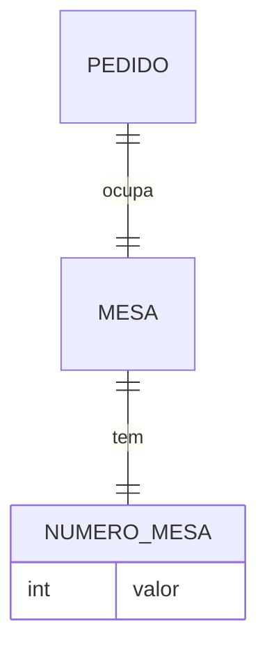

*Dica: `NUMERO_MESA` foi modelado como uma entidade separada, ligada a `MESA` por um relacionamento 1-para-1. Ela tem vida própria, ou só descreve `MESA`?*

---

📄 **[Ver gabarito dos exercícios →](Aula_02_Gabarito.md)**

> Tente resolver todos os exercícios antes de conferir — a comparação com o gabarito rende muito mais quando você já tentou construir sua própria resposta primeiro.

---

## 🏆 Conquista da Aula

!!! success "Selo desbloqueado: 🗺️ Cartógrafo(a) de Entidades"
    Você aprendeu a enxergar entidades e atributos no mundo real — do exemplo da biblioteca ao cupom fiscal do dia a dia — e a evitar as armadilhas mais comuns de quem está começando a modelar. A próxima parada da Trilha do(a) Modelador(a) de Dados: dar nome e regra aos relacionamentos entre essas entidades.

---

## 🔗 Navegação

⬅️ [Aula 01 — Introdução a BD](Aula_01_Introducao_BD.md) · ➡️ 🔒 Aula 03 — em breve.

---

*Fatec Jahu · IBD951 · Prof. Ronan Adriel Zenatti · 2026*
