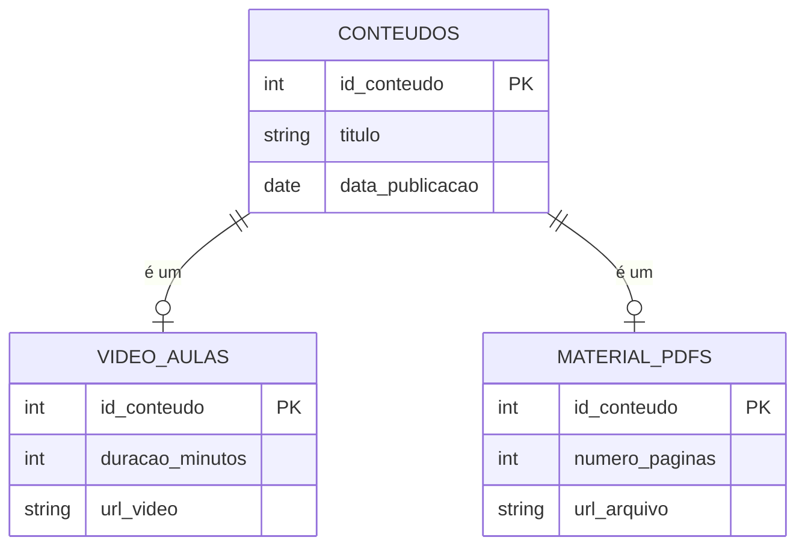
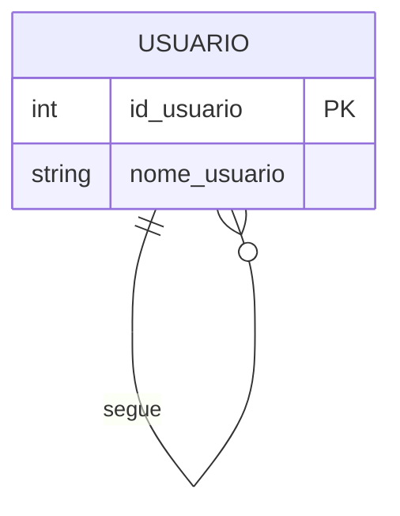
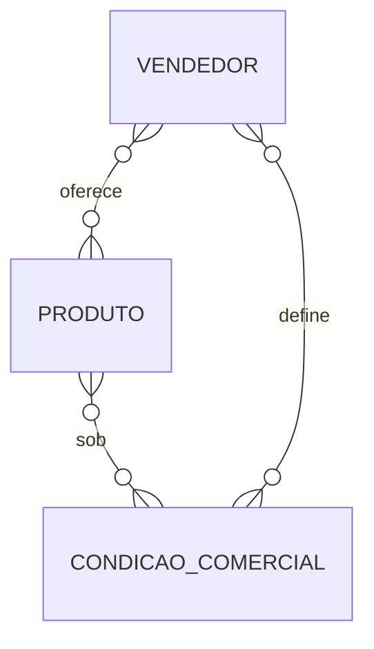
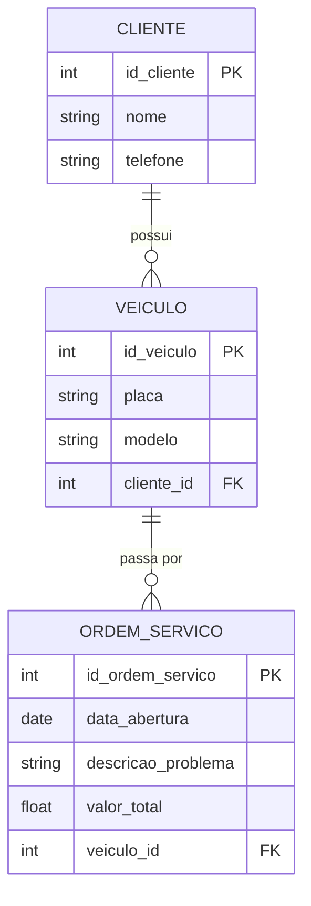
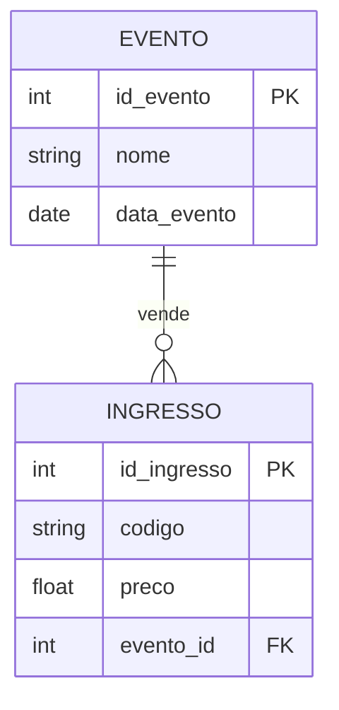
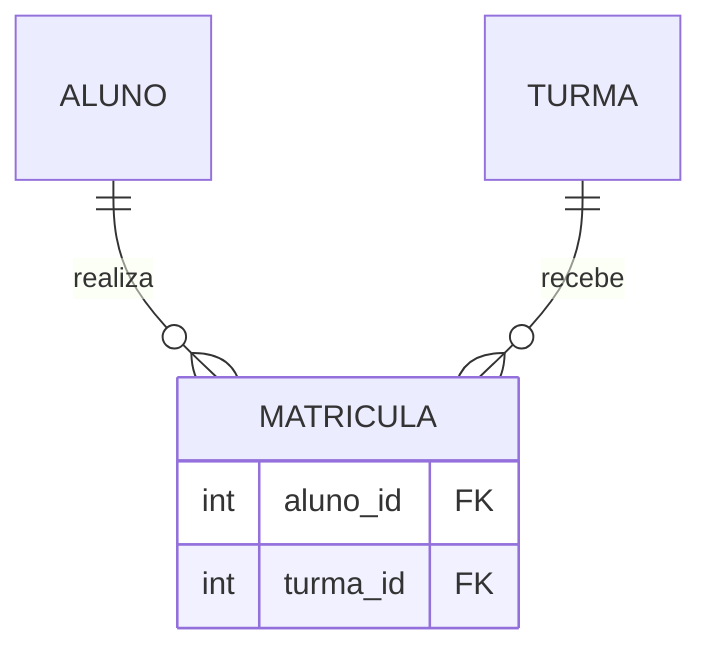
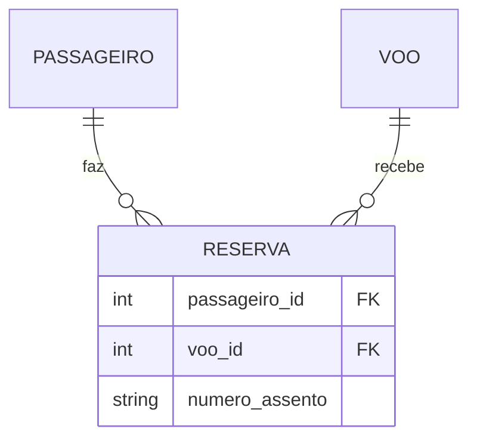
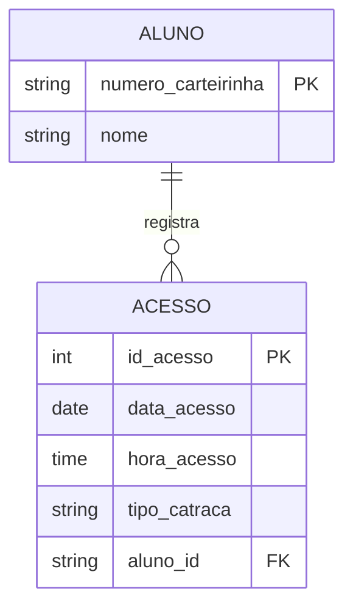

<!--
GABARITO — não faz parte do fluxo principal da aula e fica fora do `nav` do
mkdocs.yml de propósito. É acessível só pelos links dentro de Aula_03_Relacionamentos_Cardinalidade.md.
-->

# Gabarito — Aula 03 — Relacionamentos e Cardinalidade

**Disciplina:** Banco de Dados e Aplicações  
**Professor:** Ronan Adriel Zenatti · ronan.zenatti@cps.sp.gov.br   
**Fatec Jahu — 2º Semestre/2026**

---

!!! warning "Antes de conferir"
    Assim como no gabarito da Aula 02: este documento mostra **uma** solução correta possível para cada Checkpoint e Exercício. O que importa é o raciocínio — sobretudo o método das perguntas-chave (Aula 03, Seção 2) e a regra de onde entra a FK (Aula 03, Seção 4). Se sua resposta divergir na cardinalidade, refaça as perguntas antes de assumir que está errada.

---

## Checkpoint 1 — Cardinalidade: plataforma de streaming de música {: #checkpoint-1 }

**Resposta:**

**(a) USUARIO e PLAYLIST → 1:N.** "Um usuário pode criar várias playlists" (máximo N do lado PLAYLIST) e "cada playlist pertence a exatamente um usuário" (máximo 1 do lado USUARIO). A FK `usuario_id` fica em `PLAYLIST` (lado N), seguindo a Regra 6.

**(b) PLAYLIST e MUSICA → N:M.** "Pode ter mais de uma?" é sim nos dois sentidos — uma playlist tem várias músicas, e uma música está em várias playlists. Precisa de uma tabela associativa (ex.: `ITEM_PLAYLIST`, com `playlist_id FK` e `musica_id FK`).

**(c) USUARIO e ASSINATURA → 1:1.** "Um usuário tem exatamente uma assinatura ativa" e "uma assinatura pertence a exatamente um usuário" — não em quantidade nos dois sentidos. A FK fica no lado de participação parcial (se um usuário puder existir sem assinatura ativa, a FK `usuario_id` vai em `ASSINATURA`).

---

## Checkpoint 2 — Notações: locadora de veículos {: #checkpoint-2 }

**Resposta:**

**(a)** O símbolo `O{`, perto de `FILIAL`, descreve `VEICULO` — significa que **uma filial pode ter zero ou muitos veículos** (mínimo 0, máximo N).

**(b)** O símbolo `||`, perto de `VEICULO`, descreve `FILIAL` — significa que **um veículo pertence a exatamente uma filial** (mínimo 1, máximo 1).

**(c)** Em Min-Max: `FILIAL (0,N) ———— (1,1) VEICULO`.

---

## Checkpoint 3 — De cardinalidade a PK/FK: sistema de manutenção industrial {: #checkpoint-3 }

**Resposta:**

**(a)** `MAQUINA` e `ORDEM_SERVICO` são 1:N — uma máquina pode gerar várias ordens de serviço, mas cada ordem de serviço se refere a exatamente uma máquina. Pela Regra da Seção 4.1, a FK fica no lado N (`ORDEM_SERVICO`), chamada `maquina_id` (Regra 6: nome da tabela referenciada no singular + `_id`).

**(b)** `ORDEM_SERVICO` e `TECNICO` são N:M — uma ordem pode envolver vários técnicos, e um técnico atua em várias ordens. Nenhuma FK simples resolve isso porque nenhum dos dois lados consegue guardar múltiplas referências em uma única coluna (Seção 4.2). Solução: tabela associativa `ATUACAO_TECNICA` (ou similar), com `ordem_servico_id FK` e `tecnico_id FK`.

---

## Checkpoint 4 — De Herança a Tabelas: sistema de conteúdo de uma escola online {: #checkpoint-4 }

**Resposta:**

**(a)** Seguindo a Estratégia 2 (Seção 5.1): `conteudos` é a superclasse, com os atributos comuns; `video_aulas` e `material_pdfs` são as subclasses, cada uma com seus atributos exclusivos, e cuja PK é, ao mesmo tempo, FK única para `conteudos`.

**(b)** A Estratégia 1 (tabela única com coluna discriminadora) obrigaria toda linha de `conteudos` a ter as quatro colunas exclusivas (`duracao_minutos`, `url_video`, `numero_paginas`, `url_arquivo`) — metade delas sempre `NULL` para qualquer linha, já que um conteúdo nunca é os dois tipos ao mesmo tempo (especialização disjunta). Além disso, nada impediria alguém de preencher `numero_paginas` numa linha marcada como vídeo-aula.

---

## Checkpoint 5 — Participação: sistema de biblioteca com reservas {: #checkpoint-5 }

**Resposta:**

**RESERVA → participação total** em relação a `LIVRO` e a `MEMBRO`: o enunciado diz que toda reserva obrigatoriamente está vinculada aos dois — não existe reserva "solta" (mínimo 1 dos dois lados).

**LIVRO → participação parcial** no relacionamento de reserva: nem todo livro do acervo precisa ter sido reservado (mínimo 0).

**MEMBRO → participação parcial** no relacionamento de reserva: nem todo membro cadastrado precisa ter feito uma reserva (mínimo 0).

---

## Checkpoint 6 — Auto-relacionamento e Ternário: rede social e e-commerce {: #checkpoint-6 }

**Resposta:**

**(a) Auto-relacionamento.** `USUARIO` se relaciona com `USUARIO` — a mesma entidade em ambos os lados do relacionamento "segue".

**(b) Relacionamento ternário.** As três entidades `VENDEDOR`, `PRODUTO` e `CONDICAO_COMERCIAL` participam juntas de uma única ocorrência — a oferta só existe pela combinação das três, exatamente como no exemplo médico/medicamento/paciente da Seção 9.

---

## Exercício 1 — Leitura de Diagrama

**a) Um fornecedor pode existir sem fornecer nenhum produto?** Sim. O símbolo `O{`, próximo a `FORNECEDOR`, descreve `PRODUTO` e começa com círculo — mínimo 0. Um fornecedor recém-cadastrado pode ainda não ter nenhum produto associado.

**b) Um produto pode existir sem estar vinculado a um fornecedor?** Não. O símbolo `||`, próximo a `PRODUTO`, descreve `FORNECEDOR` e começa com barra dupla — mínimo 1. Todo produto precisa ter um fornecedor.

**c) Cardinalidade em Min-Max:** `FORNECEDOR (0,N) ———— (1,1) PRODUTO`.

---

## Exercício 2 — Oficina Mecânica

**Raciocínio:** há duas cadeias 1:N encadeadas. `CLIENTE` (1) para `VEICULO` (N) — um cliente pode ter vários veículos, mas cada veículo pertence a exatamente um cliente (participação total: não faz sentido um veículo cadastrado sem dono). `VEICULO` (1) para `ORDEM_SERVICO` (N) — um veículo pode passar por várias ordens de serviço ao longo do tempo, mas cada ordem de serviço se refere a exatamente um veículo.

Seguindo a regra da Seção 4.1: a FK sempre fica no lado N. `cliente_id` fica em `VEICULO`; `veiculo_id` fica em `ORDEM_SERVICO`. Ambas seguem a Regra 6 (nome da tabela referenciada no singular + `_id`).

---

## Exercício 3 — Identifique o Tipo e Decomponha

**a) Ingresso e Evento → 1:N.** Um evento pode vender muitos ingressos; cada ingresso é válido para exatamente um evento. A FK `evento_id` fica em `INGRESSO`.

**b) Aluno e Turma → N:M.** Um aluno pode estar em várias turmas no mesmo semestre (ex: turmas de disciplinas diferentes); uma turma tem vários alunos. Entidade associativa: `MATRICULA`, com `aluno_id FK` e `turma_id FK`.

**c) Passageiro e Voo → N:M.** Um passageiro pode reservar assento em vários voos; um voo tem vários passageiros. Entidade associativa: `RESERVA`, com `passageiro_id FK`, `voo_id FK` e o atributo próprio `numero_assento` (que só faz sentido na combinação passageiro+voo, não em cada entidade isolada).

---

## Exercício 4 — Nomeação de PK e FK

Seguindo a Regra 5 (PK: `id_` + nome da tabela no singular):

| Tabela | Chave Primária |
|---|---|
| `editoras` | `id_editora` |
| `livros` | `id_livro` |
| `categorias` | `id_categoria` |

Seguindo a Regra 6 (FK: nome da tabela referenciada no singular + `_id`), a chave estrangeira que `livros` usa para referenciar `editoras` é **`editora_id`**.

---

## Exercício 5 — A Catraca da Academia

**Raciocínio:** o enunciado diz explicitamente que a carteirinha "funciona como identificador do aluno dentro da academia" — exatamente o mesmo papel que o código de barras cumpria para `PRODUTO` na Seção 6. Então a PK de `ALUNO` não precisa ser um número sequencial: pode ser o próprio `numero_carteirinha`. Um aluno pode ter zero ou muitos acessos registrados (um aluno recém-cadastrado ainda não passou pela catraca); cada acesso pertence a exatamente um aluno — 1:N clássico, FK no lado N.

Note que `aluno_id` (a FK em `ACESSO`) segue a Regra 6 normalmente — mesmo a PK de `ALUNO` não sendo um número, o nome da FK continua sendo `tabela_singular` + `_id`, e não `aluno_numero_carteirinha` ou algo do tipo. É o mesmo padrão aplicado no Exercício de `PRODUTO`/`codigo_barras` da Seção 6.

---

## 🔗 Voltar

⬅️ [Aula 03 — Relacionamentos e Cardinalidade](Aula_03_Relacionamentos_Cardinalidade.md)

---

*Fatec Jahu · IBD951 · Prof. Ronan Adriel Zenatti · 2026*
