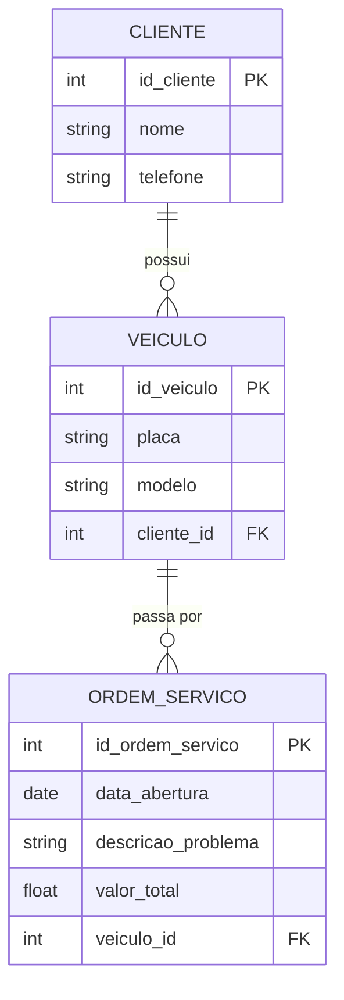
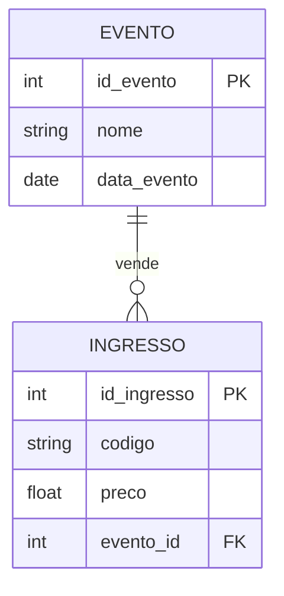
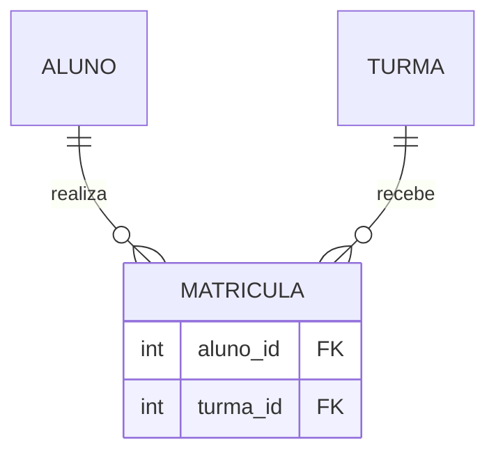
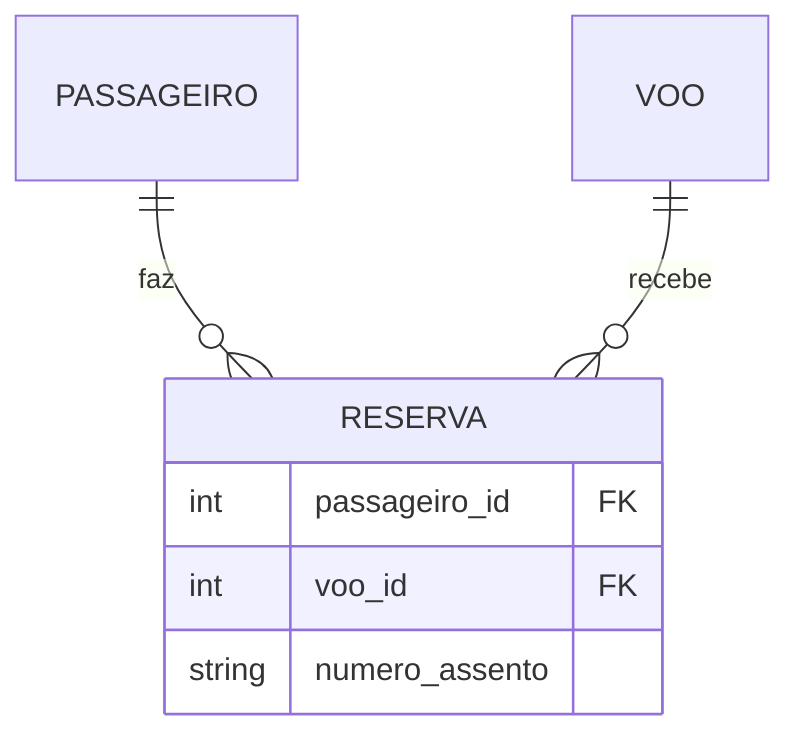
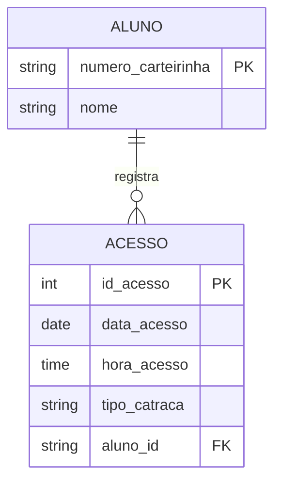

# Gabarito — Exercícios de Fixação da Aula 03

**Disciplina:** Banco de Dados e Aplicações  
**Professor:** Ronan Adriel Zenatti · ronan.zenatti@cps.sp.gov.br   
**Fatec Jahu — 2º Semestre/2026**

---

!!! warning "Antes de conferir"
    Assim como no gabarito da Aula 02: este documento mostra **uma** solução correta possível para cada exercício. O que importa é o raciocínio — sobretudo o método das perguntas-chave (Aula 03, Seção 2) e a regra de onde entra a FK (Aula 03, Seção 4). Se sua resposta divergir na cardinalidade, refaça as perguntas antes de assumir que está errada.

---

## Exercício 1 — Leitura de Diagrama

**a) Um fornecedor pode existir sem fornecer nenhum produto?** Sim. O símbolo `O{`, próximo a `FORNECEDOR`, descreve `PRODUTO` e começa com círculo — mínimo 0. Um fornecedor recém-cadastrado pode ainda não ter nenhum produto associado.

**b) Um produto pode existir sem estar vinculado a um fornecedor?** Não. O símbolo `||`, próximo a `PRODUTO`, descreve `FORNECEDOR` e começa com barra dupla — mínimo 1. Todo produto precisa ter um fornecedor.

**c) Cardinalidade em Min-Max:** `FORNECEDOR (0,N) ———— (1,1) PRODUTO`.

---

## Exercício 2 — Oficina Mecânica

**Raciocínio:** há duas cadeias 1:N encadeadas. `CLIENTE` (1) para `VEICULO` (N) — um cliente pode ter vários veículos, mas cada veículo pertence a exatamente um cliente (participação total: não faz sentido um veículo cadastrado sem dono). `VEICULO` (1) para `ORDEM_SERVICO` (N) — um veículo pode passar por várias ordens de serviço ao longo do tempo, mas cada ordem de serviço se refere a exatamente um veículo.

Seguindo a regra da Seção 4.1: a FK sempre fica no lado N. `cliente_id` fica em `VEICULO`; `veiculo_id` fica em `ORDEM_SERVICO`. Ambas seguem a Regra 6 (nome da tabela referenciada no singular + `_id`).

---

## Exercício 3 — Identifique o Tipo e Decomponha

**a) Ingresso e Evento → 1:N.** Um evento pode vender muitos ingressos; cada ingresso é válido para exatamente um evento. A FK `evento_id` fica em `INGRESSO`.

**b) Aluno e Turma → N:M.** Um aluno pode estar em várias turmas no mesmo semestre (ex: turmas de disciplinas diferentes); uma turma tem vários alunos. Entidade associativa: `MATRICULA`, com `aluno_id FK` e `turma_id FK`.

**c) Passageiro e Voo → N:M.** Um passageiro pode reservar assento em vários voos; um voo tem vários passageiros. Entidade associativa: `RESERVA`, com `passageiro_id FK`, `voo_id FK` e o atributo próprio `numero_assento` (que só faz sentido na combinação passageiro+voo, não em cada entidade isolada).

---

## Exercício 4 — Nomeação de PK e FK

Seguindo a Regra 5 (PK: `id_` + nome da tabela no singular):

| Tabela | Chave Primária |
|---|---|
| `editoras` | `id_editora` |
| `livros` | `id_livro` |
| `categorias` | `id_categoria` |

Seguindo a Regra 6 (FK: nome da tabela referenciada no singular + `_id`), a chave estrangeira que `livros` usa para referenciar `editoras` é **`editora_id`**.

---

## Exercício 5 — A Catraca da Academia

**Raciocínio:** o enunciado diz explicitamente que a carteirinha "funciona como identificador do aluno dentro da academia" — exatamente o mesmo papel que o código de barras cumpria para `PRODUTO` na Seção 5. Então a PK de `ALUNO` não precisa ser um número sequencial: pode ser o próprio `numero_carteirinha`. Um aluno pode ter zero ou muitos acessos registrados (um aluno recém-cadastrado ainda não passou pela catraca); cada acesso pertence a exatamente um aluno — 1:N clássico, FK no lado N.

Note que `aluno_id` (a FK em `ACESSO`) segue a Regra 6 normalmente — mesmo a PK de `ALUNO` não sendo um número, o nome da FK continua sendo `tabela_singular` + `_id`, e não `aluno_numero_carteirinha` ou algo do tipo. É o mesmo padrão aplicado no Exercício de `PRODUTO`/`codigo_barras` da Seção 5.

---

## 🔗 Voltar

⬅️ [Aula 03 — Relacionamentos e Cardinalidade](Aula_03_Relacionamentos_Cardinalidade.md)

---

*Fatec Jahu · IBD951 · Prof. Ronan Adriel Zenatti · 2026*
