# Aula 03 — Relacionamentos e Cardinalidade

**Disciplina:** Banco de Dados e Aplicações <br>
**Professor:** Ronan Adriel Zenatti · ronan.zenatti@cps.sp.gov.br  <br>
**Fatec Jahu — 2º Semestre/2026**

---

## 🎯 Objetivos da Aula

Ao final desta aula você deverá ser capaz de:
- Identificar relacionamentos entre entidades no modelo conceitual e aplicar o método das perguntas-chave para determinar a cardinalidade
- Ler e escrever cardinalidade nas notações Min-Max e Crow's Foot, evitando a confusão mais comum da disciplina (a posição dos símbolos)
- Explicar, na prática, como cada tipo de cardinalidade vira chave primária (PK) e chave estrangeira (FK) — inclusive em situações do dia a dia, como a leitura de um produto no caixa de um supermercado
- Reconhecer relacionamentos ternários e auto-relacionamentos
- Aplicar as convenções de nomenclatura obrigatórias da disciplina para nomear entidades, chaves primárias e chaves estrangeiras
- Visualizar e explorar diagramas também no dbdiagram.io, entendendo o básico da linguagem DBML

> 💡 **Sobre SQL:** esta aula **não** vai te ensinar a escrever `CREATE TABLE`. As convenções de nomenclatura que você vai aprender aqui já preparam o terreno para quando chegarmos lá (Aula 07 — SQL DDL), mas por enquanto o único objetivo é saber **modelar** corretamente. Colocar isso em SQL de verdade é outro passo, deliberadamente adiado.

---

## 🗺️ Mapa Mental da Aula

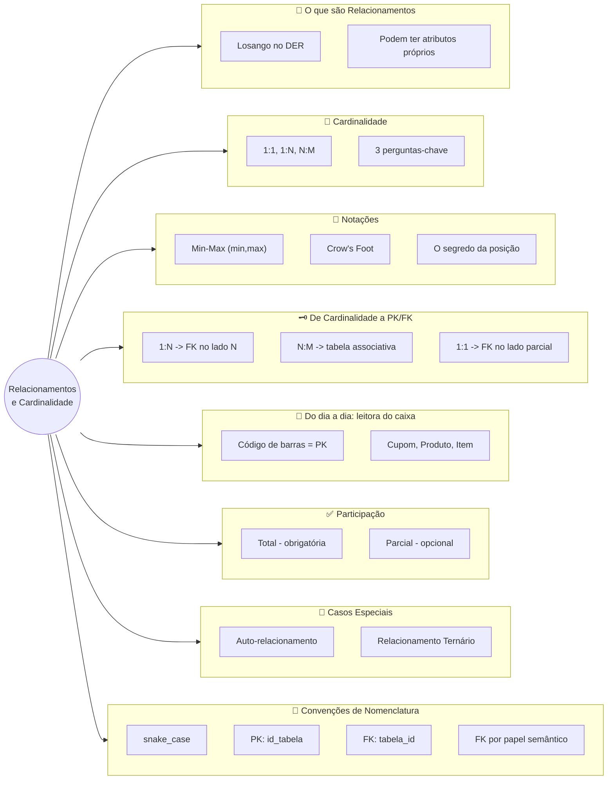

---

## 1. O que são Relacionamentos?

Entidades raramente existem de forma isolada. No mundo real, elas interagem: um `CLIENTE` realiza `PEDIDOS`, um `ALUNO` se matricula em `DISCIPLINAS`, um `FUNCIONÁRIO` trabalha em um `DEPARTAMENTO`. Essas interações entre entidades são chamadas de **relacionamentos**.


Um relacionamento é representado no DER por um losango conectado às entidades participantes. Assim como as entidades podem ter atributos, os relacionamentos também podem — e isso é um ponto que muitos estudantes não percebem de imediato. Pense num relacionamento `ALUNO` **se matricula em** `DISCIPLINA`: a `data_matricula` não pertence ao aluno nem à disciplina em si, mas sim ao evento da matrícula — ou seja, é um **atributo do relacionamento**.

> 📐 **Sobre os nomes das entidades nos diagramas:** você vai notar que, nos diagramas desta aula (e das anteriores), as entidades aparecem em **maiúsculas e no singular** — `CLIENTE`, `PEDIDO`, `FUNCIONARIO`. Essa é a convenção clássica de modelagem conceitual (Peter Chen): uma entidade representa "um tipo de coisa", então usamos o singular. Mais adiante nesta aula você vai conhecer as **convenções de nomenclatura oficiais da disciplina** — e vai notar que, quando essas entidades virarem **tabelas de verdade** no banco de dados (Aula 07), o nome muda para **plural e minúsculo** (`clientes`, `pedidos`, `funcionarios`). Não é inconsistência: são dois momentos diferentes da modelagem, cada um com sua convenção — e ambas vão valer a partir de agora, para toda a disciplina.

---

## 2. Cardinalidade: As Três Perguntas-Chave

A **cardinalidade** descreve *quantas* instâncias de uma entidade podem se relacionar com instâncias de outra entidade. É uma das informações mais importantes do modelo conceitual, pois ela determina diretamente como as tabelas serão estruturadas no modelo lógico — e, como você vai ver na Seção 4, também determina exatamente onde entra a chave estrangeira.

Antes de qualquer diagrama, antes de qualquer símbolo, existe um método simples e confiável para determinar a cardinalidade entre duas entidades: fazer **três perguntas**, sempre nos dois sentidos do relacionamento. Vamos usar um exemplo concreto — o relacionamento entre **Cliente** e **Pedido** — para aprender o método antes de aplicá-lo aos três tipos.

**Pergunta 1 — O mínimo (de A olhando para B):** *"Um [A] precisa obrigatoriamente ter pelo menos um [B]?"* — *"Um Cliente precisa obrigatoriamente ter pelo menos um Pedido?"* A resposta é **não**: um cliente pode ser cadastrado e nunca ter feito nenhum pedido. Mínimo = **0**.

**Pergunta 2 — O máximo (de A olhando para B):** *"Um [A] pode estar associado a mais de um [B]?"* — *"Um Cliente pode ter mais de um Pedido?"* A resposta é **sim**. Máximo = **N**.

**Pergunta 3 — Repita nos dois sentidos:** *"Um Pedido precisa obrigatoriamente pertencer a pelo menos um Cliente?"* → **Sim**, sempre. Mínimo = **1**. *"Um Pedido pode pertencer a mais de um Cliente?"* → **Não**. Máximo = **1**.

Resultado: **(0,N) — (1,1)**, ou seja: *"um cliente pode ter zero ou muitos pedidos; cada pedido pertence a exatamente um cliente."*

> 💡 **Memorize este método.** Sempre que tiver dúvida, pare, volte à regra de negócio em texto, e faça as três perguntas. A cardinalidade sempre vem das respostas — nunca da intuição.

Existem três tipos principais de cardinalidade, que resultam diretamente das respostas ao "máximo":

### 2.1 Relacionamento Um para Um (1:1)

Ocorre quando a resposta ao "pode ter mais de um?" é **não** nos dois sentidos. É o tipo mais raro na prática, e muitas vezes indica que as entidades poderiam ser fundidas em uma só — a menos que haja uma boa razão para separá-las (como segurança ou controle de acesso).

**Exemplo — Funcionário e Crachá:** cada funcionário possui exatamente um crachá de identificação, e cada crachá pertence a exatamente um funcionário.

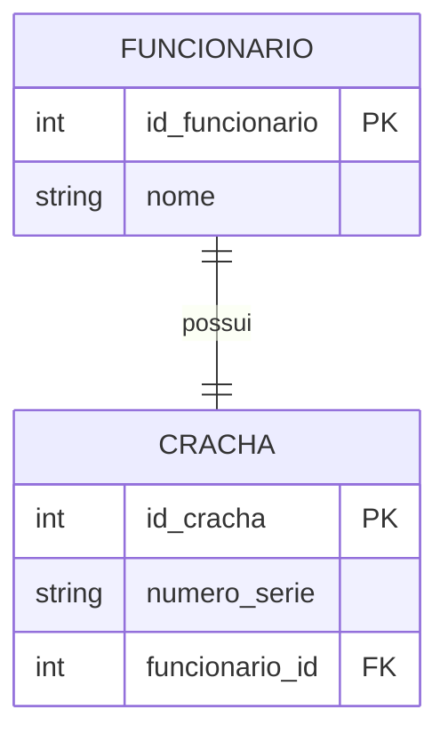

Perguntas-chave: *"Um funcionário pode ter mais de um crachá?"* → Não. *"Um crachá pode pertencer a mais de um funcionário?"* → Não. Logo, 1:1.

> 📐 **Convenção de nomenclatura (Regra 5 — chave primária):** repare que a chave primária de `FUNCIONARIO` se chama `id_funcionario` — não `id`, nem `codigo`. Essa é a regra oficial da disciplina: **toda PK segue o padrão `id_` + nome da tabela no singular**. Você já vinha vendo isso desde a Aula 01 sem que tivesse nome — agora tem: é a **Regra 5** das convenções de nomenclatura. Vamos ver a lista completa mais adiante, mas cada regra nova vai ser apresentada exatamente no primeiro lugar em que ela aparece, como agora.

> 📐 **Convenção de nomenclatura (Regra 6 — chave estrangeira):** já a chave estrangeira em `CRACHA` se chama `funcionario_id` — **repare que a ordem inverte**: a FK termina em `_id`, a PK começa com `id_`. Essa inversão não é acidente, é a **Regra 6**: o nome da FK usa o nome da tabela referenciada no singular, seguido de `_id`. É um erro comum (inclusive em material didático mais antigo) nomear a FK igual à PK que ela referencia — mas são papéis diferentes, e nomes diferentes deixam isso claro à primeira vista.

**🔎 Veja este diagrama no dbdiagram.io:**

Além do Mermaid (que você acabou de ver acima), você também pode desenhar e visualizar diagramas ER usando o **dbdiagram.io**, um site gratuito que usa uma linguagem de texto chamada **DBML** — e cuja notação de cardinalidade, você vai perceber, é ainda mais direta que a do Mermaid.

```dbml
Table funcionarios {
  id_funcionario int [pk]
  nome varchar
}

Table crachas {
  id_cracha int [pk]
  funcionario_id int
  numero_serie varchar
}

Ref: crachas.funcionario_id > funcionarios.id_funcionario
```

A sintaxe é simples: `Table nome_da_tabela { ... }` declara uma tabela; cada linha dentro dela é `nome_da_coluna tipo`, e `[pk]` marca a chave primária. Não precisa decorar mais nada por enquanto — só isso já é suficiente para o próximo exemplo.

➡️ **[Abrir e explorar este diagrama no dbdiagram.io](https://dbdiagram.io/embed?c=VGFibGUgZnVuY2lvbmFyaW9zIHsKICBpZF9mdW5jaW9uYXJpbyBpbnQgW3BrXQogIG5vbWUgdmFyY2hhcgp9CgpUYWJsZSBjcmFjaGFzIHsKICBpZF9jcmFjaGEgaW50IFtwa10KICBmdW5jaW9uYXJpb19pZCBpbnQKICBudW1lcm9fc2VyaWUgdmFyY2hhcgp9CgpSZWY6IGNyYWNoYXMuZnVuY2lvbmFyaW9faWQgPiBmdW5jaW9uYXJpb3MuaWRfZnVuY2lvbmFyaW8K)** — clique para ver o mesmo modelo renderizado por outra ferramenta. Documentação oficial da linguagem: [dbml.dbdiagram.io/docs](https://dbml.dbdiagram.io/docs/).

**Outros exemplos de 1:1:**

- **País e Capital** — cada país tem exatamente uma capital, e cada capital pertence a exatamente um país. A capital não existe sem o país: participação total dos dois lados.
- **Pessoa e CNH** — uma pessoa pode ou não ter CNH (participação **parcial** do lado de Pessoa: mínimo 0), mas se tiver, possui apenas uma; e uma CNH pertence a exatamente uma pessoa (participação **total** do lado de CNH: mínimo 1).

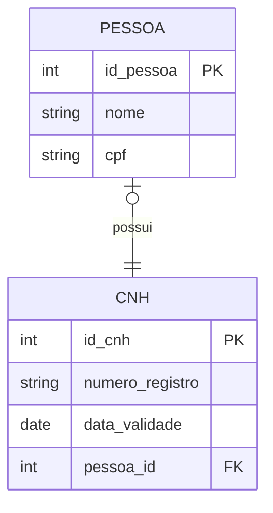

> 📌 **Dica de projeto:** em relacionamentos 1:1, a FK geralmente vai para a entidade com participação **parcial** — a que "depende" conceitualmente da outra. Aqui, `pessoa_id` vai em `CNH` porque a CNH depende da pessoa, não o contrário.

---

### 2.2 Relacionamento Um para Muitos (1:N)

É o tipo mais comum. A resposta a "pode ter mais de um?" é **sim** em apenas um dos sentidos.

**Exemplo — Departamento e Funcionários:** um departamento pode ter muitos funcionários, mas cada funcionário pertence a apenas um departamento.

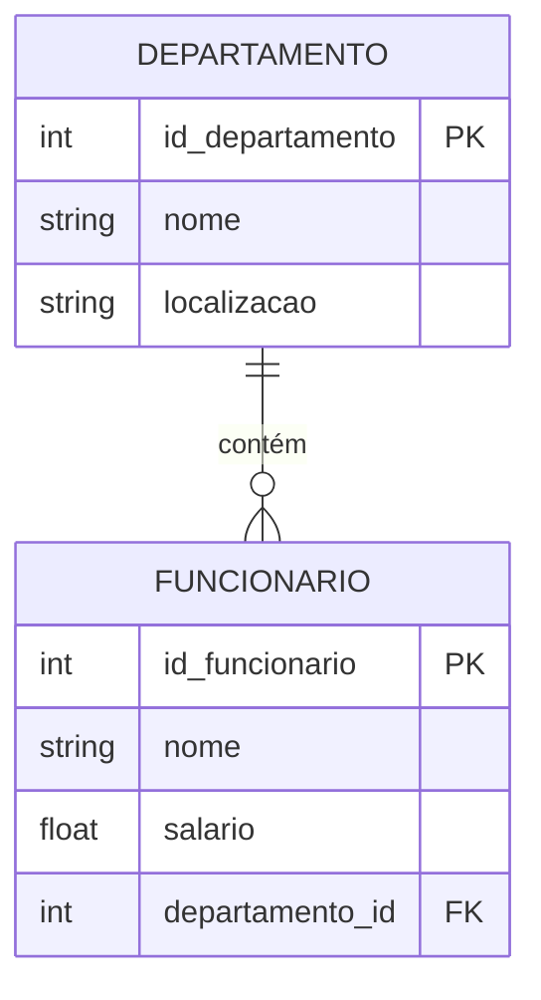

Perguntas aplicadas: *"Um departamento pode ter mais de um funcionário?"* → Sim (lado N). *"Um funcionário pode pertencer a mais de um departamento?"* → Não (lado 1). Logo, 1:N, com o N do lado de `FUNCIONARIO` — e é exatamente por isso que `departamento_id` (a FK) fica na tabela `FUNCIONARIO`, não o contrário. Guarde essa observação: ela é a regra geral que a Seção 4 vai formalizar.

**Outros exemplos de 1:N:**

- **Categoria e Produtos** — uma categoria pode conter muitos produtos; cada produto pertence a exatamente uma categoria (`PRODUTO.categoria_id FK`).
- **Pedido e Nota Fiscal** — um pedido pode gerar várias notas fiscais (entregas parceladas, por exemplo); cada nota fiscal pertence a exatamente um pedido (`NOTA_FISCAL.pedido_id FK`). Esse exemplo é útil porque mostra que, mesmo onde intuitivamente esperaríamos 1:1 (um pedido, uma nota), a regra de negócio pode exigir 1:N — **a cardinalidade sempre vem da regra de negócio, nunca da suposição.**

---

### 2.3 Relacionamento Muitos para Muitos (N:M)

A resposta a "pode ter mais de um?" é **sim** nos dois sentidos. Mapeado para o modelo relacional, este tipo **sempre gera uma tabela intermediária** (tabela associativa ou de junção) — veremos o porquê exato na Seção 4.

**Exemplo — Aluno e Disciplina:** um aluno pode se matricular em várias disciplinas, e uma disciplina pode ter vários alunos matriculados. A matrícula em si carrega atributos próprios — `nota` e `data_matricula` — o que a torna uma **entidade associativa**.

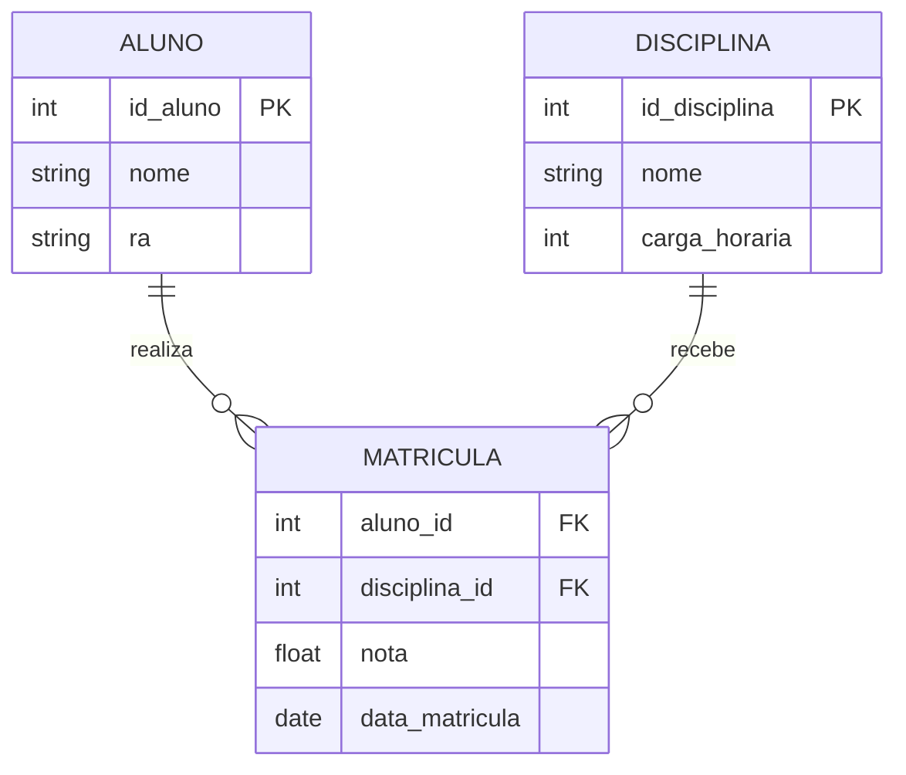

Note que o N:M original entre `ALUNO` e `DISCIPLINA` foi decomposto em **dois** relacionamentos 1:N através de `MATRICULA` — e cada um deles segue exatamente a mesma regra de FK que você acabou de ver na Seção 2.2.

**🔎 Veja este diagrama no dbdiagram.io:**

```dbml
Table alunos {
  id_aluno int [pk]
  nome varchar
}

Table disciplinas {
  id_disciplina int [pk]
  nome varchar
}

Table matriculas {
  aluno_id int
  disciplina_id int
  nota decimal
}

Ref: matriculas.aluno_id > alunos.id_aluno
Ref: matriculas.disciplina_id > disciplinas.id_disciplina
```

Mesma sintaxe de antes, só que com **dois** `Ref` — um para cada FK da tabela associativa. É assim que todo N:M vira DBML: uma tabela no meio, duas setas saindo dela.

➡️ **[Abrir e explorar este diagrama no dbdiagram.io](https://dbdiagram.io/embed?c=VGFibGUgYWx1bm9zIHsKICBpZF9hbHVubyBpbnQgW3BrXQogIG5vbWUgdmFyY2hhcgp9CgpUYWJsZSBkaXNjaXBsaW5hcyB7CiAgaWRfZGlzY2lwbGluYSBpbnQgW3BrXQogIG5vbWUgdmFyY2hhcgp9CgpUYWJsZSBtYXRyaWN1bGFzIHsKICBhbHVub19pZCBpbnQKICBkaXNjaXBsaW5hX2lkIGludAogIG5vdGEgZGVjaW1hbAp9CgpSZWY6IG1hdHJpY3VsYXMuYWx1bm9faWQgPiBhbHVub3MuaWRfYWx1bm8KUmVmOiBtYXRyaWN1bGFzLmRpc2NpcGxpbmFfaWQgPiBkaXNjaXBsaW5hcy5pZF9kaXNjaXBsaW5hCg%3D%3D)**

**Outros exemplos de N:M:**

- **Autor e Livro** (via `AUTORIA`) — um livro pode ter vários autores; um autor pode ter escrito vários livros. `AUTORIA` guarda `tipo_contribuicao` (autor principal, coautor...).
- **Médico e Paciente** (via `CONSULTA`) — um médico atende muitos pacientes; um paciente é atendido por vários médicos. `CONSULTA` guarda `data_hora`, `diagnostico`, `prescricao` — atributos ricos o suficiente para deixar claro que a entidade associativa tem vida própria, não existe só para "resolver" o N:M.

---

## 3. Notações: Min-Max e Crow's Foot

É fundamental conhecer as duas notações mais usadas, pois a literatura acadêmica usa uma e as ferramentas de mercado usam outra.

### 3.1 Notação Min-Max — (mínimo, máximo)

Proposta por Elmasri e Navathe — autores do livro-texto desta disciplina —, escreve explicitamente o par **(mínimo, máximo)** ao lado de cada entidade, **próximo à entidade que está sendo caracterizada**.

```
CLIENTE  (0,N)————————(1,1)  PEDIDO
```

Leitura: o par **(1,1)**, perto de PEDIDO, descreve o PEDIDO em relação ao CLIENTE — cada pedido pertence a no mínimo 1 e no máximo 1 cliente. O par **(0,N)**, perto de CLIENTE, descreve o CLIENTE em relação ao PEDIDO — cada cliente tem no mínimo 0 e no máximo N pedidos.

### 3.2 Notação Crow's Foot (Pé de Galinha)

É a notação padrão de mercado — usada no MySQL Workbench, no dbdiagram.io (na visualização gráfica) e em outras ferramentas profissionais. Os símbolos ficam nas **extremidades das linhas**, próximos à entidade **oposta** — e é exatamente aqui que mora a confusão clássica.

| Símbolo na ponta da linha | Significado |
|---|---|
| `\|` (barra vertical) | Exatamente um (mínimo 1, máximo 1) |
| `O` (círculo) | Zero (mínimo 0) |
| `<` ou `{` (pé de galinha) | Muitos (máximo N) |
| `O\|` | Zero ou um (mínimo 0, máximo 1) |
| `\|\|` | Um e somente um (mínimo 1, máximo 1) |
| `O{` | Zero ou muitos (mínimo 0, máximo N) |
| `\|{` | Um ou muitos (mínimo 1, máximo N) |

### 3.3 O Segredo da Posição — a maior dificuldade da disciplina

Se você perguntar a qualquer professor de banco de dados qual conceito mais confunde os alunos, a resposta quase sempre é a mesma: **cardinalidade**. O motivo tem uma causa bem específica: na notação Crow's Foot, o símbolo que indica a cardinalidade de uma entidade fica do lado **oposto** a ela — a cardinalidade de `ALUNO` é anotada perto de `DISCIPLINA`, e vice-versa. Isso contraria o instinto de associar o número ao objeto mais próximo.

```
         você lê daqui ──────────────────────────────────► para cá

CLIENTE  ──────────────────────────────────────────────── PEDIDO
         O{                                          ||
         ▲                                           ▲
         │                                           │
         Este símbolo está                    Este símbolo está
         próximo a CLIENTE,                   próximo a PEDIDO,
         mas descreve PEDIDO                  mas descreve CLIENTE
```

**Como ler corretamente, passo a passo:** (1) coloque o dedo sobre `CLIENTE`; (2) deslize o olhar pela linha até o símbolo que está do **lado de CLIENTE** (início da linha); (3) esse símbolo descreve quantos `PEDIDOS` um `CLIENTE` pode ter — no exemplo, `O{` = zero ou muitos. (4) Agora vá até o símbolo no **lado de PEDIDO** (final da linha); (5) esse símbolo descreve quantos `CLIENTES` um `PEDIDO` pode ter — no exemplo, `||` = exatamente um.

> 🔑 **A regra de ouro:** o símbolo próximo à entidade A descreve a entidade B, e vice-versa. Sempre leia o símbolo do lado *oposto* à entidade que você está descrevendo. Quando esta regra estiver automatizada no seu raciocínio, a notação Crow's Foot se torna completamente intuitiva.

**Dicionário de tradução entre as duas notações:**

| Leitura | Min-Max | Crow's Foot (próximo à entidade descrita) |
|---|---|---|
| Zero ou um | (0,1) | `O\|` |
| Exatamente um | (1,1) | `\|\|` |
| Zero ou muitos | (0,N) | `O{` |
| Um ou muitos | (1,N) | `\|{` |

---

## 4. De Cardinalidade para PK e FK: A Conexão Prática

Até aqui você aprendeu a **identificar** e **notar** a cardinalidade — mas essa informação não fica só no papel. Ela determina, de forma mecânica e previsível, exatamente onde vai a chave primária e onde vai a chave estrangeira quando o modelo vira tabelas de verdade. Essa é a peça que faltava para fechar o ciclo entre "desenhar o diagrama" e "isso vira banco de dados".

### 4.1 A regra do 1:N — a mais importante de todas

**Toda vez que você identificar um relacionamento 1:N, a chave estrangeira (FK) vai para a tabela do lado N — nunca para o lado 1.**

Relembrando o exemplo da Seção 2.2:

1. `DEPARTAMENTO` (lado 1) ganha sua PK normalmente: `id_departamento`.
2. `FUNCIONARIO` (lado N) ganha uma coluna extra — a FK `departamento_id` — que nada mais é do que **uma cópia do tipo da PK de `DEPARTAMENTO`**, funcionando como um "ponteiro": cada linha de `FUNCIONARIO` aponta para exatamente uma linha de `DEPARTAMENTO`.
3. É essa coluna extra que fisicamente materializa a linha do losango no diagrama — o relacionamento "vira" uma coluna real.

Por que a FK não pode ir no lado 1? Porque `DEPARTAMENTO` pode se relacionar com **vários** funcionários — se a FK estivesse lá, cada departamento só conseguiria guardar a referência de **um único** funcionário, o que contradiria a própria cardinalidade N.

### 4.2 A regra do N:M — por que sempre nasce uma tabela nova

Um relacionamento N:M não pode ser representado com uma FK simples, porque **nenhum dos dois lados** consegue guardar múltiplas referências em uma única coluna. A solução é criar uma **terceira tabela** — a entidade associativa (`MATRICULA`, `ITEM_CUPOM`, `AUTORIA`...) — que tem **duas FKs**, uma para cada tabela original, seguindo exatamente a regra 4.1 duas vezes: `MATRICULA.aluno_id` aponta para o lado 1 de `ALUNO`, e `MATRICULA.disciplina_id` aponta para o lado 1 de `DISCIPLINA`. O N:M "desaparece" e vira dois 1:N.

### 4.3 A regra do 1:1 — a exceção que depende do contexto

Como vimos na Seção 2.1, a FK geralmente vai para o lado de participação **parcial** (o lado "opcional", com mínimo 0) — porque esse é o lado que "depende" conceitualmente do outro para existir com sentido completo.

### Resumo da Seção 4

| Cardinalidade | Onde fica a FK |
|---|---|
| 1:N | Na tabela do lado **N** |
| N:M | Numa **tabela nova** (associativa), com duas FKs |
| 1:1 | No lado de participação **parcial** (o "dependente") |

---

## 5. Do Dia a Dia pro Banco: O Produto na Leitora do Caixa

Vamos aplicar tudo o que vimos até aqui num evento que você já viveu centenas de vezes: passar um produto na leitora do caixa de um supermercado.

Você já modelou esse cenário antes — sem saber ainda de cardinalidade nem de FK. Lá na [Aula 02, Seção 7](Aula_02_Modelagem_Entidades.md#7-passo-a-passo-do-cupom-fiscal-as-entidades), você decompôs um cupom fiscal em três entidades: `CUPOM_FISCAL`, `PRODUTO` e `ITEM_CUPOM`. Agora, com cardinalidade e PK/FK, dá pra fechar esse modelo por completo.

**O que acontece, passo a passo, quando o produto passa na leitora:**

1. A leitora óptica lê o **código de barras** impresso na embalagem. Esse código (o EAN/GTIN do produto) é, na prática, a **chave primária** da entidade `PRODUTO` no banco de dados da loja — cada produto tem um código único, e é assim que o sistema o identifica sem ambiguidade.
2. O sistema usa esse código para **buscar** o produto já cadastrado — ele não digita o nome nem o preço de novo a cada venda; ele só guarda a **referência** (a FK) para o produto que já existe na tabela `PRODUTO`.
3. Essa leitura vira uma nova linha na tabela `ITEM_CUPOM` — a entidade associativa entre `CUPOM_FISCAL` (o cupom sendo emitido naquele momento) e `PRODUTO` (o item lido).
4. Quando você recebe o cupom impresso, o sistema já reuniu, de várias tabelas diferentes, o nome e o preço de cada produto lido — uma operação chamada **JOIN**, que você vai estudar em detalhe numa aula futura. Por enquanto, basta entender que é a FK que torna esse reencontro de informações possível.

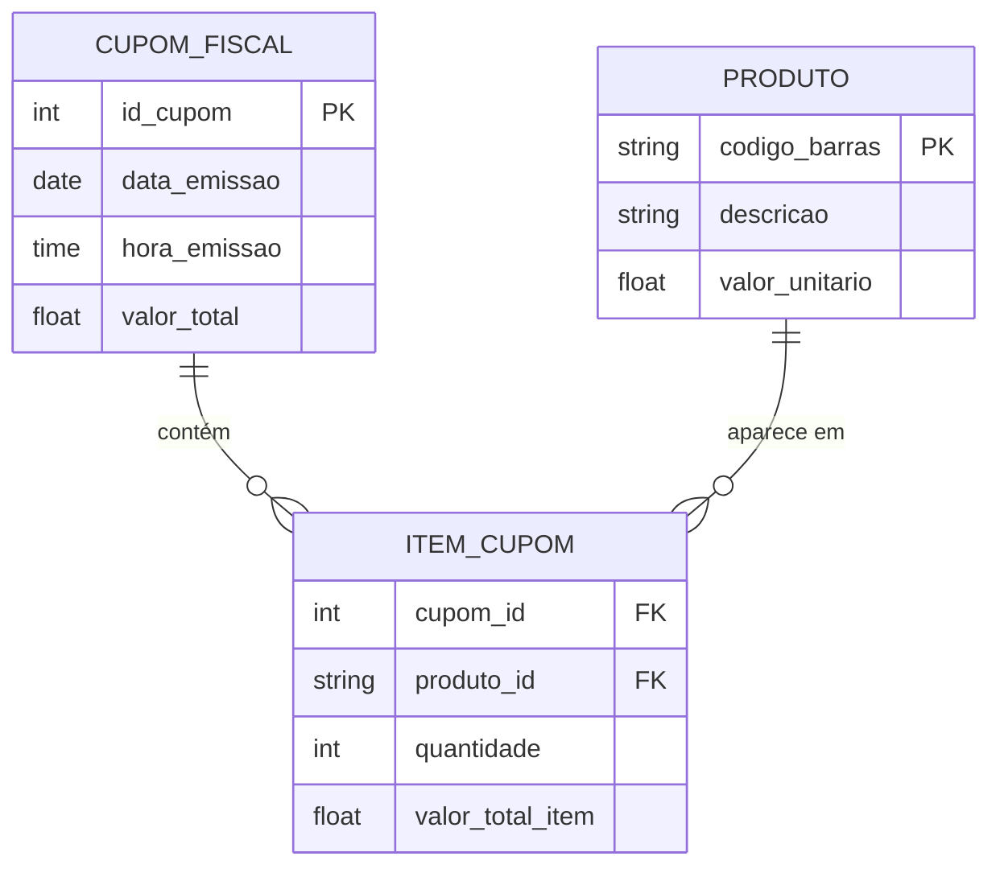

Perceba a cardinalidade aplicada: um `CUPOM_FISCAL` contém **zero ou muitos** `ITEM_CUPOM` (não existe cupom com zero itens na prática, mas na modelagem tratamos a criação do cupom e a leitura dos itens como dois passos); um `PRODUTO` aparece em **zero ou muitos** itens ao longo do tempo (um produto novo, recém-cadastrado, ainda pode não ter sido vendido nenhuma vez). É um N:M clássico entre `CUPOM_FISCAL` e `PRODUTO`, resolvido pela mesma regra da Seção 4.2.

> 📐 **Nota sobre a PK de `PRODUTO`:** aqui a chave primária não é um número sequencial (`id_produto`), é o próprio **código de barras** (`codigo_barras`) — um identificador que já existe no mundo real, fora do banco. Isso é perfeitamente válido: nem toda PK precisa ser um número auto-incrementado: ela só precisa ser única e não-nula. E note que a FK em `ITEM_CUPOM` continua se chamando `produto_id`, seguindo a Regra 6 — mesmo o valor sendo um código de barras, o nome da FK segue o padrão da tabela referenciada (`produtos` → `produto_id`), não o nome literal da coluna referenciada.

**🔎 Veja o modelo completo no dbdiagram.io:**

```dbml
Table cupons_fiscais {
  id_cupom int [pk]
  data_emissao date
  valor_total decimal
}

Table produtos {
  codigo_barras varchar [pk]
  descricao varchar
  valor_unitario decimal
}

Table itens_cupom {
  cupom_id int
  produto_id varchar
  quantidade int
  valor_total_item decimal
}

Ref: itens_cupom.cupom_id > cupons_fiscais.id_cupom
Ref: itens_cupom.produto_id > produtos.codigo_barras
```

➡️ **[Abrir e explorar este diagrama no dbdiagram.io](https://dbdiagram.io/embed?c=VGFibGUgY3Vwb25zX2Zpc2NhaXMgewogIGlkX2N1cG9tIGludCBbcGtdCiAgZGF0YV9lbWlzc2FvIGRhdGUKICB2YWxvcl90b3RhbCBkZWNpbWFsCn0KClRhYmxlIHByb2R1dG9zIHsKICBjb2RpZ29fYmFycmFzIHZhcmNoYXIgW3BrXQogIGRlc2NyaWNhbyB2YXJjaGFyCiAgdmFsb3JfdW5pdGFyaW8gZGVjaW1hbAp9CgpUYWJsZSBpdGVuc19jdXBvbSB7CiAgY3Vwb21faWQgaW50CiAgcHJvZHV0b19pZCB2YXJjaGFyCiAgcXVhbnRpZGFkZSBpbnQKICB2YWxvcl90b3RhbF9pdGVtIGRlY2ltYWwKfQoKUmVmOiBpdGVuc19jdXBvbS5jdXBvbV9pZCA+IGN1cG9uc19maXNjYWlzLmlkX2N1cG9tClJlZjogaXRlbnNfY3Vwb20ucHJvZHV0b19pZCA+IHByb2R1dG9zLmNvZGlnb19iYXJyYXMK)**

---

## 6. Participação: Total vs. Parcial

Além da cardinalidade máxima, precisamos indicar se a **participação** de uma entidade num relacionamento é **total** ou **parcial** — essa informação vem exatamente do **mínimo** que você calculou com as perguntas-chave da Seção 2.


A **participação total** (mínimo = 1) significa que toda instância da entidade *deve* obrigatoriamente participar do relacionamento — não pode existir uma instância "solta". Exemplo: todo `PEDIDO` obrigatoriamente pertence a um `CLIENTE`.

A **participação parcial** (mínimo = 0) significa que a entidade *pode* existir sem participar do relacionamento. Exemplo: nem todo `CLIENTE` precisa ter feito um pedido.

Para fixar: pense nas consequências práticas. Se tentarmos inserir um pedido sem informar o cliente, o banco deve rejeitar essa operação — isso é o que a participação total de `PEDIDO` representa em termos de restrições de integridade referencial (a FK `cliente_id` não pode ser nula).

---

## 7. Auto-Relacionamento

Um auto-relacionamento ocorre quando uma entidade se relaciona **consigo mesma**. O exemplo clássico é a hierarquia de funcionários: um `FUNCIONÁRIO` pode ser supervisor de outros funcionários, e cada funcionário tem (ou não) um supervisor — que também é um funcionário.

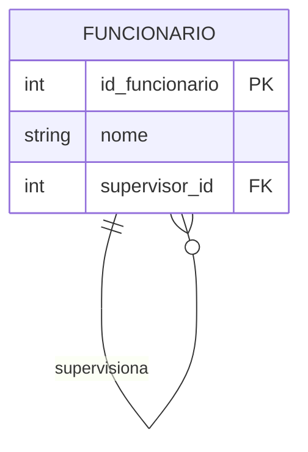

> 📐 **Convenção de nomenclatura (Regra 7 — FK pelo papel semântico):** aqui está o caso mais claro para entender essa regra. A FK **não** se chama `funcionario_id` — se chamasse, seria impossível saber, só pelo nome da coluna, se ela representa "o funcionário" ou "o supervisor dele" (afinal, ambos são registros da mesma tabela `FUNCIONARIO`). Por isso, quando uma FK referencia uma tabela cuja entidade pode exercer **papéis diferentes** dentro do relacionamento, a Regra 7 manda usar o **papel** no nome, não o nome da tabela: `supervisor_id`. O padrão de nomenclatura continua o mesmo (termina em `_id`), só que a palavra antes do `_id` comunica a função, não a origem.

---

## 8. Relacionamento Ternário

Quando três entidades participam de um único relacionamento, temos um **relacionamento ternário**. São mais complexos e devem ser usados apenas quando o negócio realmente exige que as três entidades sejam analisadas em conjunto para definir a ocorrência.

**Exemplo:** um `MÉDICO` prescreve um `MEDICAMENTO` para um `PACIENTE`. A combinação das três entidades define a prescrição — não faz sentido registrar "médico prescreve medicamento" sem saber para qual paciente.

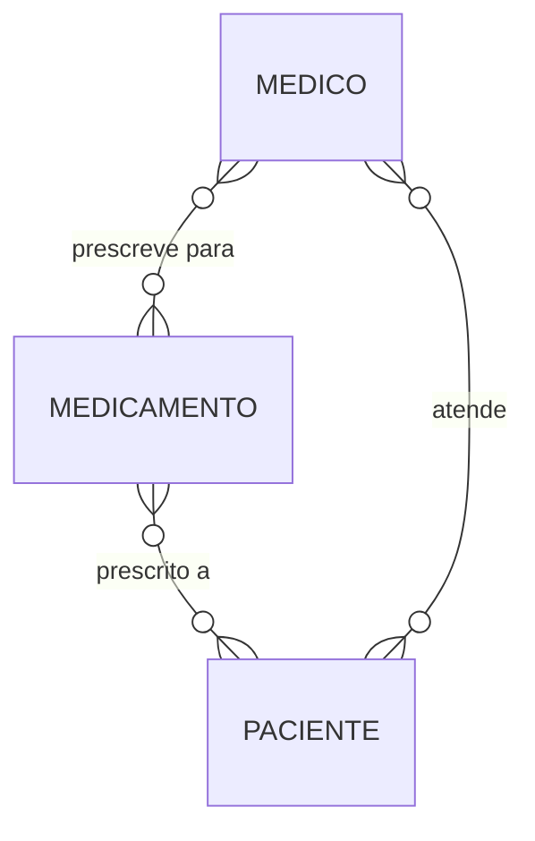

---

## 9. Exemplos Resolvidos

Três exemplos guiados, do jeito que você vai precisar resolver em prova: com o raciocínio completo, não só a resposta.

**Exemplo 1 — Leitura de Diagrama:**

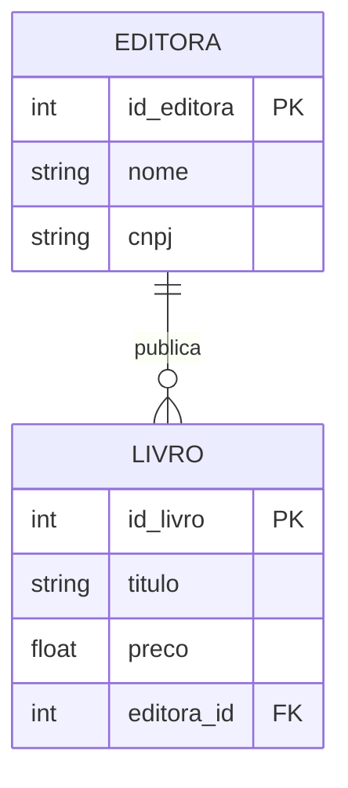

*a) Uma editora pode existir sem ter publicado nenhum livro?* Sim — o símbolo `O{` próximo a `EDITORA` (descrevendo `LIVRO`) começa com círculo, mínimo 0.
*b) Um livro pode existir sem estar vinculado a uma editora?* Não — o símbolo `||` próximo a `LIVRO` (descrevendo `EDITORA`) começa com barra dupla, mínimo 1.
*c) Cardinalidade em Min-Max:* `EDITORA (0,N) ———— (1,1) LIVRO`.

**Exemplo 2 — Construção a partir de Regras de Negócio:**

> *"Um professor pode orientar vários alunos de TCC. Um aluno tem exatamente um orientador, mas pode não ter escolhido ainda (início do semestre). Um professor pode não ter nenhum orientando."*

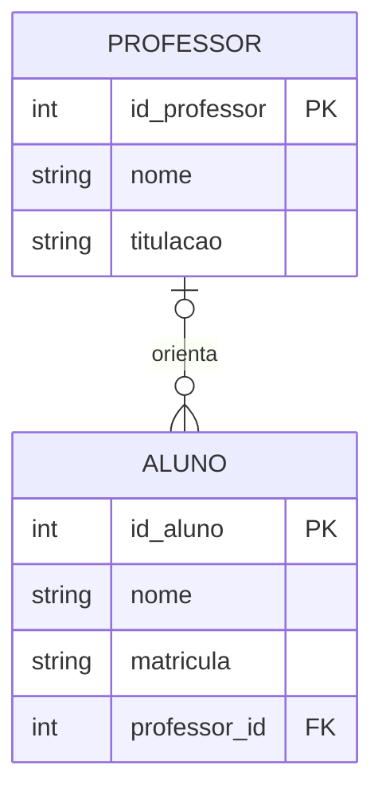

Raciocínio: um professor pode ter zero ou muitos orientandos (`O{`). Um aluno pode ter zero ou um orientador — nunca dois, porque a regra diz "exatamente um orientador", mas permite que ainda não tenha sido escolhido (`O|`). Min-Max: `PROFESSOR (0,N) ———— (0,1) ALUNO`.

**Exemplo 3 — Identifique o Tipo:**

Para cada situação, identifique 1:1, 1:N ou N:M:

*a) "Um produto pode estar em vários carrinhos de compra; um carrinho pode conter vários produtos; cada produto em um carrinho tem uma quantidade."* → **N:M** — entidade associativa `ITEM_CARRINHO`, com `carrinho_id FK`, `produto_id FK` e `quantidade`.
*b) "Um contrato de trabalho pertence a exatamente um funcionário, e um funcionário tem exatamente um contrato ativo."* → **1:1**, participação total dos dois lados.
*c) "Uma turma tem muitos alunos. Um aluno está em apenas uma turma por vez."* → **1:N** — `TURMA (1)` para `ALUNO (N)`; a FK `turma_id` vai em `ALUNO`.

---

## 10. Armadilhas Clássicas

**Armadilha 1 — Inverter os símbolos:** colocar o pé de galinha no lado errado é o erro mais comum. Lembre-se: o pé de galinha fica do lado da entidade que aparece **em quantidade**. Se muitos `ALUNOS` pertencem a uma `TURMA`, o pé de galinha fica do lado de `ALUNO`.

**Armadilha 2 — Confundir participação com cardinalidade máxima:** a participação (total/parcial) vem do **mínimo**, não do máximo. Um relacionamento pode ser 1:N com participação parcial (mínimo 0 de um lado) — e isso é perfeitamente válido.

**Armadilha 3 — Modelar como 1:N quando é N:M:** acontece quando você analisa o relacionamento em apenas um sentido. Sempre faça as perguntas **nos dois sentidos**.

**Armadilha 4 — Esquecer de decompor o N:M:** na modelagem conceitual, o N:M é válido. Mas na passagem para o modelo lógico, ele *obrigatoriamente* vira duas relações 1:N com uma tabela associativa no meio (Seção 4.2). Nunca se implementa um N:M "direto".

**Armadilha 5 — Nomear a FK igual à PK que ela referencia:** como vimos nas Regras 5 e 6, a PK começa com `id_` e a FK termina com `_id` — são padrões diferentes de propósito. Uma FK chamada `id_departamento` dentro da tabela `funcionarios` é ambígua: parece uma segunda PK.

---

## 📐 Convenções de Nomenclatura — Resumo

Ao longo desta aula, cada regra foi apresentada no momento em que apareceu pela primeira vez. Aqui está o resumo, para consulta rápida — a lista completa (com mais regras específicas de SQL) volta com força total na Aula 07:

| Regra | O que diz | Onde vimos |
|---|---|---|
| **1 — snake_case** | Nomes de colunas sempre com underline entre palavras, nunca `camelCase` | Em todos os atributos desde a Aula 01 |
| **4 — Entidade vs. Tabela** | No MER conceitual, entidade é singular e maiúscula (`CLIENTE`); quando virar tabela real, o nome muda para plural e minúsculo (`clientes`) | Seção 1 |
| **5 — PK: `id_` + tabela no singular** | `id_funcionario`, `id_produto`, `id_cliente` | Seção 2.1 |
| **6 — FK: tabela no singular + `_id`** | `departamento_id`, `categoria_id`, `produto_id` — a ordem inverte em relação à PK | Seção 2.1 |
| **7 — FK pelo papel semântico** | Quando a FK referencia uma tabela cuja entidade pode ter papéis diferentes, o nome usa o papel, não a tabela: `supervisor_id`, não `funcionario_id` | Seção 7 |

> 💡 **Por que isso importa de verdade:** convenção não é frescura estética. Quando **todo mundo** nomeia PK e FK do mesmo jeito, você para de gastar energia mental decidindo "como eu escrevi isso da última vez?" — e sobra atenção para o que realmente importa nesta fase da disciplina: **a modelagem em si**. Um diagrama de um colega, de uma aula passada, ou de você mesmo daqui a um ano, fica imediatamente legível, porque a nomenclatura não muda — só o domínio do problema muda.

---

## 🃏 Flashcards de Revisão

??? question "Quais são as três perguntas-chave para determinar cardinalidade entre A e B?"
    (1) Um A precisa obrigatoriamente ter pelo menos um B? → define o mínimo. (2) Um A pode ter mais de um B? → define o máximo. (3) Repita as duas perguntas no sentido contrário (de B para A).

??? question "Na notação Crow's Foot, o símbolo perto da entidade A descreve o quê?"
    Descreve a entidade do **outro lado** (B) — não a entidade ao lado da qual o símbolo está desenhado. Essa é a fonte da maior confusão da disciplina.

??? question "Em um relacionamento 1:N, em qual tabela fica a chave estrangeira?"
    Na tabela do lado **N** (muitos) — nunca no lado 1. A FK é uma cópia do tipo da PK do lado 1.

??? question "Como um relacionamento N:M é implementado no modelo lógico?"
    Cria-se uma tabela associativa nova, com duas chaves estrangeiras — uma para cada uma das tabelas originais — decompondo o N:M em dois relacionamentos 1:N.

??? question "Em um relacionamento 1:1, de que lado geralmente fica a chave estrangeira?"
    Do lado de participação **parcial** (mínimo 0) — a entidade que "depende" conceitualmente da outra para fazer sentido completo.

??? question "Qual a diferença entre participação total e parcial?"
    Participação total (mínimo 1): toda instância da entidade obrigatoriamente participa do relacionamento. Participação parcial (mínimo 0): a entidade pode existir sem participar.

??? question "O que é um auto-relacionamento? Dê um exemplo."
    É quando uma entidade se relaciona com ela mesma. Exemplo: FUNCIONARIO supervisiona FUNCIONARIO (hierarquia de supervisão).

??? question "Como se nomeia a PK de uma tabela `pedidos`? E a FK em `itens_pedidos` que referencia `produtos`?"
    PK de `pedidos`: `id_pedido` (Regra 5). FK em `itens_pedidos` para `produtos`: `produto_id` (Regra 6) — repare que a ordem das palavras inverte entre PK e FK.

??? question "Por que às vezes a FK usa um 'papel semântico' em vez do nome da tabela referenciada?"
    Porque, quando a mesma tabela pode ser referenciada em papéis diferentes dentro do mesmo relacionamento (como um funcionário que supervisiona outro funcionário), nomear a FK só com o nome da tabela seria ambíguo. O papel (`supervisor_id`) comunica a função; o nome da tabela sozinho não comunicaria.

---

## ✅ Quiz de Fixação

<quiz>
Uma editora publica muitos livros; cada livro pertence a exatamente uma editora. Qual é a cardinalidade desse relacionamento?
- [ ] 1:1
- [x] 1:N
- [ ] N:M
- [ ] Ternário

A resposta a "uma editora pode ter mais de um livro?" é sim; a resposta a "um livro pode ter mais de uma editora?" é não. Isso é 1:N, com o N do lado de LIVRO.
</quiz>

<quiz>
Na notação Crow's Foot, entre CLIENTE e PEDIDO, o símbolo `||` aparece próximo a PEDIDO. O que isso significa?
- [ ] Um pedido pode ter vários clientes
- [x] Cada pedido pertence a exatamente um cliente
- [ ] Um cliente só pode ter um pedido
- [ ] A participação do cliente é opcional

O símbolo perto de PEDIDO descreve CLIENTE (regra da posição oposta): `||` significa "exatamente um". Logo, cada pedido está associado a exatamente um cliente.
</quiz>

<quiz>
Em um relacionamento 1:N entre CATEGORIA (1) e PRODUTO (N), onde deve ficar a chave estrangeira?
- [ ] Em CATEGORIA, chamada categoria_id
- [x] Em PRODUTO, chamada categoria_id
- [ ] Em PRODUTO, chamada id_categoria
- [ ] Em uma tabela associativa nova

A FK sempre vai no lado N (PRODUTO), e segue a Regra 6 de nomenclatura: nome da tabela referenciada no singular + "_id" → categoria_id.
</quiz>

<quiz>
Quais destas afirmações sobre relacionamentos N:M são verdadeiras? (selecione todas as corretas)
- [x] Sempre exigem uma tabela associativa no modelo lógico
- [x] A tabela associativa costuma ter duas chaves estrangeiras
- [ ] Podem ser implementados com uma única FK, como no 1:N
- [x] A entidade associativa pode ter atributos próprios, como MATRICULA ou CONSULTA

N:M nunca vira uma FK simples — sempre precisa de uma tabela nova com FKs para as duas entidades originais, e essa tabela pode (e frequentemente deve) carregar atributos próprios do relacionamento.
</quiz>

<quiz>
Uma FK chamada supervisor_id, dentro da própria tabela FUNCIONARIO, é um exemplo de qual convenção?
- [ ] Regra 5 — nomenclatura de PK
- [ ] Regra 4 — entidade vs. tabela
- [x] Regra 7 — FK pelo papel semântico
- [ ] Nenhuma convenção — é um erro

Como a FK referencia a própria tabela FUNCIONARIO (auto-relacionamento), usar "funcionario_id" seria ambíguo. A Regra 7 resolve isso nomeando a FK pelo papel que ela representa no relacionamento — nesse caso, "supervisor".
</quiz>

<quiz>
No exemplo do cupom fiscal, por que o código de barras pode ser a chave primária de PRODUTO, mesmo não sendo um número sequencial gerado pelo banco?
- [ ] Toda PK precisa ser sequencial — esse exemplo está incorreto
- [x] Uma PK só precisa ser única e não-nula; um identificador do mundo real pode cumprir esse papel
- [ ] Só pode ser PK porque também é usado como FK em outra tabela
- [ ] Códigos de barras nunca podem ser chave primária em bancos relacionais

Chave primária não precisa ser um número gerado automaticamente — qualquer valor único e não-nulo serve, incluindo identificadores que já existem fora do banco, como o código de barras de um produto.
</quiz>

---

## ✏️ Exercícios de Fixação Práticos

Para cada exercício, identifique a cardinalidade (com o método das perguntas-chave), desenhe o diagrama (Mermaid ou dbdiagram.io, como preferir) e nomeie PK e FK seguindo as convenções desta aula.

**Exercício 1 — Leitura de Diagrama**

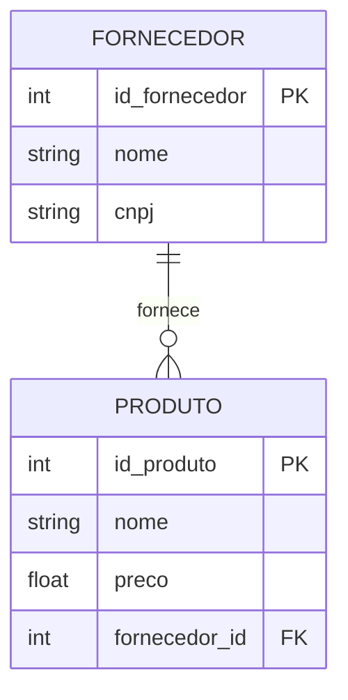

a) Um fornecedor pode existir sem fornecer nenhum produto? Justifique pelo símbolo.
b) Um produto pode existir sem estar vinculado a um fornecedor? Justifique pelo símbolo.
c) Escreva a cardinalidade na notação Min-Max.

---

**Exercício 2 — Construção a partir de Regras de Negócio**

*"Uma oficina mecânica atende vários clientes. Cada cliente pode ter vários veículos cadastrados, mas cada veículo pertence a exatamente um cliente. Cada veículo pode passar por várias ordens de serviço ao longo do tempo, e cada ordem de serviço se refere a exatamente um veículo."*

Construa o diagrama completo (três entidades), com cardinalidade, PK e FK nomeadas corretamente.

---

**Exercício 3 — Identifique o Tipo e Decomponha (quando for N:M)**

a) *"Um ingresso é válido para um único evento. Um evento pode vender milhares de ingressos."*
b) *"Um aluno pode estar matriculado em várias turmas no mesmo semestre. Uma turma tem vários alunos matriculados."*
c) *"Um passageiro pode ter reservado assento em vários voos ao longo do ano. Um voo tem vários passageiros reservados, e cada reserva registra o número do assento."*

Para cada item, diga se é 1:1, 1:N ou N:M. Para os que forem N:M, proponha a entidade associativa com seus atributos.

---

**Exercício 4 — Nomeação de PK e FK**

Dadas as tabelas abaixo (já no plural, seguindo a Regra 4), escreva o nome correto da chave primária de cada uma e, em seguida, o nome correto da chave estrangeira que `livros` usaria para referenciar `editoras`:

- `editoras`
- `livros`
- `categorias`

---

**Exercício 5 — Modelagem do Dia a Dia: a Catraca da Academia**

*"Toda vez que um aluno passa a carteirinha na catraca de uma academia, o sistema registra o acesso: data, hora e qual catraca (entrada ou saída) foi usada. Cada aluno tem uma carteirinha com um número único, que funciona como identificador do aluno dentro da academia. Um aluno pode ter muitos acessos registrados ao longo do tempo."*

Siga o mesmo raciocínio da Seção 5 (cupom fiscal): identifique as entidades, escolha a chave primária de `ALUNO` com base no enunciado, modele a cardinalidade entre `ALUNO` e `ACESSO`, e nomeie a FK corretamente.

---

📄 **[Ver gabarito dos exercícios →](Aula_03_Gabarito.md)**

> Tente resolver todos os exercícios antes de conferir — principalmente o Exercício 5, que reaproveita exatamente o raciocínio da Seção 5, só que em um domínio diferente.

---

## 📝 Resumo

Nesta aula aprendemos que relacionamentos descrevem as interações entre entidades e podem ter atributos próprios. A cardinalidade (1:1, 1:N, N:M) — determinada com o método das três perguntas-chave — é uma das informações mais críticas do modelo conceitual, porque impacta diretamente a estrutura das tabelas: vimos exatamente como cada tipo de cardinalidade se traduz em chave primária e chave estrangeira, inclusive num evento do dia a dia como a leitura de um produto no caixa de um supermercado. Aprendemos a distinguir participação total de parcial, conhecemos casos especiais como o auto-relacionamento e o relacionamento ternário, e vimos as duas notações mais usadas (Min-Max e Crow's Foot) — com atenção especial ao "segredo da posição" que mais confunde estudantes. Por fim, começamos a aplicar as convenções de nomenclatura oficiais da disciplina, que vão acompanhar todo o restante do curso.

---

## 🏆 Conquista da Aula

!!! success "Selo desbloqueado: 🔗 Mestre dos Relacionamentos"
    Você aprendeu a determinar cardinalidade com método, a ler Crow's Foot sem cair na armadilha da posição, e — o mais importante — a transformar isso em chave primária e estrangeira de verdade. Você já consegue explicar, em termos de banco de dados, o que acontece no caixa de qualquer supermercado. A próxima parada da Trilha do(a) Modelador(a) de Dados: transformar tudo isso no Modelo Lógico Relacional completo.

---

## 🔗 Navegação

⬅️ [Aula 02 — Modelagem Conceitual: Entidades](Aula_02_Modelagem_Entidades.md) · ➡️ 🔒 Aula 04 — em breve.

---

*Fatec Jahu · IBD951 · Prof. Ronan Adriel Zenatti · 2026*
