# Aula 03 — Relacionamentos e Cardinalidade

**Disciplina:** Banco de Dados e Aplicações <br>
**Professor:** Ronan Adriel Zenatti · ronan.zenatti@cps.sp.gov.br  <br>
**Fatec Jahu — 2º Semestre/2026**

---

## 🎯 Objetivos da Aula

Ao final desta aula você deverá ser capaz de:
- Definir o que é uma chave primária (PK), declará-la em DBML e justificar o tipo padrão desta disciplina (`BIGINT UNSIGNED`, com exceção para chaves naturais)
- Definir o que é uma chave estrangeira (FK), declará-la em DBML, explicar por que seu tipo precisa casar com o da PK referenciada, e aplicar suas restrições (integridade referencial e nulabilidade)
- Aplicar de cor as 9 regras oficiais de nomenclatura da disciplina, reconhecendo-as em qualquer exemplo, checkpoint ou exercício
- Identificar relacionamentos entre entidades no modelo conceitual e aplicar o método das perguntas-chave para determinar a cardinalidade
- Ler e escrever cardinalidade nas notações Min-Max e Crow's Foot, evitando a confusão mais comum da disciplina (a posição dos símbolos)
- Explicar, na prática, onde cada tipo de cardinalidade posiciona a PK e a FK já conhecidas — inclusive em situações do dia a dia, como a leitura de um produto no caixa de um supermercado
- Mapear uma hierarquia de generalização/especialização (Aula 02) para tabelas de verdade, escolhendo entre as estratégias possíveis e justificando a recomendada pela disciplina
- Reconhecer relacionamentos ternários e auto-relacionamentos
- Visualizar e explorar diagramas também no dbdiagram.io, entendendo o básico da linguagem DBML

> 💡 **Sobre SQL:** esta aula **não** vai te ensinar a escrever `CREATE TABLE`. Você vai sair daqui sabendo exatamente quais tabelas, colunas, PKs e FKs o seu modelo precisa — o **Modelo Lógico Relacional** completo —, mas ainda em notação textual e DBML, não em SQL de verdade. As convenções de nomenclatura que você vai aprender aqui já preparam o terreno para quando chegarmos lá (Aula 06 — SQL DDL). Colocar isso em SQL de verdade é outro passo, deliberadamente adiado.

---

## 🗺️ Mapa Mental da Aula

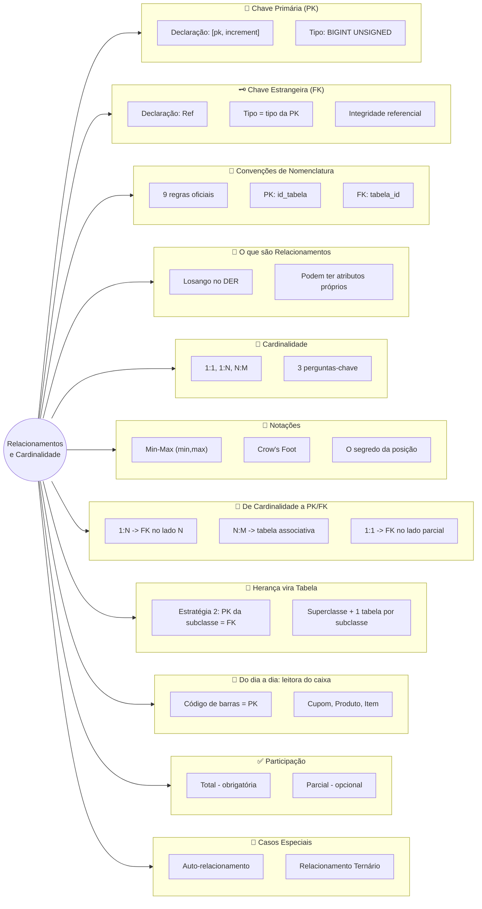

---

## 1. Chave Primária (PK)

Antes de entrar em relacionamentos e cardinalidade, vamos fixar dois blocos de construção que vão aparecer em **toda** tabela do curso a partir de agora: a chave primária e a chave estrangeira. Depois deles, uma parada rápida pelas convenções de nomenclatura completas — e só então começamos os relacionamentos propriamente ditos.

Uma **chave primária (PK — Primary Key)** é a coluna (ou conjunto de colunas) que identifica **de forma única** cada linha de uma tabela. Duas regras não-negociáveis: o valor precisa ser **único** (nenhuma linha repete o valor de outra) e **não-nulo** (toda linha precisa ter um valor).

### 1.1 Como declarar uma PK

Em DBML (a linguagem do dbdiagram.io, que você vai usar o curso inteiro), a PK é marcada com o atributo `[pk]` na coluna:

```dbml
Table produtos {
  id_produto BIGINT UNSIGNED [pk, increment]
  descricao  VARCHAR(255)
}
```

`increment` diz que o valor é gerado automaticamente pelo banco, incrementando a cada nova linha (1, 2, 3...) — você nunca escolhe ou informa esse valor manualmente. Isso é o que chamamos de **chave substituta** (surrogate key): um identificador artificial, sem significado no mundo real, criado só para o banco distinguir as linhas.

> 💡 **Adiantando:** em SQL de verdade (Aula 06 — SQL DDL), a mesma ideia se escreve `id_produto BIGINT UNSIGNED PRIMARY KEY AUTO_INCREMENT`. A sintaxe muda, o conceito é idêntico — você já sai desta aula sabendo o que essa linha de SQL vai significar.

### 1.2 O tipo de uma PK

**Convenção desta disciplina: toda PK substituta usa o tipo `BIGINT UNSIGNED` com `increment`.** É o padrão que você vai ver em toda tabela, em todo exemplo, a partir de agora — não porque `BIGINT` seja "o tipo certo" universalmente (dimensionar tipo por tipo é assunto da Aula 06), mas porque adotar um único padrão para toda PK evita ter que decidir, tabela por tabela, "será que `INT` é grande o suficiente?". `BIGINT UNSIGNED` comporta até ~18,4 quintilhões de linhas — nunca vai faltar.

Existe uma exceção deliberada: quando a entidade já tem um identificador único **do mundo real** (uma **chave natural**, como o código de barras de um produto), ele pode ser usado como PK diretamente, com o tipo que fizer sentido para ele (`VARCHAR`, por exemplo) — você vai ver esse caso na Seção 9 (o produto na leitora do caixa).

### 1.3 O nome de uma PK

O nome segue a **Regra 5** das convenções desta disciplina (Seção 3, a seguir): `id_` + nome da tabela no singular. Tabela `produtos` → PK `id_produto`. Tabela `funcionarios` → PK `id_funcionario`.

---

## 2. Chave Estrangeira (FK)

Uma **chave estrangeira (FK — Foreign Key)** é a coluna que materializa um relacionamento: ela vive numa tabela e guarda o valor da PK de **outra** tabela (ou até da mesma tabela, no caso de auto-relacionamento — Seção 11), funcionando como um "ponteiro" entre as duas linhas.

### 2.1 Como declarar uma FK

Em DBML, a FK é uma coluna comum — sem `[pk]` — mais uma linha `Ref` que declara explicitamente a relação:

```dbml
Table produtos {
  id_produto BIGINT UNSIGNED [pk, increment]
  descricao  VARCHAR(255)
}

Table itens_pedido {
  id_item_pedido BIGINT UNSIGNED [pk, increment]
  produto_id     BIGINT UNSIGNED [not null]
}

Ref: itens_pedido.produto_id > produtos.id_produto
```

`Ref: tabela_origem.coluna_fk > tabela_destino.coluna_pk` — o símbolo `>` aponta da FK para a PK que ela referencia. É essa linha que faz o dbdiagram.io desenhar a linha de conexão entre as duas tabelas no diagrama.

### 2.2 O tipo de uma FK

**Regra de integridade, não de estilo: a FK precisa ter exatamente o mesmo tipo da PK que ela referencia.** Se `produtos.id_produto` é `BIGINT UNSIGNED`, então toda FK que aponta para ele — `produto_id`, em qualquer tabela — também precisa ser `BIGINT UNSIGNED`. Isso não é opcional: o banco compara o valor da FK com os valores da PK para checar se a linha referenciada existe, e essa comparação exige tipos compatíveis.

Isso vale inclusive para o caso de chave natural (Seção 1.2): se `produtos.codigo_barras` (a PK) for `VARCHAR`, toda FK que apontar para ele também precisa ser `VARCHAR` — mesmo sendo menos comum que `BIGINT UNSIGNED`.

### 2.3 Restrições de uma FK

Duas restrições sempre valem para uma FK:

1. **Integridade referencial:** todo valor não-nulo de uma FK precisa existir como valor de PK na tabela referenciada. O banco rejeita, na origem, um `INSERT` ou `UPDATE` que tente gravar uma FK apontando para uma linha que não existe — é impossível ter `pedidos.cliente_id = 999` se não existe `clientes.id_cliente = 999`.
2. **Aceita ou não `NULL`, dependendo da participação:** se a entidade que carrega a FK **precisa** obrigatoriamente do relacionamento (participação total — você vai formalizar isso na Seção 10), a coluna é `NOT NULL`. Se o relacionamento é opcional (participação parcial), a FK pode ser `NULL` — a linha existe mesmo sem apontar para nada ainda.

### 2.4 O nome de uma FK

Segue a **Regra 6** (tabela referenciada no singular + `_id`) ou, quando a tabela referenciada pode ter papéis diferentes no mesmo relacionamento, a **Regra 7** (nome do papel + `_id`) — ambas detalhadas na Seção 3, a seguir.

---

## 3. Convenções de Nomenclatura desta Disciplina {: #convencoes-de-nomenclatura }

Antes de ver o primeiro relacionamento, conheça de uma vez as **9 regras oficiais** de nomenclatura desta disciplina — a Regra 5 e a Regra 6 você acabou de ver aplicadas nas Seções 1 e 2. Todo exemplo, checkpoint e exercício **desta aula em diante** segue todas elas.

| Regra | O que diz | Exemplo |
|---|---|---|
| **1 — snake_case** | Nomes de colunas sempre com underline entre palavras, nunca `camelCase` | `data_nascimento`, não `DataNascimento` |
| **2 — minúsculas** | Nomes criados por você (atributos, entidades quando viram tabelas) sempre em letras minúsculas | `produtos`, `valor_unitario` |
| **3 — palavras reservadas em maiúsculas** | Comandos e tipos SQL/DBML ficam em maiúsculas — só o que você nomeia fica minúsculo (Regra 2) | `BIGINT UNSIGNED`, `NOT NULL`, `PRIMARY KEY` |
| **4 — Entidade vs. Tabela** | No MER conceitual, entidade é singular e maiúscula (`CLIENTE`); quando vira tabela real, o nome muda para plural e minúsculo (`clientes`) | `CLIENTE` (conceitual) → `clientes` (tabela) |
| **5 — PK: `id_` + tabela no singular** | Toda chave primária segue este padrão, sem exceção de nome | `id_funcionario`, `id_produto`, `id_cliente` |
| **6 — FK: tabela no singular + `_id`** | A ordem inverte em relação à PK — repare bem nisso | `departamento_id`, `categoria_id`, `produto_id` |
| **7 — FK pelo papel semântico** | Quando a FK referencia uma tabela cuja entidade pode ter papéis diferentes, o nome usa o papel, não a tabela | `supervisor_id`, não `funcionario_id` |
| **8 — Tipo e tamanho adequados ao dado** | Escolher o tipo pelo domínio real do dado, nunca "o que parece mais simples" | `DECIMAL` para dinheiro, nunca `FLOAT`/`DOUBLE` |
| **9 — Toda tabela tem campos de log** | `criado_em`, `atualizado_em`, `deletado_em` em toda tabela, sem exceção — inclusive tabelas associativas e de subclasse | Detalhada por completo na Aula 07 |

> 💡 **Por que isso importa de verdade:** convenção não é frescura estética. Quando **todo mundo** nomeia PK e FK do mesmo jeito, você para de gastar energia mental decidindo "como eu escrevi isso da última vez?" — e sobra atenção para o que realmente importa nesta fase da disciplina: **a modelagem em si**. Um diagrama de um colega, de uma aula passada, ou de você mesmo daqui a um ano, fica imediatamente legível, porque a nomenclatura não muda — só o domínio do problema muda.

> 📏 **Sobre as Regras 3, 8 e 9:** elas aparecem aqui de forma introdutória porque dependem de sintaxe SQL que ainda vamos formalizar nas Aulas 06 (tipos, Regra 8) e 07 (constraints, Regra 9). Isso não as torna opcionais — só significa que você vai vê-las com mais profundidade mais adiante. **Todo exemplo desta aula já segue todas as 9**, mesmo as que ainda não foram detalhadas por completo.

---

## 4. O que são Relacionamentos?

Entidades raramente existem de forma isolada. No mundo real, elas interagem: um `CLIENTE` realiza `PEDIDOS`, um `ALUNO` se matricula em `DISCIPLINAS`, um `FUNCIONÁRIO` trabalha em um `DEPARTAMENTO`. Essas interações entre entidades são chamadas de **relacionamentos**.

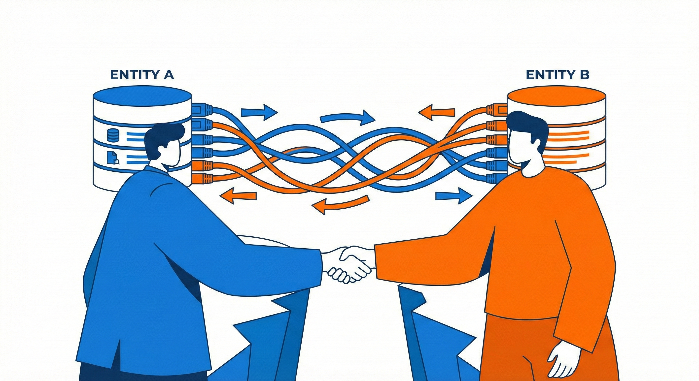

Um relacionamento é representado no DER por um losango conectado às entidades participantes. Assim como as entidades podem ter atributos, os relacionamentos também podem — e isso é um ponto que muitos estudantes não percebem de imediato. Pense num relacionamento `ALUNO` **se matricula em** `DISCIPLINA`: a `data_matricula` não pertence ao aluno nem à disciplina em si, mas sim ao evento da matrícula — ou seja, é um **atributo do relacionamento**.

> 📐 **Sobre os nomes das entidades nos diagramas:** você vai notar que, nos diagramas desta aula (e das anteriores), as entidades aparecem em **maiúsculas e no singular** — `CLIENTE`, `PEDIDO`, `FUNCIONARIO`. Essa é a convenção clássica de modelagem conceitual (Peter Chen): uma entidade representa "um tipo de coisa", então usamos o singular. Você já viu, nas Seções 1 a 3, que quando essas entidades viram **tabelas de verdade** no banco de dados, o nome muda para **plural e minúsculo** (`clientes`, `pedidos`, `funcionarios`) — é a Regra 4. Não é inconsistência: são dois momentos diferentes da modelagem, cada um com sua convenção — e ambas vão valer a partir de agora, para toda a disciplina.

---

## 5. Cardinalidade: As Três Perguntas-Chave

A **cardinalidade** descreve *quantas* instâncias de uma entidade podem se relacionar com instâncias de outra entidade. É uma das informações mais importantes do modelo conceitual, pois ela determina diretamente como as tabelas serão estruturadas no modelo lógico — e, como você vai ver na Seção 7, também determina exatamente onde entra a chave estrangeira que você já conhece das Seções 1 e 2.

Antes de qualquer diagrama, antes de qualquer símbolo, existe um método simples e confiável para determinar a cardinalidade entre duas entidades: fazer **três perguntas**, sempre nos dois sentidos do relacionamento. Vamos usar um exemplo concreto — o relacionamento entre **Cliente** e **Pedido** — para aprender o método antes de aplicá-lo aos três tipos.

**Pergunta 1 — O mínimo (de A olhando para B):** *"Um [A] precisa obrigatoriamente ter pelo menos um [B]?"* — *"Um Cliente precisa obrigatoriamente ter pelo menos um Pedido?"* A resposta é **não**: um cliente pode ser cadastrado e nunca ter feito nenhum pedido. Mínimo = **0**.

**Pergunta 2 — O máximo (de A olhando para B):** *"Um [A] pode estar associado a mais de um [B]?"* — *"Um Cliente pode ter mais de um Pedido?"* A resposta é **sim**. Máximo = **N**.

**Pergunta 3 — Repita nos dois sentidos:** *"Um Pedido precisa obrigatoriamente pertencer a pelo menos um Cliente?"* → **Sim**, sempre. Mínimo = **1**. *"Um Pedido pode pertencer a mais de um Cliente?"* → **Não**. Máximo = **1**.

Resultado: **(0,N) — (1,1)**, ou seja: *"um cliente pode ter zero ou muitos pedidos; cada pedido pertence a exatamente um cliente."*

> 💡 **Memorize este método.** Sempre que tiver dúvida, pare, volte à regra de negócio em texto, e faça as três perguntas. A cardinalidade sempre vem das respostas — nunca da intuição.

Existem três tipos principais de cardinalidade, que resultam diretamente das respostas ao "máximo":

### 5.1 Relacionamento Um para Um (1:1)

Ocorre quando a resposta ao "pode ter mais de um?" é **não** nos dois sentidos. É o tipo mais raro na prática, e muitas vezes indica que as entidades poderiam ser fundidas em uma só — a menos que haja uma boa razão para separá-las (como segurança ou controle de acesso).

**Exemplo — Funcionário e Crachá:** cada funcionário possui exatamente um crachá de identificação, e cada crachá pertence a exatamente um funcionário.

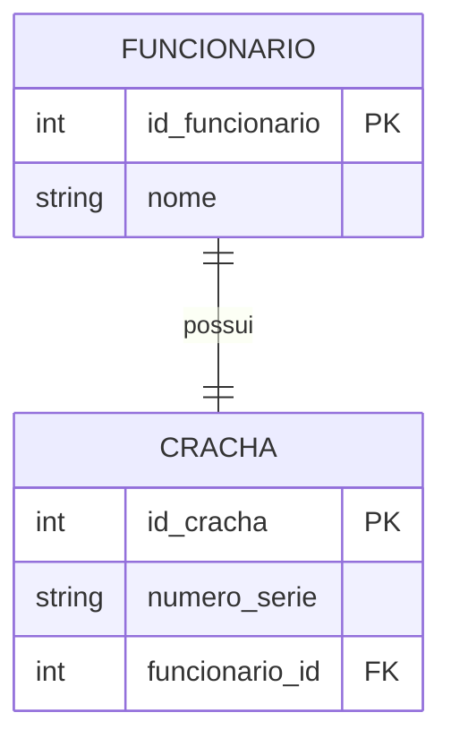

Perguntas-chave: *"Um funcionário pode ter mais de um crachá?"* → Não. *"Um crachá pode pertencer a mais de um funcionário?"* → Não. Logo, 1:1.

> 📐 **Relembrando as Regras 5 e 6 (Seção 3):** a chave primária de `FUNCIONARIO` se chama `id_funcionario`, seguindo a Regra 5 (`id_` + tabela no singular). A chave estrangeira em `CRACHA` se chama `funcionario_id`, seguindo a Regra 6 — repare que a ordem inverte: a FK termina em `_id`, a PK começa com `id_`. É um erro comum nomear a FK igual à PK que ela referencia, mas são papéis diferentes, e nomes diferentes deixam isso claro à primeira vista.

**🔎 Veja este diagrama no dbdiagram.io:**

Além do Mermaid (que você acabou de ver acima), você também pode desenhar e visualizar diagramas ER usando o **dbdiagram.io**, um site gratuito que usa uma linguagem de texto chamada **DBML** — e cuja notação de cardinalidade, você vai perceber, é ainda mais direta que a do Mermaid.

```dbml
Table funcionarios {
  id_funcionario BIGINT UNSIGNED [pk, increment]
  nome VARCHAR(255)
}

Table crachas {
  id_cracha BIGINT UNSIGNED [pk, increment]
  funcionario_id BIGINT UNSIGNED
  numero_serie VARCHAR(50)
}

Ref: crachas.funcionario_id > funcionarios.id_funcionario
```

A sintaxe é simples: `Table nome_da_tabela { ... }` declara uma tabela; cada linha dentro dela é `nome_da_coluna tipo`, e `[pk]` marca a chave primária — exatamente como você viu nas Seções 1 e 2. Não precisa decorar mais nada por enquanto — só isso já é suficiente para o próximo exemplo.

➡️ **[Abrir e explorar este diagrama no dbdiagram.io](https://dbdiagram.io/embed?c=VGFibGUgZnVuY2lvbmFyaW9zIHsKICBpZF9mdW5jaW9uYXJpbyBCSUdJTlQgVU5TSUdORUQgW3BrLCBpbmNyZW1lbnRdCiAgbm9tZSBWQVJDSEFSKDI1NSkKfQoKVGFibGUgY3JhY2hhcyB7CiAgaWRfY3JhY2hhIEJJR0lOVCBVTlNJR05FRCBbcGssIGluY3JlbWVudF0KICBmdW5jaW9uYXJpb19pZCBCSUdJTlQgVU5TSUdORUQKICBudW1lcm9fc2VyaWUgVkFSQ0hBUig1MCkKfQoKUmVmOiBjcmFjaGFzLmZ1bmNpb25hcmlvX2lkID4gZnVuY2lvbmFyaW9zLmlkX2Z1bmNpb25hcmlvCg%3D%3D)** — clique para ver o mesmo modelo renderizado por outra ferramenta. Documentação oficial da linguagem: [dbml.dbdiagram.io/docs](https://dbml.dbdiagram.io/docs/).

**Outros exemplos de 1:1:**

- **País e Capital** — cada país tem exatamente uma capital, e cada capital pertence a exatamente um país. A capital não existe sem o país: participação total dos dois lados.
- **Pessoa e CNH** — uma pessoa pode ou não ter CNH (participação **parcial** do lado de Pessoa: mínimo 0), mas se tiver, possui apenas uma; e uma CNH pertence a exatamente uma pessoa (participação **total** do lado de CNH: mínimo 1).

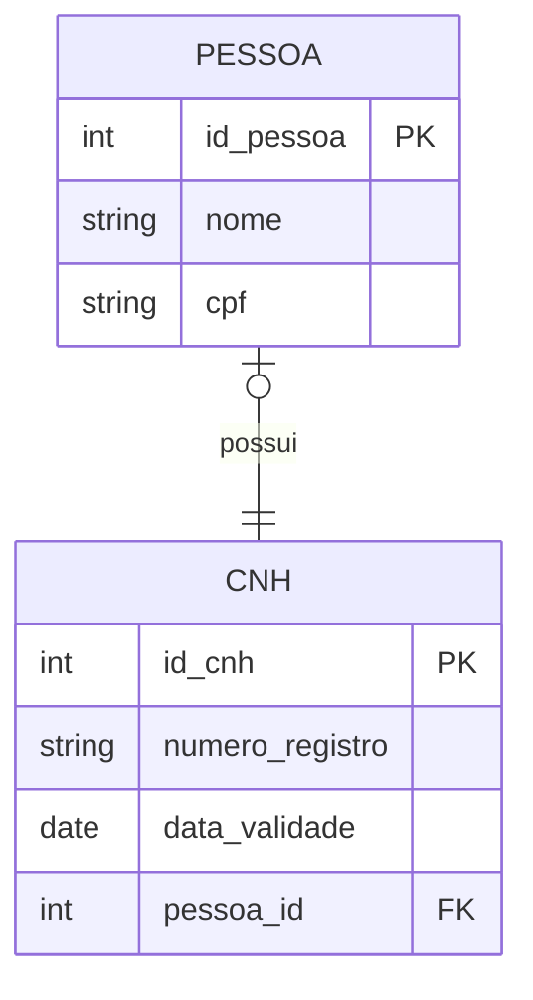

> 📌 **Dica de projeto:** em relacionamentos 1:1, a FK geralmente vai para a entidade com participação **parcial** — a que "depende" conceitualmente da outra. Aqui, `pessoa_id` vai em `CNH` porque a CNH depende da pessoa, não o contrário.

---

### 5.2 Relacionamento Um para Muitos (1:N)

É o tipo mais comum. A resposta a "pode ter mais de um?" é **sim** em apenas um dos sentidos.

**Exemplo — Departamento e Funcionários:** um departamento pode ter muitos funcionários, mas cada funcionário pertence a apenas um departamento.

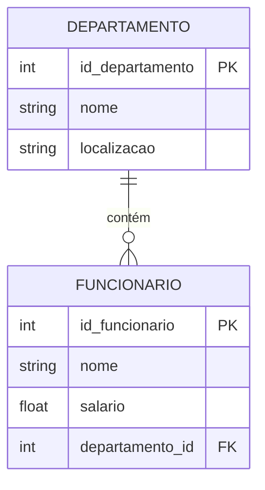

Perguntas aplicadas: *"Um departamento pode ter mais de um funcionário?"* → Sim (lado N). *"Um funcionário pode pertencer a mais de um departamento?"* → Não (lado 1). Logo, 1:N, com o N do lado de `FUNCIONARIO` — e é exatamente por isso que `departamento_id` (a FK) fica na tabela `FUNCIONARIO`, não o contrário. Guarde essa observação: ela é a regra geral que a Seção 7 vai formalizar.

**Outros exemplos de 1:N:**

- **Categoria e Produtos** — uma categoria pode conter muitos produtos; cada produto pertence a exatamente uma categoria (`PRODUTO.categoria_id FK`).
- **Pedido e Nota Fiscal** — um pedido pode gerar várias notas fiscais (entregas parceladas, por exemplo); cada nota fiscal pertence a exatamente um pedido (`NOTA_FISCAL.pedido_id FK`). Esse exemplo é útil porque mostra que, mesmo onde intuitivamente esperaríamos 1:1 (um pedido, uma nota), a regra de negócio pode exigir 1:N — **a cardinalidade sempre vem da regra de negócio, nunca da suposição.**

---

### 5.3 Relacionamento Muitos para Muitos (N:M)

A resposta a "pode ter mais de um?" é **sim** nos dois sentidos. Mapeado para o modelo relacional, este tipo **sempre gera uma tabela intermediária** (tabela associativa ou de junção) — veremos o porquê exato na Seção 7.

**Exemplo — Aluno e Disciplina:** um aluno pode se matricular em várias disciplinas, e uma disciplina pode ter vários alunos matriculados. A matrícula em si carrega atributos próprios — `nota` e `data_matricula` — o que a torna uma **entidade associativa**.

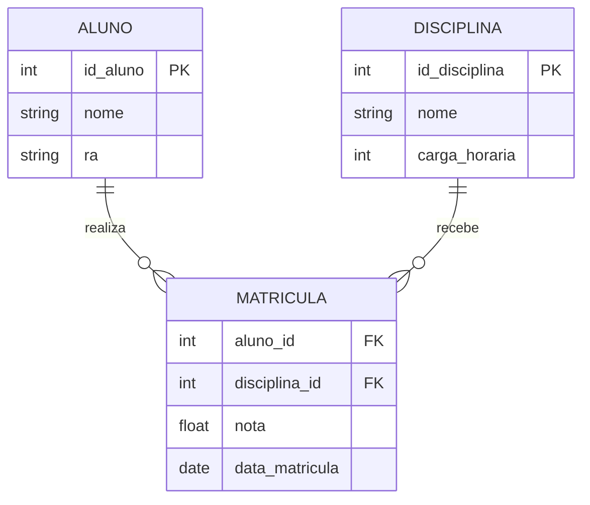

Note que o N:M original entre `ALUNO` e `DISCIPLINA` foi decomposto em **dois** relacionamentos 1:N através de `MATRICULA` — e cada um deles segue exatamente a mesma regra de FK que você acabou de ver na Seção 5.2.

**🔎 Veja este diagrama no dbdiagram.io:**

```dbml
Table alunos {
  id_aluno BIGINT UNSIGNED [pk, increment]
  nome VARCHAR(255)
}

Table disciplinas {
  id_disciplina BIGINT UNSIGNED [pk, increment]
  nome VARCHAR(255)
}

Table matriculas {
  aluno_id BIGINT UNSIGNED
  disciplina_id BIGINT UNSIGNED
  nota DECIMAL(4,2)
}

Ref: matriculas.aluno_id > alunos.id_aluno
Ref: matriculas.disciplina_id > disciplinas.id_disciplina
```

Mesma sintaxe de antes, só que com **dois** `Ref` — um para cada FK da tabela associativa. É assim que todo N:M vira DBML: uma tabela no meio, duas setas saindo dela.

➡️ **[Abrir e explorar este diagrama no dbdiagram.io](https://dbdiagram.io/embed?c=VGFibGUgYWx1bm9zIHsKICBpZF9hbHVubyBCSUdJTlQgVU5TSUdORUQgW3BrLCBpbmNyZW1lbnRdCiAgbm9tZSBWQVJDSEFSKDI1NSkKfQoKVGFibGUgZGlzY2lwbGluYXMgewogIGlkX2Rpc2NpcGxpbmEgQklHSU5UIFVOU0lHTkVEIFtwaywgaW5jcmVtZW50XQogIG5vbWUgVkFSQ0hBUigyNTUpCn0KClRhYmxlIG1hdHJpY3VsYXMgewogIGFsdW5vX2lkIEJJR0lOVCBVTlNJR05FRAogIGRpc2NpcGxpbmFfaWQgQklHSU5UIFVOU0lHTkVECiAgbm90YSBERUNJTUFMKDQsMikKfQoKUmVmOiBtYXRyaWN1bGFzLmFsdW5vX2lkID4gYWx1bm9zLmlkX2FsdW5vClJlZjogbWF0cmljdWxhcy5kaXNjaXBsaW5hX2lkID4gZGlzY2lwbGluYXMuaWRfZGlzY2lwbGluYQo%3D)**

**Outros exemplos de N:M:**

- **Autor e Livro** (via `AUTORIA`) — um livro pode ter vários autores; um autor pode ter escrito vários livros. `AUTORIA` guarda `tipo_contribuicao` (autor principal, coautor...).
- **Médico e Paciente** (via `CONSULTA`) — um médico atende muitos pacientes; um paciente é atendido por vários médicos. `CONSULTA` guarda `data_hora`, `diagnostico`, `prescricao` — atributos ricos o suficiente para deixar claro que a entidade associativa tem vida própria, não existe só para "resolver" o N:M.

!!! example "🔍 Checkpoint 1 — Cardinalidade: plataforma de streaming de música"
    Uma plataforma de streaming de música tem as seguintes regras de negócio: (a)
    um `USUARIO` pode criar várias `PLAYLIST`, e cada playlist pertence a exatamente
    um usuário; (b) uma `PLAYLIST` pode conter várias `MUSICA`, e uma música pode
    estar em várias playlists diferentes; (c) um `USUARIO` tem exatamente uma
    `ASSINATURA` ativa por vez, e uma assinatura pertence a exatamente um usuário.
    Para cada uma das três relações (a, b, c), aplique as perguntas-chave da Seção 5
    e identifique o tipo de cardinalidade (1:1, 1:N ou N:M), justificando.

    🔑 Resolução no [Gabarito da Aula 03](Aula_03_Gabarito.md#checkpoint-1) — tente resolver antes de conferir.

---

## 6. Notações: Min-Max e Crow's Foot

É fundamental conhecer as duas notações mais usadas, pois a literatura acadêmica usa uma e as ferramentas de mercado usam outra.

### 6.1 Notação Min-Max — (mínimo, máximo)

Proposta por Elmasri e Navathe — autores do livro-texto desta disciplina —, escreve explicitamente o par **(mínimo, máximo)** ao lado de cada entidade, **próximo à entidade que está sendo caracterizada**.

```
CLIENTE  (0,N)————————(1,1)  PEDIDO
```

Leitura: o par **(1,1)**, perto de PEDIDO, descreve o PEDIDO em relação ao CLIENTE — cada pedido pertence a no mínimo 1 e no máximo 1 cliente. O par **(0,N)**, perto de CLIENTE, descreve o CLIENTE em relação ao PEDIDO — cada cliente tem no mínimo 0 e no máximo N pedidos.

### 6.2 Notação Crow's Foot (Pé de Galinha)

É a notação padrão de mercado — usada no MySQL Workbench, no dbdiagram.io (na visualização gráfica) e em outras ferramentas profissionais. Os símbolos ficam nas **extremidades das linhas**, próximos à entidade **oposta** — e é exatamente aqui que mora a confusão clássica.

| Símbolo na ponta da linha | Significado |
|---|---|
| `\|` (barra vertical) | Exatamente um (mínimo 1, máximo 1) |
| `O` (círculo) | Zero (mínimo 0) |
| `<` ou `{` (pé de galinha) | Muitos (máximo N) |
| `O\|` | Zero ou um (mínimo 0, máximo 1) |
| `\|\|` | Um e somente um (mínimo 1, máximo 1) |
| `O{` | Zero ou muitos (mínimo 0, máximo N) |
| `\|{` | Um ou muitos (mínimo 1, máximo N) |

### 6.3 O Segredo da Posição — a maior dificuldade da disciplina

Se você perguntar a qualquer professor de banco de dados qual conceito mais confunde os alunos, a resposta quase sempre é a mesma: **cardinalidade**. O motivo tem uma causa bem específica: na notação Crow's Foot, o símbolo que indica a cardinalidade de uma entidade fica do lado **oposto** a ela — a cardinalidade de `ALUNO` é anotada perto de `DISCIPLINA`, e vice-versa. Isso contraria o instinto de associar o número ao objeto mais próximo.

```
         você lê daqui ──────────────────────────────────► para cá

CLIENTE  ──────────────────────────────────────────────── PEDIDO
         O{                                          ||
         ▲                                           ▲
         │                                           │
         Este símbolo está                    Este símbolo está
         próximo a CLIENTE,                   próximo a PEDIDO,
         mas descreve PEDIDO                  mas descreve CLIENTE
```

**Como ler corretamente, passo a passo:** (1) coloque o dedo sobre `CLIENTE`; (2) deslize o olhar pela linha até o símbolo que está do **lado de CLIENTE** (início da linha); (3) esse símbolo descreve quantos `PEDIDOS` um `CLIENTE` pode ter — no exemplo, `O{` = zero ou muitos. (4) Agora vá até o símbolo no **lado de PEDIDO** (final da linha); (5) esse símbolo descreve quantos `CLIENTES` um `PEDIDO` pode ter — no exemplo, `||` = exatamente um.

> 🔑 **A regra de ouro:** o símbolo próximo à entidade A descreve a entidade B, e vice-versa. Sempre leia o símbolo do lado *oposto* à entidade que você está descrevendo. Quando esta regra estiver automatizada no seu raciocínio, a notação Crow's Foot se torna completamente intuitiva.

**Dicionário de tradução entre as duas notações:**

| Leitura | Min-Max | Crow's Foot (próximo à entidade descrita) |
|---|---|---|
| Zero ou um | (0,1) | `O\|` |
| Exatamente um | (1,1) | `\|\|` |
| Zero ou muitos | (0,N) | `O{` |
| Um ou muitos | (1,N) | `\|{` |

!!! example "🔍 Checkpoint 2 — Notações: locadora de veículos"
    A relação entre `FILIAL` e `VEICULO` de uma locadora é descrita assim em
    Crow's Foot: `FILIAL ────O{─────||──── VEICULO` (o símbolo `O{` fica do lado de
    `FILIAL`, e o símbolo `||` fica do lado de `VEICULO`). Aplicando a "regra de
    ouro" da Seção 6.3: (a) o símbolo `O{`, perto de `FILIAL`, descreve qual das
    duas entidades, e o que ele significa? (b) o símbolo `||`, perto de `VEICULO`,
    descreve qual das duas entidades, e o que ele significa? (c) escreva essa mesma
    cardinalidade na notação Min-Max, no formato `FILIAL (min,max) ———— (min,max)
    VEICULO`.

    🔑 Resolução no [Gabarito da Aula 03](Aula_03_Gabarito.md#checkpoint-2) — tente resolver antes de conferir.

---

## 7. De Cardinalidade para PK e FK: Onde Elas Vão

Você já sabe **o que é** uma PK e uma FK, como declará-las e suas restrições (Seções 1 e 2). O que falta agora é saber **onde** cada uma vai quando o modelo vira tabelas de verdade — e é a cardinalidade que responde essa pergunta, de forma mecânica e previsível. Essa é a peça que faltava para fechar o ciclo entre "desenhar o diagrama" e "isso vira banco de dados".

### 7.1 A regra do 1:N — a mais importante de todas

**Toda vez que você identificar um relacionamento 1:N, a chave estrangeira (FK) vai para a tabela do lado N — nunca para o lado 1.**

Relembrando o exemplo da Seção 5.2:

1. `DEPARTAMENTO` (lado 1) ganha sua PK normalmente: `id_departamento`.
2. `FUNCIONARIO` (lado N) ganha uma coluna extra — a FK `departamento_id` — que nada mais é do que **uma cópia do tipo da PK de `DEPARTAMENTO`**, funcionando como um "ponteiro": cada linha de `FUNCIONARIO` aponta para exatamente uma linha de `DEPARTAMENTO`.
3. É essa coluna extra que fisicamente materializa a linha do losango no diagrama — o relacionamento "vira" uma coluna real.

Por que a FK não pode ir no lado 1? Porque `DEPARTAMENTO` pode se relacionar com **vários** funcionários — se a FK estivesse lá, cada departamento só conseguiria guardar a referência de **um único** funcionário, o que contradiria a própria cardinalidade N.

### 7.2 A regra do N:M — por que sempre nasce uma tabela nova

Um relacionamento N:M não pode ser representado com uma FK simples, porque **nenhum dos dois lados** consegue guardar múltiplas referências em uma única coluna. A solução é criar uma **terceira tabela** — a entidade associativa (`MATRICULA`, `ITEM_CUPOM`, `AUTORIA`...) — que tem **duas FKs**, uma para cada tabela original, seguindo exatamente a regra 7.1 duas vezes: `MATRICULA.aluno_id` aponta para o lado 1 de `ALUNO`, e `MATRICULA.disciplina_id` aponta para o lado 1 de `DISCIPLINA`. O N:M "desaparece" e vira dois 1:N.

### 7.3 A regra do 1:1 — a exceção que depende do contexto

Como vimos na Seção 5.1, a FK geralmente vai para o lado de participação **parcial** (o lado "opcional", com mínimo 0) — porque esse é o lado que "depende" conceitualmente do outro para existir com sentido completo.

### Resumo da Seção 7

| Cardinalidade | Onde fica a FK |
|---|---|
| 1:N | Na tabela do lado **N** |
| N:M | Numa **tabela nova** (associativa), com duas FKs |
| 1:1 | No lado de participação **parcial** (o "dependente") |

!!! example "🔍 Checkpoint 3 — De cardinalidade a PK/FK: sistema de manutenção industrial"
    Uma fábrica tem as entidades `MAQUINA` e `ORDEM_SERVICO`: uma máquina pode gerar
    várias ordens de serviço ao longo do tempo, mas cada ordem de serviço se refere
    a exatamente uma máquina. Além disso, uma `ORDEM_SERVICO` pode envolver vários
    `TECNICO`, e um técnico pode atuar em várias ordens de serviço diferentes.
    (a) Identifique a cardinalidade entre `MAQUINA` e `ORDEM_SERVICO`, e diga em
    qual das duas tabelas a chave estrangeira deve ficar, com o nome que ela deve
    ter (siga a Regra 6). (b) Identifique a cardinalidade entre `ORDEM_SERVICO` e
    `TECNICO`, e explique por que nenhuma FK simples resolve essa relação — proponha
    o nome da tabela associativa e suas duas FKs.

    🔑 Resolução no [Gabarito da Aula 03](Aula_03_Gabarito.md#checkpoint-3) — tente resolver antes de conferir.

---

## 8. De Generalização/Especialização para Tabelas {: #generalizacao-especializacao-tabelas }

Na [Aula 02, Seção 4](Aula_02_Modelagem_Entidades.md#4-generalizacao-e-especializacao), você aprendeu a modelar hierarquias como `VEICULO` → `CARRO`/`MOTO`/`CAMINHAO`: uma superclasse com os atributos comuns, e subclasses com os atributos exclusivos de cada tipo. Isso resolve o problema **no nível conceitual**. Mas, assim como toda entidade e todo relacionamento, essa hierarquia também precisa virar tabelas de verdade — e aqui, diferente do 1:N e do N:M, existe mais de uma forma de fazer isso, com tradeoffs bem diferentes.

### 8.1 Três Estratégias Possíveis

**Estratégia 1 — Tabela única com coluna discriminadora:** uma única tabela `veiculos`, com todos os atributos de todas as subclasses e uma coluna extra (`tipo_veiculo`) para indicar qual subtipo aquela linha representa.

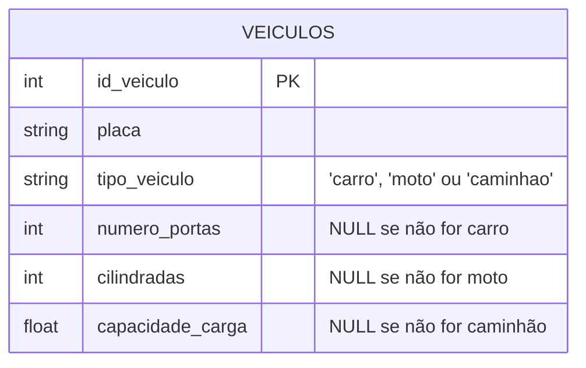

Problema: cada linha carrega colunas que **não fazem sentido** para o seu tipo (uma moto não tem `numero_portas`), sempre `NULL`. Quanto mais subclasses e mais atributos exclusivos, mais colunas inúteis por linha — e nada impede, só com PK/FK, que alguém preencha `cilindradas` numa linha marcada como `'carro'`.

**Estratégia 2 — Superclasse + uma tabela por subclasse (✅ recomendada nesta disciplina):** uma tabela para a superclasse com os atributos comuns, e **uma tabela por subclasse** contendo só os atributos exclusivos dela — cuja chave primária é, ao mesmo tempo, chave estrangeira única para a superclasse. É a mesma lógica de um 1:1 de participação total dos dois lados (Seção 5.1), só que aplicada a herança em vez de a duas entidades independentes.

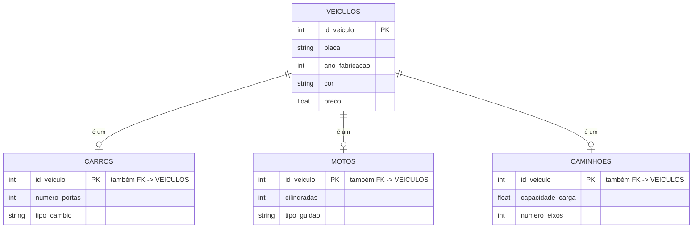

Nenhuma coluna fica órfã: `carros` só existe para veículos que são carros, e só tem colunas que fazem sentido para carro. Consultar "todos os veículos", independente do tipo, é uma query simples em `veiculos`. Consultar os detalhes de um carro específico é um JOIN entre `veiculos` e `carros` pela PK/FK compartilhada.

**Estratégia 3 — Tabelas totalmente separadas, sem tabela para a superclasse:** `carros`, `motos` e `caminhoes` cada uma com **todos** os seus atributos, inclusive os que seriam comuns (`placa`, `ano_fabricacao`, `cor`, `preco` repetidos nas três). Problema: duplica atributos comuns em várias tabelas (o mesmo risco de inconsistência que a Aula 02, Seção 4.1, já rejeitou no nível conceitual) e torna impossível consultar "todos os veículos" sem um `UNION` manual das três tabelas.

### 8.2 Por que a Estratégia 2 é a recomendada

| Estratégia | Nulos indevidos? | Duplica atributos comuns? | Consulta "todos os X" |
|---|---|---|---|
| 1 — Tabela única | Sim, vários por linha | Não | Trivial (mas mistura tipos) |
| 2 — Superclasse + subclasses (✅) | Não | Não | Trivial (consulta a superclasse) |
| 3 — Tabelas separadas | Não | Sim | Precisa `UNION` manual |

> 📐 **Convenção desta disciplina:** hierarquias de generalização/especialização **sempre** usam a Estratégia 2 — uma tabela para a superclasse, e uma tabela por subclasse cuja PK é, ao mesmo tempo, FK única para a superclasse. Repare que essa tabela de subclasse **não segue a Regra 5 normalmente**: sua PK não é um novo `id_` autoincrementado, é o mesmo valor da PK da superclasse, reaproveitado como FK — isso é o que garante, na própria estrutura do banco, que um carro só pode existir se já existir a linha correspondente em `veiculos`.

**🔎 Veja o modelo completo no dbdiagram.io:**

```dbml
Table veiculos {
  id_veiculo BIGINT UNSIGNED [pk, increment]
  placa VARCHAR(10)
  ano_fabricacao INT UNSIGNED
  cor VARCHAR(50)
  preco DECIMAL(10,2)
}

Table carros {
  id_veiculo BIGINT UNSIGNED [pk]
  numero_portas TINYINT UNSIGNED
  tipo_cambio VARCHAR(20)
}

Table motos {
  id_veiculo BIGINT UNSIGNED [pk]
  cilindradas INT UNSIGNED
  tipo_guidao VARCHAR(20)
}

Ref: carros.id_veiculo > veiculos.id_veiculo
Ref: motos.id_veiculo > veiculos.id_veiculo
```

➡️ **[Abrir e explorar este diagrama no dbdiagram.io](https://dbdiagram.io/embed?c=VGFibGUgdmVpY3Vsb3MgewogIGlkX3ZlaWN1bG8gQklHSU5UIFVOU0lHTkVEIFtwaywgaW5jcmVtZW50XQogIHBsYWNhIFZBUkNIQVIoMTApCiAgYW5vX2ZhYnJpY2FjYW8gSU5UIFVOU0lHTkVECiAgY29yIFZBUkNIQVIoNTApCiAgcHJlY28gREVDSU1BTCgxMCwyKQp9CgpUYWJsZSBjYXJyb3MgewogIGlkX3ZlaWN1bG8gQklHSU5UIFVOU0lHTkVEIFtwa10KICBudW1lcm9fcG9ydGFzIFRJTllJTlQgVU5TSUdORUQKICB0aXBvX2NhbWJpbyBWQVJDSEFSKDIwKQp9CgpUYWJsZSBtb3RvcyB7CiAgaWRfdmVpY3VsbyBCSUdJTlQgVU5TSUdORUQgW3BrXQogIGNpbGluZHJhZGFzIElOVCBVTlNJR05FRAogIHRpcG9fZ3VpZGFvIFZBUkNIQVIoMjApCn0KClJlZjogY2Fycm9zLmlkX3ZlaWN1bG8gPiB2ZWljdWxvcy5pZF92ZWljdWxvClJlZjogbW90b3MuaWRfdmVpY3VsbyA%2BIHZlaWN1bG9zLmlkX3ZlaWN1bG8K)**

### 8.3 E quando a especialização é com sobreposição?

Relembrando a Aula 02, Seção 4.3: numa especialização **com sobreposição**, uma instância pode pertencer a mais de uma subclasse ao mesmo tempo — como `MEDICO` que também é `FUNCIONARIO`. Na Estratégia 2, isso não muda a estrutura das tabelas: `pessoas` continua sendo a superclasse, e simplesmente **existe uma linha com o mesmo `id_pessoa` tanto em `medicos` quanto em `funcionarios`**. Nenhuma tabela nova é necessária só por causa da sobreposição — o que muda é apenas que, para essa pessoa específica, duas FKs diferentes (em tabelas diferentes) apontam de volta para a mesma linha de `pessoas`.

!!! example "🔍 Checkpoint 4 — De Herança a Tabelas: sistema de conteúdo de uma escola online"
    Uma escola online tem `CONTEUDO` como superclasse, especializada em `VIDEO_AULA`
    (com `duracao_minutos` e `url_video`) e `MATERIAL_PDF` (com `numero_paginas` e
    `url_arquivo`) — todo conteúdo obrigatoriamente é um dos dois tipos, nunca os
    dois ao mesmo tempo (especialização total e disjunta, Aula 02 Seção 4.3). Os
    atributos comuns a qualquer conteúdo são `titulo` e `data_publicacao`.
    (a) Desenhe as tabelas seguindo a Estratégia 2, com PK e FK nomeadas
    corretamente. (b) Explique, em uma frase, por que a Estratégia 1 (tabela única
    com coluna discriminadora) seria uma escolha pior aqui.

    🔑 Resolução no [Gabarito da Aula 03](Aula_03_Gabarito.md#checkpoint-4) — tente resolver antes de conferir.

---

## 9. Do Dia a Dia pro Banco: O Produto na Leitora do Caixa

Vamos aplicar tudo o que vimos até aqui num evento que você já viveu centenas de vezes: passar um produto na leitora do caixa de um supermercado.

Você já modelou esse cenário antes — sem saber ainda de cardinalidade nem de FK. Lá na [Aula 02, Seção 7](Aula_02_Modelagem_Entidades.md#7-passo-a-passo-do-cupom-fiscal-as-entidades), você decompôs um cupom fiscal em três entidades: `CUPOM_FISCAL`, `PRODUTO` e `ITEM_CUPOM`. Agora, com cardinalidade, PK/FK e mapeamento de herança, dá pra fechar esse modelo por completo.

**O que acontece, passo a passo, quando o produto passa na leitora:**

1. A leitora óptica lê o **código de barras** impresso na embalagem. Esse código (o EAN/GTIN do produto) é, na prática, a **chave primária** da entidade `PRODUTO` no banco de dados da loja — cada produto tem um código único, e é assim que o sistema o identifica sem ambiguidade.
2. O sistema usa esse código para **buscar** o produto já cadastrado — ele não digita o nome nem o preço de novo a cada venda; ele só guarda a **referência** (a FK) para o produto que já existe na tabela `PRODUTO`.
3. Essa leitura vira uma nova linha na tabela `ITEM_CUPOM` — a entidade associativa entre `CUPOM_FISCAL` (o cupom sendo emitido naquele momento) e `PRODUTO` (o item lido).
4. Quando você recebe o cupom impresso, o sistema já reuniu, de várias tabelas diferentes, o nome e o preço de cada produto lido — uma operação chamada **JOIN**, que você vai estudar em detalhe numa aula futura. Por enquanto, basta entender que é a FK que torna esse reencontro de informações possível.

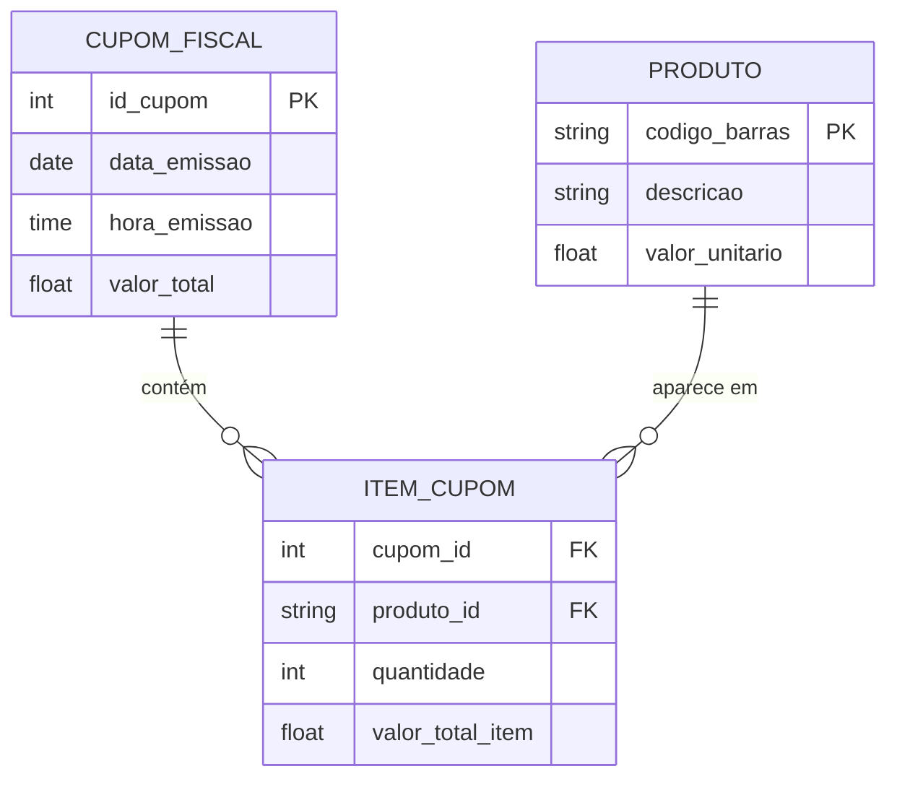

Perceba a cardinalidade aplicada: um `CUPOM_FISCAL` contém **zero ou muitos** `ITEM_CUPOM` (não existe cupom com zero itens na prática, mas na modelagem tratamos a criação do cupom e a leitura dos itens como dois passos); um `PRODUTO` aparece em **zero ou muitos** itens ao longo do tempo (um produto novo, recém-cadastrado, ainda pode não ter sido vendido nenhuma vez). É um N:M clássico entre `CUPOM_FISCAL` e `PRODUTO`, resolvido pela mesma regra da Seção 7.2.

> 📐 **Nota sobre a PK de `PRODUTO`:** aqui a chave primária não é um número sequencial (`id_produto`), é o próprio **código de barras** (`codigo_barras`) — um identificador que já existe no mundo real, fora do banco. Isso é perfeitamente válido: nem toda PK precisa ser um número auto-incrementado: ela só precisa ser única e não-nula. E note que a FK em `ITEM_CUPOM` continua se chamando `produto_id`, seguindo a Regra 6 — mesmo o valor sendo um código de barras, o nome da FK segue o padrão da tabela referenciada (`produtos` → `produto_id`), não o nome literal da coluna referenciada.

**🔎 Veja o modelo completo no dbdiagram.io:**

```dbml
Table cupons_fiscais {
  id_cupom BIGINT UNSIGNED [pk, increment]
  data_emissao DATE
  valor_total DECIMAL(10,2)
}

Table produtos {
  codigo_barras VARCHAR(14) [pk]
  descricao VARCHAR(255)
  valor_unitario DECIMAL(10,2)
}

Table itens_cupom {
  cupom_id BIGINT UNSIGNED
  produto_id VARCHAR(14)
  quantidade INT UNSIGNED
  valor_total_item DECIMAL(10,2)
}

Ref: itens_cupom.cupom_id > cupons_fiscais.id_cupom
Ref: itens_cupom.produto_id > produtos.codigo_barras
```

➡️ **[Abrir e explorar este diagrama no dbdiagram.io](https://dbdiagram.io/embed?c=VGFibGUgY3Vwb25zX2Zpc2NhaXMgewogIGlkX2N1cG9tIEJJR0lOVCBVTlNJR05FRCBbcGssIGluY3JlbWVudF0KICBkYXRhX2VtaXNzYW8gREFURQogIHZhbG9yX3RvdGFsIERFQ0lNQUwoMTAsMikKfQoKVGFibGUgcHJvZHV0b3MgewogIGNvZGlnb19iYXJyYXMgVkFSQ0hBUigxNCkgW3BrXQogIGRlc2NyaWNhbyBWQVJDSEFSKDI1NSkKICB2YWxvcl91bml0YXJpbyBERUNJTUFMKDEwLDIpCn0KClRhYmxlIGl0ZW5zX2N1cG9tIHsKICBjdXBvbV9pZCBCSUdJTlQgVU5TSUdORUQKICBwcm9kdXRvX2lkIFZBUkNIQVIoMTQpCiAgcXVhbnRpZGFkZSBJTlQgVU5TSUdORUQKICB2YWxvcl90b3RhbF9pdGVtIERFQ0lNQUwoMTAsMikKfQoKUmVmOiBpdGVuc19jdXBvbS5jdXBvbV9pZCA%2BIGN1cG9uc19maXNjYWlzLmlkX2N1cG9tClJlZjogaXRlbnNfY3Vwb20ucHJvZHV0b19pZCA%2BIHByb2R1dG9zLmNvZGlnb19iYXJyYXMK)**

---

## 10. Participação: Total vs. Parcial

Além da cardinalidade máxima, precisamos indicar se a **participação** de uma entidade num relacionamento é **total** ou **parcial** — essa informação vem exatamente do **mínimo** que você calculou com as perguntas-chave da Seção 5.

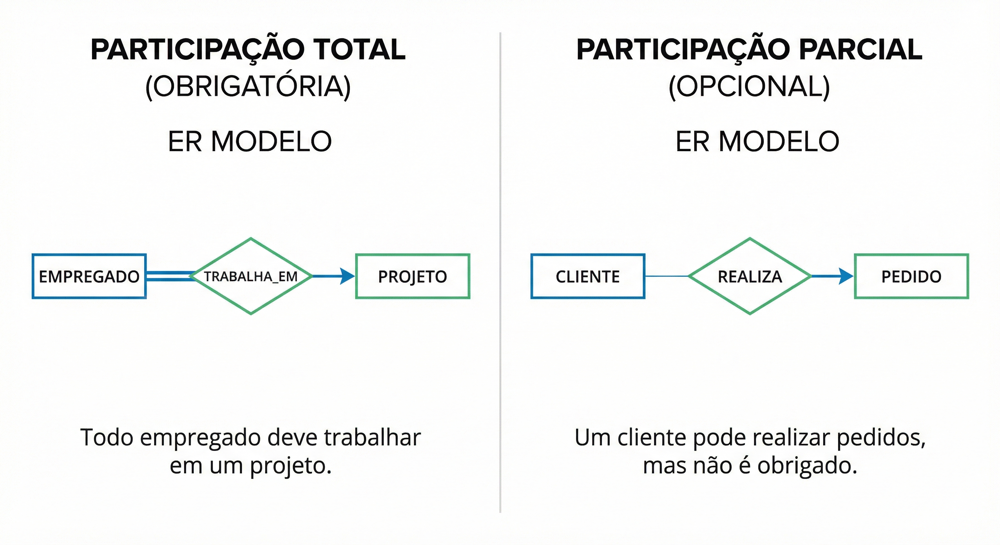

A **participação total** (mínimo = 1) significa que toda instância da entidade *deve* obrigatoriamente participar do relacionamento — não pode existir uma instância "solta". Exemplo: todo `PEDIDO` obrigatoriamente pertence a um `CLIENTE`.

A **participação parcial** (mínimo = 0) significa que a entidade *pode* existir sem participar do relacionamento. Exemplo: nem todo `CLIENTE` precisa ter feito um pedido.

Para fixar: pense nas consequências práticas. Se tentarmos inserir um pedido sem informar o cliente, o banco deve rejeitar essa operação — isso é o que a participação total de `PEDIDO` representa em termos de restrições de integridade referencial (a FK `cliente_id` não pode ser nula).

!!! example "🔍 Checkpoint 5 — Participação: sistema de biblioteca com reservas"
    Em uma biblioteca: (a) toda `RESERVA` obrigatoriamente está vinculada a um
    `LIVRO` e a um `MEMBRO` — não existe reserva "solta"; (b) nem todo `LIVRO` do
    acervo precisa ter sido reservado alguma vez; (c) nem todo `MEMBRO` cadastrado
    precisa ter feito alguma reserva. Para cada uma das três entidades (`RESERVA`,
    `LIVRO`, `MEMBRO`) em relação ao relacionamento de reserva, classifique a
    participação como **total** ou **parcial**, justificando com base no mínimo de
    cada uma.

    🔑 Resolução no [Gabarito da Aula 03](Aula_03_Gabarito.md#checkpoint-5) — tente resolver antes de conferir.

---

## 11. Auto-Relacionamento

Um auto-relacionamento ocorre quando uma entidade se relaciona **consigo mesma**. O exemplo clássico é a hierarquia de funcionários: um `FUNCIONÁRIO` pode ser supervisor de outros funcionários, e cada funcionário tem (ou não) um supervisor — que também é um funcionário.

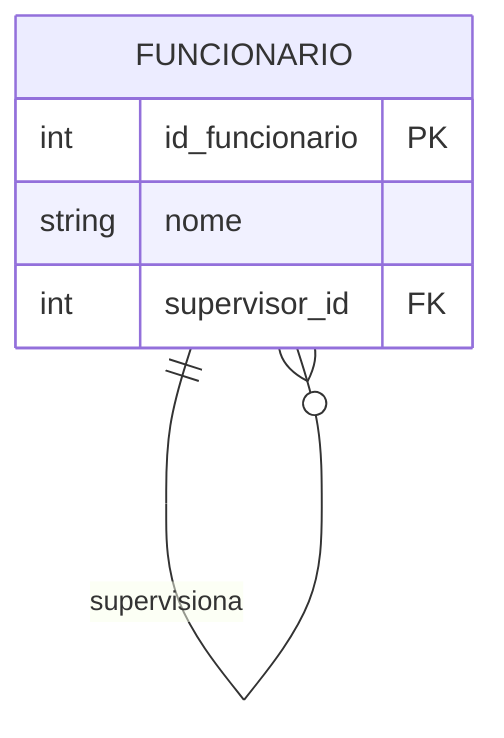

> 📐 **Convenção de nomenclatura (Regra 7 — FK pelo papel semântico):** aqui está o caso mais claro para entender essa regra. A FK **não** se chama `funcionario_id` — se chamasse, seria impossível saber, só pelo nome da coluna, se ela representa "o funcionário" ou "o supervisor dele" (afinal, ambos são registros da mesma tabela `FUNCIONARIO`). Por isso, quando uma FK referencia uma tabela cuja entidade pode exercer **papéis diferentes** dentro do relacionamento, a Regra 7 manda usar o **papel** no nome, não o nome da tabela: `supervisor_id`. O padrão de nomenclatura continua o mesmo (termina em `_id`), só que a palavra antes do `_id` comunica a função, não a origem.

---

## 12. Relacionamento Ternário

Quando três entidades participam de um único relacionamento, temos um **relacionamento ternário**. São mais complexos e devem ser usados apenas quando o negócio realmente exige que as três entidades sejam analisadas em conjunto para definir a ocorrência.

**Exemplo:** um `MÉDICO` prescreve um `MEDICAMENTO` para um `PACIENTE`. A combinação das três entidades define a prescrição — não faz sentido registrar "médico prescreve medicamento" sem saber para qual paciente.

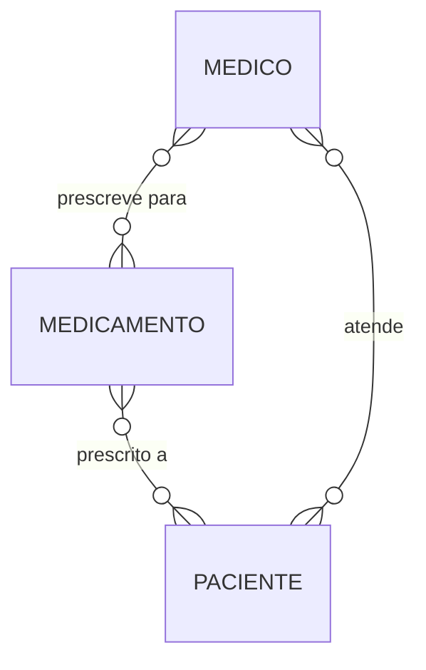

!!! example "🔍 Checkpoint 6 — Auto-relacionamento e Ternário: rede social e e-commerce"
    Analise as duas situações a seguir. **(a)** Em uma rede social, um `USUARIO`
    pode seguir vários outros `USUARIO`, e um `USUARIO` pode ser seguido por vários
    outros — a entidade se relaciona com ela mesma. **(b)** Em um marketplace, um
    `VENDEDOR` oferece um `PRODUTO` sob uma `CONDICAO_COMERCIAL` específica (à
    vista, parcelado em 3x, ou assinatura mensal) — a combinação das três definições
    define exatamente qual oferta está disponível; não faz sentido falar de
    "vendedor oferece produto" sem saber sob qual condição. Para cada situação,
    identifique se é um caso de **auto-relacionamento** ou de **relacionamento
    ternário**, e desenhe o `erDiagram` correspondente (inclua a FK, se for o caso).

    🔑 Resolução no [Gabarito da Aula 03](Aula_03_Gabarito.md#checkpoint-6) — tente resolver antes de conferir.

---

## 13. Exemplos Resolvidos

Três exemplos guiados, do jeito que você vai precisar resolver em prova: com o raciocínio completo, não só a resposta.

**Exemplo 1 — Leitura de Diagrama:**

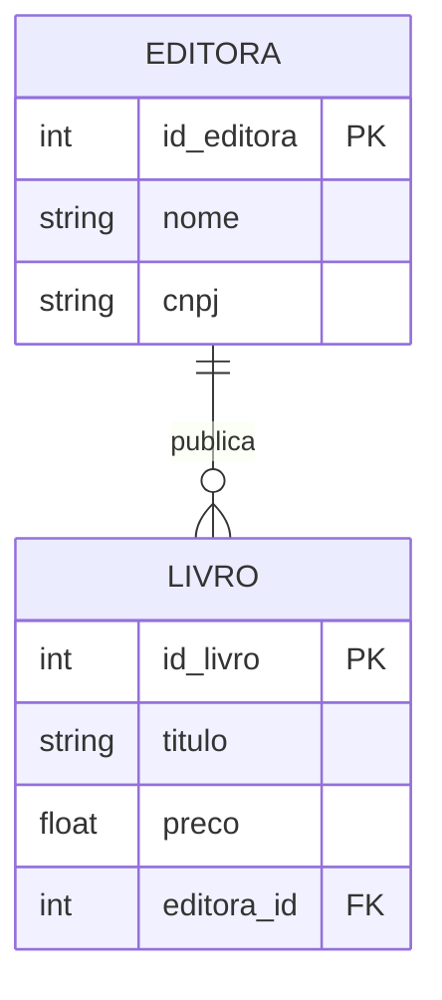

*a) Uma editora pode existir sem ter publicado nenhum livro?* Sim — o símbolo `O{` próximo a `EDITORA` (descrevendo `LIVRO`) começa com círculo, mínimo 0.
*b) Um livro pode existir sem estar vinculado a uma editora?* Não — o símbolo `||` próximo a `LIVRO` (descrevendo `EDITORA`) começa com barra dupla, mínimo 1.
*c) Cardinalidade em Min-Max:* `EDITORA (0,N) ———— (1,1) LIVRO`.

**Exemplo 2 — Construção a partir de Regras de Negócio:**

> *"Um professor pode orientar vários alunos de TCC. Um aluno tem exatamente um orientador, mas pode não ter escolhido ainda (início do semestre). Um professor pode não ter nenhum orientando."*

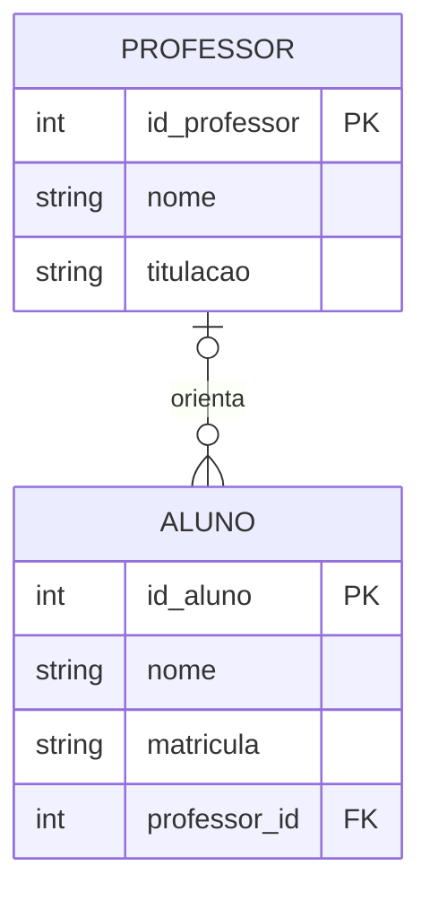

Raciocínio: um professor pode ter zero ou muitos orientandos (`O{`). Um aluno pode ter zero ou um orientador — nunca dois, porque a regra diz "exatamente um orientador", mas permite que ainda não tenha sido escolhido (`O|`). Min-Max: `PROFESSOR (0,N) ———— (0,1) ALUNO`.

**Exemplo 3 — Identifique o Tipo:**

Para cada situação, identifique 1:1, 1:N ou N:M:

*a) "Um produto pode estar em vários carrinhos de compra; um carrinho pode conter vários produtos; cada produto em um carrinho tem uma quantidade."* → **N:M** — entidade associativa `ITEM_CARRINHO`, com `carrinho_id FK`, `produto_id FK` e `quantidade`.
*b) "Um contrato de trabalho pertence a exatamente um funcionário, e um funcionário tem exatamente um contrato ativo."* → **1:1**, participação total dos dois lados.
*c) "Uma turma tem muitos alunos. Um aluno está em apenas uma turma por vez."* → **1:N** — `TURMA (1)` para `ALUNO (N)`; a FK `turma_id` vai em `ALUNO`.

---

## 14. Armadilhas Clássicas

**Armadilha 1 — Inverter os símbolos:** colocar o pé de galinha no lado errado é o erro mais comum. Lembre-se: o pé de galinha fica do lado da entidade que aparece **em quantidade**. Se muitos `ALUNOS` pertencem a uma `TURMA`, o pé de galinha fica do lado de `ALUNO`.

**Armadilha 2 — Confundir participação com cardinalidade máxima:** a participação (total/parcial) vem do **mínimo**, não do máximo. Um relacionamento pode ser 1:N com participação parcial (mínimo 0 de um lado) — e isso é perfeitamente válido.

**Armadilha 3 — Modelar como 1:N quando é N:M:** acontece quando você analisa o relacionamento em apenas um sentido. Sempre faça as perguntas **nos dois sentidos**.

**Armadilha 4 — Esquecer de decompor o N:M:** na modelagem conceitual, o N:M é válido. Mas na passagem para o modelo lógico, ele *obrigatoriamente* vira duas relações 1:N com uma tabela associativa no meio (Seção 7.2). Nunca se implementa um N:M "direto".

**Armadilha 5 — Nomear a FK igual à PK que ela referencia:** como vimos nas Regras 5 e 6 (Seção 3), a PK começa com `id_` e a FK termina com `_id` — são padrões diferentes de propósito. Uma FK chamada `id_departamento` dentro da tabela `funcionarios` é ambígua: parece uma segunda PK.

---

> 📐 **Precisa relembrar as 9 regras de nomenclatura?** Elas estão todas juntas, com exemplos, na [Seção 3](#convencoes-de-nomenclatura) — logo no início desta aula.

---

## 🃏 Flashcards de Revisão

??? question "Qual o tipo padrão de uma PK nesta disciplina, e qual a exceção?"
    `BIGINT UNSIGNED` com `increment` (chave substituta). A exceção é a chave natural — um identificador que já existe no mundo real (ex.: código de barras), que pode usar o tipo que fizer sentido para ele, como `VARCHAR`.

??? question "Por que a FK precisa ter o mesmo tipo da PK que ela referencia?"
    Porque o banco compara os valores da FK com os da PK para checar se a linha referenciada existe — essa comparação exige tipos compatíveis. Se a PK é `BIGINT UNSIGNED`, a FK também precisa ser.

??? question "Quais são as duas restrições que sempre valem para uma FK?"
    (1) Integridade referencial: todo valor não-nulo precisa existir como PK na tabela referenciada. (2) Aceitar ou não `NULL` depende da participação — `NOT NULL` se a participação é total, `NULL` permitido se é parcial.

??? question "Quais são as três perguntas-chave para determinar cardinalidade entre A e B?"
    (1) Um A precisa obrigatoriamente ter pelo menos um B? → define o mínimo. (2) Um A pode ter mais de um B? → define o máximo. (3) Repita as duas perguntas no sentido contrário (de B para A).

??? question "Na notação Crow's Foot, o símbolo perto da entidade A descreve o quê?"
    Descreve a entidade do **outro lado** (B) — não a entidade ao lado da qual o símbolo está desenhado. Essa é a fonte da maior confusão da disciplina.

??? question "Em um relacionamento 1:N, em qual tabela fica a chave estrangeira?"
    Na tabela do lado **N** (muitos) — nunca no lado 1. A FK é uma cópia do tipo da PK do lado 1.

??? question "Como um relacionamento N:M é implementado no modelo lógico?"
    Cria-se uma tabela associativa nova, com duas chaves estrangeiras — uma para cada uma das tabelas originais — decompondo o N:M em dois relacionamentos 1:N.

??? question "Em um relacionamento 1:1, de que lado geralmente fica a chave estrangeira?"
    Do lado de participação **parcial** (mínimo 0) — a entidade que "depende" conceitualmente da outra para fazer sentido completo.

??? question "Qual a diferença entre participação total e parcial?"
    Participação total (mínimo 1): toda instância da entidade obrigatoriamente participa do relacionamento. Participação parcial (mínimo 0): a entidade pode existir sem participar.

??? question "O que é um auto-relacionamento? Dê um exemplo."
    É quando uma entidade se relaciona com ela mesma. Exemplo: FUNCIONARIO supervisiona FUNCIONARIO (hierarquia de supervisão).

??? question "Como se nomeia a PK de uma tabela `pedidos`? E a FK em `itens_pedidos` que referencia `produtos`?"
    PK de `pedidos`: `id_pedido` (Regra 5). FK em `itens_pedidos` para `produtos`: `produto_id` (Regra 6) — repare que a ordem das palavras inverte entre PK e FK.

??? question "Por que às vezes a FK usa um 'papel semântico' em vez do nome da tabela referenciada?"
    Porque, quando a mesma tabela pode ser referenciada em papéis diferentes dentro do mesmo relacionamento (como um funcionário que supervisiona outro funcionário), nomear a FK só com o nome da tabela seria ambíguo. O papel (`supervisor_id`) comunica a função; o nome da tabela sozinho não comunicaria.

??? question "Na Estratégia 2 de mapeamento de generalização/especialização, o que é a PK de uma tabela de subclasse?"
    É, ao mesmo tempo, uma FK única para a PK da superclasse — não é um novo `id_` autoincrementado. Isso garante, na própria estrutura do banco, que uma linha de subclasse só existe se já existir a linha correspondente na superclasse.

---

## ✅ Quiz de Fixação

<quiz>
Em DBML, `produtos.id_produto BIGINT UNSIGNED [pk, increment]` e, em outra tabela, `pedido_id BIGINT UNSIGNED` com `Ref: itens.pedido_id > pedidos.id_pedido`. Por que `pedido_id` também precisa ser `BIGINT UNSIGNED`?
- [ ] Por estética — poderia ser qualquer tipo, contanto que o nome siga a Regra 6
- [x] Porque a FK precisa ter o mesmo tipo da PK que referencia, para o banco poder comparar os valores e checar a integridade referencial
- [ ] Porque toda coluna numérica do banco precisa ser BIGINT UNSIGNED
- [ ] Não precisa — isso só importa quando a PK é uma chave natural

O tipo da FK precisa casar com o da PK referenciada porque o banco compara os dois valores para validar a integridade referencial — tipos incompatíveis tornam essa comparação impossível.
</quiz>

<quiz>
Uma editora publica muitos livros; cada livro pertence a exatamente uma editora. Qual é a cardinalidade desse relacionamento?
- [ ] 1:1
- [x] 1:N
- [ ] N:M
- [ ] Ternário

A resposta a "uma editora pode ter mais de um livro?" é sim; a resposta a "um livro pode ter mais de uma editora?" é não. Isso é 1:N, com o N do lado de LIVRO.
</quiz>

<quiz>
Na notação Crow's Foot, entre CLIENTE e PEDIDO, o símbolo `||` aparece próximo a PEDIDO. O que isso significa?
- [ ] Um pedido pode ter vários clientes
- [x] Cada pedido pertence a exatamente um cliente
- [ ] Um cliente só pode ter um pedido
- [ ] A participação do cliente é opcional

O símbolo perto de PEDIDO descreve CLIENTE (regra da posição oposta): `||` significa "exatamente um". Logo, cada pedido está associado a exatamente um cliente.
</quiz>

<quiz>
Em um relacionamento 1:N entre CATEGORIA (1) e PRODUTO (N), onde deve ficar a chave estrangeira?
- [ ] Em CATEGORIA, chamada categoria_id
- [x] Em PRODUTO, chamada categoria_id
- [ ] Em PRODUTO, chamada id_categoria
- [ ] Em uma tabela associativa nova

A FK sempre vai no lado N (PRODUTO), e segue a Regra 6 de nomenclatura: nome da tabela referenciada no singular + "_id" → categoria_id.
</quiz>

<quiz>
Quais destas afirmações sobre relacionamentos N:M são verdadeiras? (selecione todas as corretas)
- [x] Sempre exigem uma tabela associativa no modelo lógico
- [x] A tabela associativa costuma ter duas chaves estrangeiras
- [ ] Podem ser implementados com uma única FK, como no 1:N
- [x] A entidade associativa pode ter atributos próprios, como MATRICULA ou CONSULTA

N:M nunca vira uma FK simples — sempre precisa de uma tabela nova com FKs para as duas entidades originais, e essa tabela pode (e frequentemente deve) carregar atributos próprios do relacionamento.
</quiz>

<quiz>
Uma FK chamada supervisor_id, dentro da própria tabela FUNCIONARIO, é um exemplo de qual convenção?
- [ ] Regra 5 — nomenclatura de PK
- [ ] Regra 4 — entidade vs. tabela
- [x] Regra 7 — FK pelo papel semântico
- [ ] Nenhuma convenção — é um erro

Como a FK referencia a própria tabela FUNCIONARIO (auto-relacionamento), usar "funcionario_id" seria ambíguo. A Regra 7 resolve isso nomeando a FK pelo papel que ela representa no relacionamento — nesse caso, "supervisor".
</quiz>

<quiz>
No exemplo do cupom fiscal, por que o código de barras pode ser a chave primária de PRODUTO, mesmo não sendo um número sequencial gerado pelo banco?
- [ ] Toda PK precisa ser sequencial — esse exemplo está incorreto
- [x] Uma PK só precisa ser única e não-nula; um identificador do mundo real pode cumprir esse papel
- [ ] Só pode ser PK porque também é usado como FK em outra tabela
- [ ] Códigos de barras nunca podem ser chave primária em bancos relacionais

Chave primária não precisa ser um número gerado automaticamente — qualquer valor único e não-nulo serve, incluindo identificadores que já existem fora do banco, como o código de barras de um produto.
</quiz>

<quiz>
Uma hierarquia CONTEUDO → VIDEO_AULA / MATERIAL_PDF foi mapeada seguindo a Estratégia 2. Qual afirmação está correta?
- [ ] video_aulas e material_pdfs ganham um novo id_ autoincrementado, sem relação com conteudos
- [x] video_aulas.id_conteudo e material_pdfs.id_conteudo são, ao mesmo tempo, PK da subclasse e FK para conteudos
- [ ] Todos os atributos, comuns e exclusivos, ficam numa única tabela conteudos
- [ ] Cada subclasse duplica os atributos comuns de conteudos

Na Estratégia 2, a PK da tabela de subclasse é reaproveitada como FK única para a superclasse — é isso que impede, na própria estrutura do banco, que exista um video_aulas sem o conteudos correspondente.
</quiz>

---

## ✏️ Exercícios de Fixação Práticos

Para cada exercício, identifique a cardinalidade (com o método das perguntas-chave), desenhe o diagrama (Mermaid ou dbdiagram.io, como preferir) e nomeie PK e FK seguindo as convenções desta aula.

**Exercício 1 — Leitura de Diagrama**

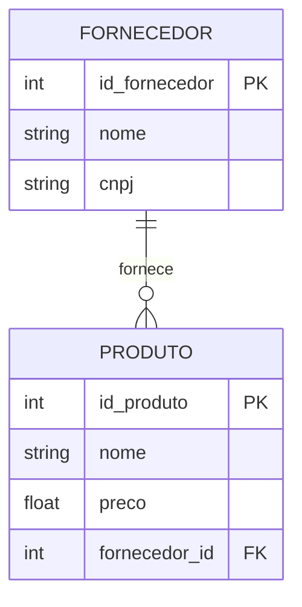

a) Um fornecedor pode existir sem fornecer nenhum produto? Justifique pelo símbolo.
b) Um produto pode existir sem estar vinculado a um fornecedor? Justifique pelo símbolo.
c) Escreva a cardinalidade na notação Min-Max.

---

**Exercício 2 — Construção a partir de Regras de Negócio**

*"Uma oficina mecânica atende vários clientes. Cada cliente pode ter vários veículos cadastrados, mas cada veículo pertence a exatamente um cliente. Cada veículo pode passar por várias ordens de serviço ao longo do tempo, e cada ordem de serviço se refere a exatamente um veículo."*

Construa o diagrama completo (três entidades), com cardinalidade, PK e FK nomeadas corretamente.

---

**Exercício 3 — Identifique o Tipo e Decomponha (quando for N:M)**

a) *"Um ingresso é válido para um único evento. Um evento pode vender milhares de ingressos."*
b) *"Um aluno pode estar matriculado em várias turmas no mesmo semestre. Uma turma tem vários alunos matriculados."*
c) *"Um passageiro pode ter reservado assento em vários voos ao longo do ano. Um voo tem vários passageiros reservados, e cada reserva registra o número do assento."*

Para cada item, diga se é 1:1, 1:N ou N:M. Para os que forem N:M, proponha a entidade associativa com seus atributos.

---

**Exercício 4 — Nomeação de PK e FK**

Dadas as tabelas abaixo (já no plural, seguindo a Regra 4), escreva o nome correto da chave primária de cada uma e, em seguida, o nome correto da chave estrangeira que `livros` usaria para referenciar `editoras`:

- `editoras`
- `livros`
- `categorias`

---

**Exercício 5 — Modelagem do Dia a Dia: a Catraca da Academia**

*"Toda vez que um aluno passa a carteirinha na catraca de uma academia, o sistema registra o acesso: data, hora e qual catraca (entrada ou saída) foi usada. Cada aluno tem uma carteirinha com um número único, que funciona como identificador do aluno dentro da academia. Um aluno pode ter muitos acessos registrados ao longo do tempo."*

Siga o mesmo raciocínio da Seção 9 (cupom fiscal): identifique as entidades, escolha a chave primária de `ALUNO` com base no enunciado, modele a cardinalidade entre `ALUNO` e `ACESSO`, e nomeie a FK corretamente.

---

📄 **[Ver gabarito dos exercícios →](Aula_03_Gabarito.md)**

> Tente resolver todos os exercícios antes de conferir — principalmente o Exercício 5, que reaproveita exatamente o raciocínio da Seção 9, só que em um domínio diferente.

---

## 📝 Resumo

Começamos esta aula pelos alicerces: o que é uma chave primária (PK), como declará-la em DBML e por que seu tipo padrão é `BIGINT UNSIGNED`; o que é uma chave estrangeira (FK), como declará-la, por que seu tipo precisa casar com o da PK referenciada, e suas duas restrições (integridade referencial e nulabilidade conforme a participação). Em seguida, fechamos as 9 regras oficiais de nomenclatura da disciplina de uma vez, antes de qualquer exemplo — todo exemplo, checkpoint e exercício desta aula segue todas elas. Só então entramos em relacionamentos: eles descrevem as interações entre entidades e podem ter atributos próprios. A cardinalidade (1:1, 1:N, N:M) — determinada com o método das três perguntas-chave — é uma das informações mais críticas do modelo conceitual, porque impacta diretamente a estrutura das tabelas: vimos exatamente onde a cardinalidade posiciona a PK e a FK já conhecidas, inclusive num evento do dia a dia como a leitura de um produto no caixa de um supermercado. Vimos também como mapear as hierarquias de generalização/especialização da Aula 02 para tabelas de verdade, usando a Estratégia 2 (superclasse + uma tabela por subclasse, com PK compartilhada). Aprendemos a distinguir participação total de parcial, conhecemos casos especiais como o auto-relacionamento e o relacionamento ternário, e vimos as duas notações mais usadas (Min-Max e Crow's Foot) — com atenção especial ao "segredo da posição" que mais confunde estudantes. Com isso, você sai desta aula sabendo transformar qualquer modelo conceitual completo (entidades, relacionamentos e hierarquias) no Modelo Lógico Relacional correspondente.

Para praticar tudo isso de uma vez, com um cenário maior e a ferramenta [dbdiagram.io](https://dbdiagram.io), veja a [Prática — Modelagem com dbdiagram.io](../atividades/Pratica_Modelagem_dbdiagram.md) na página de Atividades.

---

## 🏆 Conquista da Aula

!!! success "Selo desbloqueado: 🔗 Mestre dos Relacionamentos"
    Você aprendeu a determinar cardinalidade com método, a ler Crow's Foot sem cair na armadilha da posição, e — o mais importante — a transformar isso em chave primária e estrangeira de verdade, inclusive em hierarquias de herança. Você já consegue explicar, em termos de banco de dados, o que acontece no caixa de qualquer supermercado, e já sabe montar o Modelo Lógico Relacional completo a partir de qualquer modelo conceitual. A próxima parada da Trilha do(a) Modelador(a) de Dados: eliminar redundância e inconsistência com Normalização de Dados.

---

## 🔗 Navegação

⬅️ [Aula 02 — Modelagem Conceitual: Entidades](Aula_02_Modelagem_Entidades.md) · ➡️ 🔒 Aula 04 — Normalização de Dados — em breve.

---

*Fatec Jahu · IBD951 · Prof. Ronan Adriel Zenatti · 2026*
