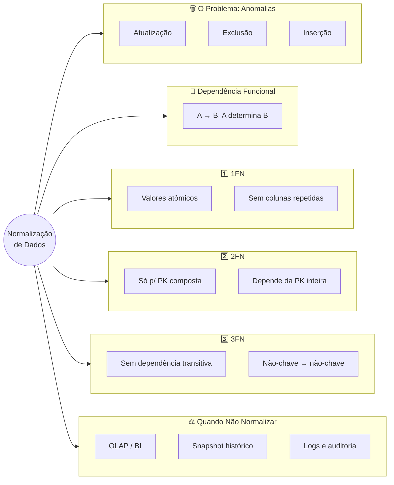
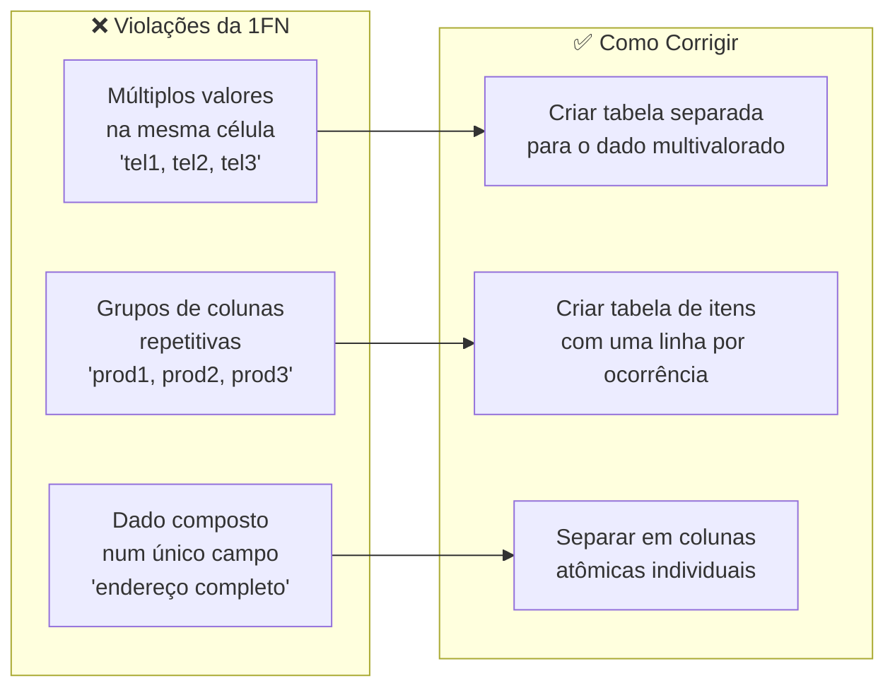
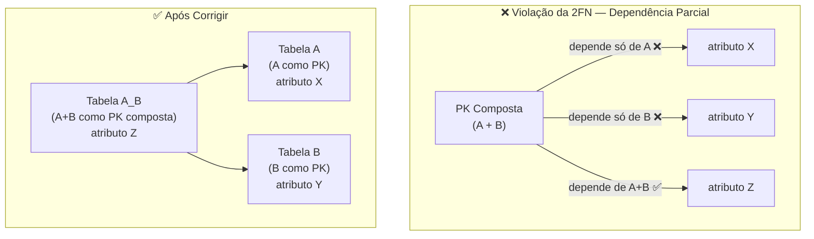
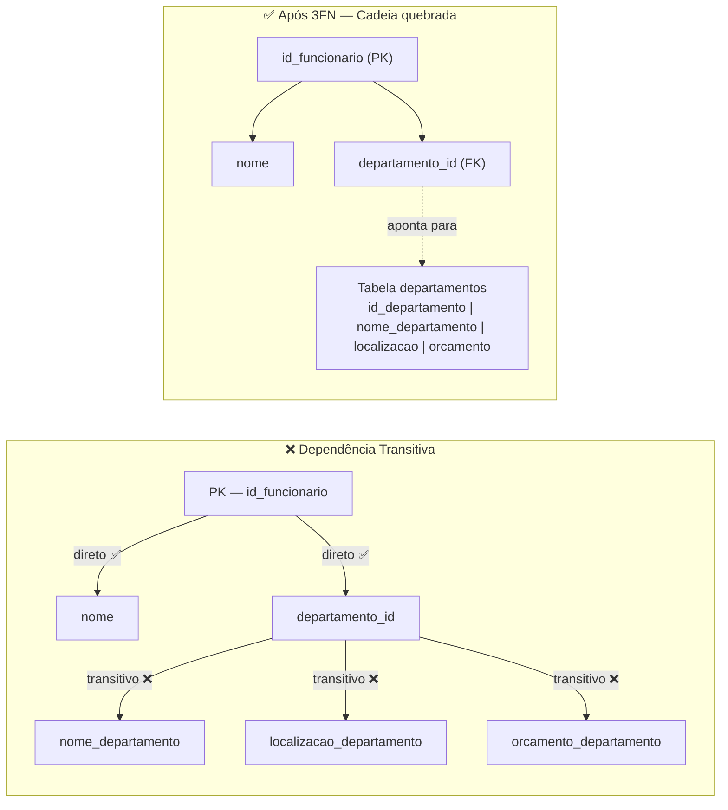
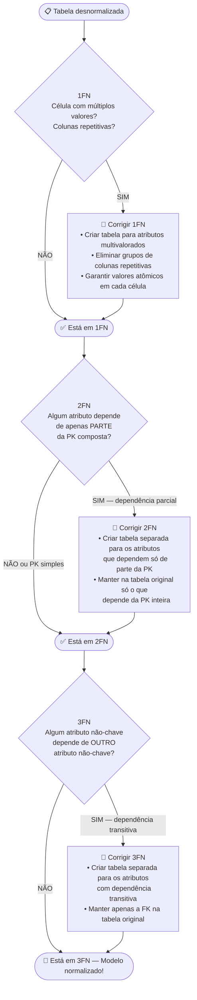
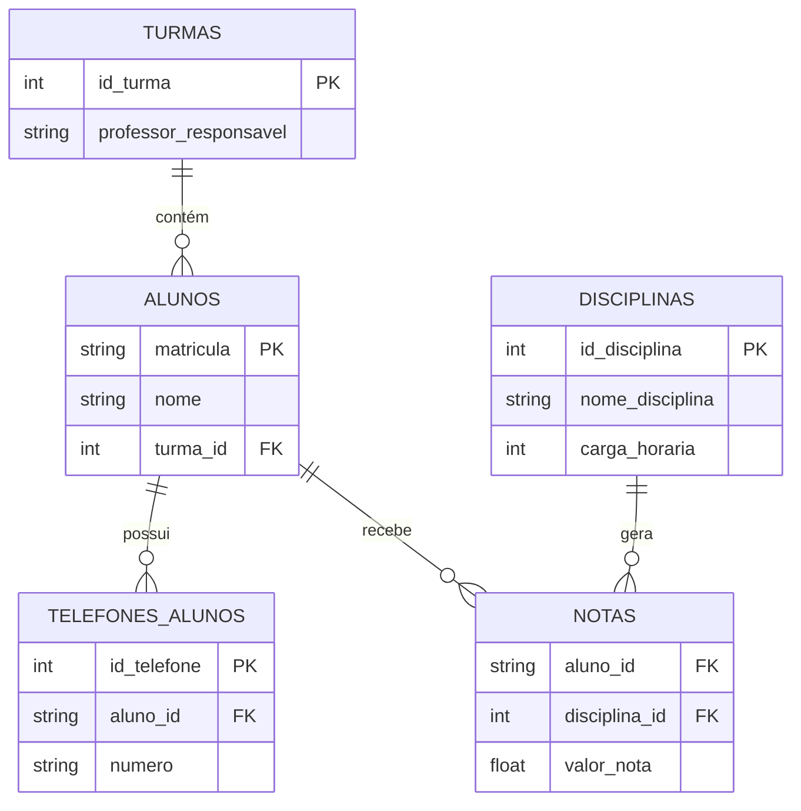

# Aula 04 — Normalização de Dados

**Disciplina:** Banco de Dados e Aplicações (IBD951)  
**Professor:** Ronan Adriel Zenatti · ronan.zenatti@cps.sp.gov.br  
**Fatec Jahu — 2º Semestre/2026**

---

## 🎯 Objetivos da Aula

Ao final desta aula você deverá ser capaz de:

- Explicar com suas próprias palavras o que é normalização e por que ela é necessária
- Identificar e corrigir violações da 1ª, 2ª e 3ª Formas Normais
- Aplicar pelo menos 3 exemplos reais de cada forma normal
- Reconhecer situações em que normalizar pode não ser a melhor escolha
- Resolver exercícios práticos de normalização, passo a passo, nomeando corretamente PK e FK das tabelas resultantes

---

## 🗺️ Mapa Mental da Aula

---

## 1. O Problema: Quando os Dados Viram uma Bagunça

Antes de entrar em qualquer teoria, vamos experimentar o problema na prática. Imagine que você foi contratado como estagiário numa escola e encontrou a seguinte planilha usada para controlar as notas dos alunos:

| matricula | nome_aluno | turma | professor_turma | disc1 | nota1 | disc2 | nota2 | disc3 | nota3 | telefone1 | telefone2 |
|---|---|---|---|---|---|---|---|---|---|---|---|
| 001 | Ana Lima | 1A | Prof. Carlos | Matemática | 8.5 | Português | 7.0 | História | 9.0 | 99111-0001 | 99222-0002 |
| 002 | Bruno Melo | 1A | Prof. Carlos | Matemática | 6.0 | Português | 8.5 | História | 7.5 | 99333-0003 | — |
| 003 | Carla Souza | 1B | Prof. Marcos | Matemática | 9.0 | Português | 9.5 | História | 8.0 | 99444-0004 | 99555-0005 |

Essa tabela "funciona" para casos simples, mas agora pense nas seguintes situações:

**Situação 1:** O Prof. Carlos foi trocado por outro professor na turma 1A. Você precisaria atualizar a coluna `professor_turma` em **todas** as linhas de alunos da 1A. Se tiver 30 alunos, são 30 atualizações — e se você esquecer de atualizar uma, o banco passa a ter dois professores diferentes para a mesma turma ao mesmo tempo. Isso se chama **anomalia de atualização**.

> 💡 **Do dia a dia:** é como o mercadinho de bairro que escreve o preço do quilo do arroz, à caneta, numa etiqueta em cada prateleira onde o produto aparece. Quando o preço muda, o dono precisa lembrar de trocar **todas** as etiquetas — se esquecer uma, um cliente paga um preço e outro paga outro pelo mesmo saco de arroz, no mesmo dia.

**Situação 2:** Bruno Melo saiu da escola. Ao deletar sua linha, você perde a informação de que a turma 1A existe e quem é seu professor. Se todos os alunos de 1A saírem, a turma desaparece do banco como se nunca tivesse existido. Isso se chama **anomalia de exclusão**.

> 💡 **Do dia a dia:** é como o caderninho de fiado da padaria, onde o nome de cada cliente só existe anotado ao lado das compras fiadas dele. Se o último fiado de um cliente for quitado e a página arrancada, some também o único registro de que aquele cliente algum dia existiu — não tem uma lista de clientes separada da lista de fiados.

**Situação 3:** Uma nova turma 2C foi criada com o Prof. Rodrigo, mas ainda não tem alunos matriculados. Como inserir essa informação se a tabela exige `matricula` e `nome_aluno`? Você seria obrigado a criar um aluno fictício — ou simplesmente não consegue salvar a informação. Isso se chama **anomalia de inserção**.

> 💡 **Do dia a dia:** é como o formulário de papel de um posto de gasolina que só tem 3 linhas fixas — Gasolina, Etanol, Diesel — para anotar o estoque do dia. Quando o posto começa a vender também Etanol Aditivado, não existe onde anotar: o formulário precisaria ser refeito do zero só para caber um item novo.

**Situação 4:** Ana Lima ganhou um terceiro telefone. Para onde você coloca? Não tem `telefone3` na tabela. Você precisaria alterar a estrutura da tabela toda vez que alguém tiver mais telefones que o esperado.

| Anomalia | O que acontece | Exemplo do dia a dia |
|---|---|---|
| **Atualização** | Um dado repetido precisa ser corrigido em várias linhas ao mesmo tempo | Etiqueta de preço repetida em toda prateleira do mercadinho |
| **Exclusão** | Apagar uma linha apaga, "de brinde", uma informação que não deveria depender dela | Caderninho de fiado que também é a única lista de clientes da padaria |
| **Inserção** | Não dá para guardar um dado novo porque a estrutura da tabela não tem espaço para ele | Formulário do posto de gasolina sem linha para um combustível novo |

A **normalização** é exatamente o processo de reorganizar essas tabelas para eliminar esses problemas, garantindo que cada informação fique guardada **em um único lugar** e que os dados se mantenham consistentes ao longo do tempo.

---

## 2. Dependência Funcional: a Base de Tudo

Antes de aprender as formas normais, precisamos entender uma ideia simples chamada **dependência funcional**. Não deixe o nome assustar — o conceito é muito intuitivo.

> Dizemos que o atributo **B depende funcionalmente de A** quando, sabendo o valor de A, conseguimos descobrir com certeza o valor de B.

Pense assim: se eu te digo que o CPF de alguém é `123.456.789-00`, você consegue saber o nome dessa pessoa? Sim — porque para cada CPF existe **exatamente uma** pessoa. Logo: `cpf → nome` (CPF determina o nome).

> 💡 **Do dia a dia:** é exatamente o que acontece no balcão do cartório ou na fila do banco: o atendente pede seu CPF, digita, e o sistema já "sabe" quem você é — nome, endereço, tudo. Ninguém precisa perguntar seu nome depois, porque o CPF sozinho já determina isso sem ambiguidade.

Agora o contrário: se eu te digo o nome "João da Silva", você consegue saber o CPF? Não com certeza, porque pode haver várias pessoas com esse nome. Logo: `nome` **não** determina funcionalmente o `cpf`.

Outros exemplos do mundo real de dependências funcionais:

- `id_produto → nome_produto, preco` (o ID de um produto determina seu nome e preço)
- `cep → cidade, estado` (o CEP determina a cidade e o estado)
- `id_pedido + id_produto → quantidade` (a combinação pedido+produto determina a quantidade)
- `id_funcionario → id_departamento` (o ID do funcionário determina em qual departamento ele está)

Essas dependências funcionais são a "régua" que usamos para verificar se uma tabela está normalizada.

---

## 3. Primeira Forma Normal (1FN): Uma Coisa por Célula

### O que é?

Uma tabela está na **1ª Forma Normal** quando:

1. Cada célula contém **apenas um valor** (valores atômicos, ou seja, indivisíveis)
2. **Não existem grupos de colunas repetidas** (como `telefone1`, `telefone2`, `telefone3...`)
3. Cada linha é única e identificável por uma chave primária

Pense numa gaveta bem organizada: cada compartimento guarda **uma coisa só**. Quando você começa a enfiar várias coisas no mesmo compartimento, ou cria vários compartimentos para guardar a mesma categoria de coisa, a gaveta vira uma bagunça.

> 💡 **Do dia a dia:** pense no rodízio de pizza de domingo — cada fatia que chega à mesa tem **um** sabor só, pepperoni ou mussarela, nunca "metade disso, metade daquilo" misturado na mesma massa. Você sabe exatamente o que está comendo em cada pedaço. Uma célula não-atômica é como uma fatia com três sabores amassados juntos: impossível separar depois.

### Exemplo 1 — Múltiplos valores numa célula (lista de telefones)

**❌ Antes da 1FN:**

| id_cliente | nome | telefones |
|---|---|---|
| 1 | Ana Lima | (14) 99111-0001, (14) 99222-0002 |
| 2 | Bruno Melo | (14) 99333-0003 |
| 3 | Carla Souza | (14) 99444-0004, (14) 99555-0005, (14) 99666-0006 |

O problema: a coluna `telefones` tem múltiplos valores separados por vírgula. Não dá para buscar "clientes com o telefone (14) 99444-0004" de forma eficiente — o banco não entende que há mais de um número ali.

**✅ Depois da 1FN:**

Criamos uma tabela separada para os telefones:

Tabela `clientes`:

| id_cliente | nome |
|---|---|
| 1 | Ana Lima |
| 2 | Bruno Melo |
| 3 | Carla Souza |

Tabela `telefones`:

| id_telefone | cliente_id | numero |
|---|---|---|
| 1 | 1 | (14) 99111-0001 |
| 2 | 1 | (14) 99222-0002 |
| 3 | 2 | (14) 99333-0003 |
| 4 | 3 | (14) 99444-0004 |
| 5 | 3 | (14) 99555-0005 |
| 6 | 3 | (14) 99666-0006 |

Agora cada célula tem exatamente um valor. Carla pode ter quantos telefones quiser sem precisar alterar a estrutura da tabela. Repare que `cliente_id` segue a Regra 6 de nomenclatura (Aula 03): tabela referenciada no singular + `_id`.

### Exemplo 2 — Colunas repetitivas (grupos de colunas para a mesma informação)

**❌ Antes da 1FN:**

| id_pedido | cliente | produto1 | qtd1 | produto2 | qtd2 | produto3 | qtd3 |
|---|---|---|---|---|---|---|---|
| 1 | João | Camisa | 2 | Calça | 1 | — | — |
| 2 | Maria | Tênis | 1 | Meia | 3 | Boné | 2 |

O problema: `produto1`, `produto2`, `produto3` são a mesma informação repetida em colunas diferentes. E se alguém comprar 4 produtos? Precisamos criar `produto4` e `qtd4`? Isso é inviável.

**✅ Depois da 1FN:**

Tabela `pedidos`:

| id_pedido | cliente_id |
|---|---|
| 1 | 1 |
| 2 | 2 |

Tabela `itens_pedido`:

| pedido_id | produto_id | quantidade |
|---|---|---|
| 1 | 101 | 2 |
| 1 | 102 | 1 |
| 2 | 103 | 1 |
| 2 | 104 | 3 |
| 2 | 105 | 2 |

Agora qualquer pedido pode ter quantos itens forem necessários — sem precisar mudar a estrutura do banco. `pedido_id` e `produto_id` formam a chave primária composta de `itens_pedido` — o mesmo padrão que você já viu em `matriculas` (Aula 03, Seção 5.3).

### Exemplo 3 — Endereço misturado numa única coluna

**❌ Antes da 1FN:**

| id_funcionario | nome | endereco_completo |
|---|---|---|
| 1 | Paulo Ramos | Rua das Flores, 123, Centro, Jahu, SP, 17200-000 |
| 2 | Lúcia Torres | Av. Brasil, 456, Jardim, Bauru, SP, 17000-000 |

O problema: `endereco_completo` mistura logradouro, número, bairro, cidade, estado e CEP em um só campo. Não é possível buscar "todos os funcionários de Bauru" sem gambiarra.

**✅ Depois da 1FN:**

Tabela `funcionarios`:

| id_funcionario | nome | logradouro | numero | bairro | cidade | estado | cep |
|---|---|---|---|---|---|---|---|
| 1 | Paulo Ramos | Rua das Flores | 123 | Centro | Jahu | SP | 17200-000 |
| 2 | Lúcia Torres | Av. Brasil | 456 | Jardim | Bauru | SP | 17000-000 |

Cada informação em sua própria coluna, permitindo filtros precisos por qualquer campo.

!!! example "🔍 Checkpoint 1 — 1FN: revenda de gás de bairro"
    Uma revenda de gás de bairro anota os pedidos numa cadernetinha, depois digitada
    numa única tabela `pedidos_revenda` assim: `id_pedido`, `nome_cliente`,
    `telefones` (guarda `"99111-2233, 99222-3344"` quando o cliente tem mais de um
    número) e `itens` (guarda `"P13, P45"` quando o pedido tem mais de um botijão).
    (a) Liste as violações de 1FN nessa tabela. (b) Proponha as tabelas corrigidas,
    já nomeando PK e FK conforme as 9 regras de nomenclatura da Aula 03.

    🔑 Resolução no [Gabarito da Aula 04](Aula_04_Gabarito.md#checkpoint-1) — tente resolver antes de conferir.

---

## 4. Segunda Forma Normal (2FN): Sem "Carona" na Chave

### O que é?

Uma tabela está na **2ª Forma Normal** quando:

1. Já está na 1FN
2. Todos os atributos que **não fazem parte da chave** dependem da chave **inteira** — não apenas de uma parte dela

> ⚠️ A 2FN só se aplica quando a chave primária é **composta** (formada por dois ou mais atributos). Se a sua PK tem apenas uma coluna, a tabela automaticamente satisfaz a 2FN assim que estiver na 1FN.

A ideia por trás da 2FN é simples: cada tabela deve falar sobre um único assunto. Quando um atributo "pega carona" na chave composta, mas na verdade pertence a outro assunto, temos um problema.

> 💡 **Do dia a dia:** pense no açougue. O preço do quilo da picanha é uma característica **do corte de carne**, não de cada comanda de venda. O açougueiro não reescreve "picanha R$ 89,90/kg" em toda comanda que vende picanha — ele olha o preço uma vez, no quadro de preços, e usa em quantas comandas precisar. Se o preço "pegasse carona" em cada comanda, mudar o preço da picanha significaria correr atrás de todas as comandas do dia para atualizar.

### Exemplo 1 — Itens de pedido com dados do produto

**❌ Antes da 2FN:**

Tabela `itens_pedido` com PK composta `(pedido_id, produto_id)`:

| **pedido_id** | **produto_id** | quantidade | nome_produto | preco_produto | categoria_produto |
|---|---|---|---|---|---|
| 1 | 10 | 2 | Camisa Polo | 89.90 | Vestuário |
| 1 | 20 | 1 | Calça Jeans | 149.90 | Vestuário |
| 2 | 10 | 3 | Camisa Polo | 89.90 | Vestuário |
| 3 | 30 | 1 | Tênis Running | 299.90 | Calçados |

O problema: `nome_produto`, `preco_produto` e `categoria_produto` dependem **apenas** de `produto_id` — não importa em qual pedido o produto aparece, o nome é sempre o mesmo. Esses atributos estão "pegando carona" na PK composta quando deveriam estar em outra tabela.

**✅ Depois da 2FN:**

Tabela `itens_pedido` (só o que realmente pertence ao par pedido+produto):

| **pedido_id** | **produto_id** | quantidade |
|---|---|---|
| 1 | 10 | 2 |
| 1 | 20 | 1 |
| 2 | 10 | 3 |
| 3 | 30 | 1 |

Tabela `produtos` (dados que pertencem ao produto, não ao pedido):

| **id_produto** | nome_produto | preco_produto | categoria_produto |
|---|---|---|---|
| 10 | Camisa Polo | 89.90 | Vestuário |
| 20 | Calça Jeans | 149.90 | Vestuário |
| 30 | Tênis Running | 299.90 | Calçados |

Agora, se o preço da Camisa Polo mudar, atualizamos em **um único lugar**.

### Exemplo 2 — Notas de alunos por disciplina

**❌ Antes da 2FN:**

PK composta `(aluno_id, disciplina_id)`:

| **aluno_id** | **disciplina_id** | nota | nome_disciplina | carga_horaria | nome_professor |
|---|---|---|---|---|---|
| 1 | 10 | 8.5 | Matemática | 80h | Prof. Carlos |
| 2 | 10 | 6.0 | Matemática | 80h | Prof. Carlos |
| 1 | 20 | 7.0 | Português | 60h | Prof. Beatriz |
| 3 | 20 | 9.5 | Português | 60h | Prof. Beatriz |

`nome_disciplina`, `carga_horaria` e `nome_professor` dependem só de `disciplina_id` — não do aluno. São dados da disciplina, não da matrícula.

**✅ Depois da 2FN:**

Tabela `notas`:

| **aluno_id** | **disciplina_id** | nota |
|---|---|---|
| 1 | 10 | 8.5 |
| 2 | 10 | 6.0 |
| 1 | 20 | 7.0 |
| 3 | 20 | 9.5 |

Tabela `disciplinas`:

| **id_disciplina** | nome_disciplina | carga_horaria | nome_professor |
|---|---|---|---|
| 10 | Matemática | 80h | Prof. Carlos |
| 20 | Português | 60h | Prof. Beatriz |

### Exemplo 3 — Estoque por filial e produto

**❌ Antes da 2FN:**

PK composta `(filial_id, produto_id)`:

| **filial_id** | **produto_id** | qtd_estoque | cidade_filial | gerente_filial | nome_produto |
|---|---|---|---|---|---|
| 1 | 100 | 50 | Jahu | Sr. Roberto | Notebook |
| 1 | 200 | 30 | Jahu | Sr. Roberto | Mouse |
| 2 | 100 | 20 | Bauru | Sra. Fernanda | Notebook |

`cidade_filial` e `gerente_filial` dependem apenas de `filial_id`. `nome_produto` depende apenas de `produto_id`. Nenhum dos dois depende da PK inteira.

**✅ Depois da 2FN:**

Tabela `estoques`:

| **filial_id** | **produto_id** | qtd_estoque |
|---|---|---|
| 1 | 100 | 50 |
| 1 | 200 | 30 |
| 2 | 100 | 20 |

Tabela `filiais`:

| **id_filial** | cidade_filial | gerente_filial |
|---|---|---|
| 1 | Jahu | Sr. Roberto |
| 2 | Bauru | Sra. Fernanda |

Tabela `produtos`:

| **id_produto** | nome_produto |
|---|---|
| 100 | Notebook |
| 200 | Mouse |

!!! example "🔍 Checkpoint 2 — 2FN: oficina de bicicletas"
    Uma oficina de bicicletas registra os reparos numa tabela `itens_ordem` com PK
    composta `(ordem_id, peca_id)` e colunas: `ordem_id`, `peca_id`, `quantidade`,
    `nome_peca`, `preco_peca`, `fornecedor_peca`. (a) Identifique quais colunas
    "pegam carona" na PK composta e de qual parte da chave elas realmente dependem.
    (b) Corrija para 2FN, propondo as tabelas resultantes com PK e FK nomeadas
    corretamente.

    🔑 Resolução no [Gabarito da Aula 04](Aula_04_Gabarito.md#checkpoint-2) — tente resolver antes de conferir.

---

## 5. Terceira Forma Normal (3FN): Sem "Telefone Sem Fio"

### O que é?

Uma tabela está na **3ª Forma Normal** quando:

1. Já está na 2FN
2. **Nenhum atributo não-chave depende de outro atributo não-chave**

O problema que a 3FN resolve é chamado de **dependência transitiva**. É como o telefone sem fio: a chave determina A, A determina B, e daí B está "dependendo indiretamente" da chave — mas via A, não diretamente.

> 💡 **Analogia do endereço pelo CEP:** Você tem uma tabela de clientes com `id_cliente`, `nome`, `cep`, `cidade` e `estado`. A cidade e o estado dependem do CEP — não diretamente do `id_cliente`. Isso é uma dependência transitiva: `id_cliente → cep → cidade, estado`. É exatamente como funciona a busca de endereço nos Correios: você informa o CEP, e o sistema já devolve cidade e estado — porque essa é uma característica do **CEP**, não da pessoa que mora lá. Se o CEP mudar, a cidade muda junto — e você tem dados de cidade repetidos por nada.

### Exemplo 1 — Funcionário com dados do departamento

**❌ Antes da 3FN:**

| **id_funcionario** | nome | departamento_id | nome_departamento | localizacao_departamento | orcamento_departamento |
|---|---|---|---|---|---|
| 1 | Ana | D1 | TI | Bloco A | R$ 50.000 |
| 2 | Bruno | D1 | TI | Bloco A | R$ 50.000 |
| 3 | Carla | D2 | RH | Bloco B | R$ 30.000 |
| 4 | Diego | D2 | RH | Bloco B | R$ 30.000 |

A cadeia: `id_funcionario → departamento_id → nome_departamento, localizacao_departamento, orcamento_departamento`. Os dados do departamento dependem de `departamento_id`, não de `id_funcionario`. O resultado é redundância: "TI, Bloco A, R$ 50.000" se repete, e se o orçamento mudar, precisamos atualizar múltiplas linhas.

**✅ Depois da 3FN:**

Tabela `funcionarios`:

| **id_funcionario** | nome | departamento_id |
|---|---|---|
| 1 | Ana | D1 |
| 2 | Bruno | D1 |
| 3 | Carla | D2 |
| 4 | Diego | D2 |

Tabela `departamentos`:

| **id_departamento** | nome_departamento | localizacao_departamento | orcamento_departamento |
|---|---|---|---|
| D1 | TI | Bloco A | R$ 50.000 |
| D2 | RH | Bloco B | R$ 30.000 |

Agora o orçamento é atualizado em um único lugar.

### Exemplo 2 — Cliente com CEP e cidade

**❌ Antes da 3FN:**

| **id_cliente** | nome | cep | cidade | estado |
|---|---|---|---|---|
| 1 | Lucas | 17201-310 | Jahu | SP |
| 2 | Mariana | 17201-310 | Jahu | SP |
| 3 | Pedro | 17015-000 | Bauru | SP |
| 4 | Juliana | 17201-310 | Jahu | SP |

`cidade` e `estado` dependem do `cep`, não do `id_cliente`. Se 100 clientes moram em Jahu com o mesmo CEP, a palavra "Jahu" se repete 100 vezes na tabela.

**✅ Depois da 3FN:**

Tabela `clientes`:

| **id_cliente** | nome | cep |
|---|---|---|
| 1 | Lucas | 17201-310 |
| 2 | Mariana | 17201-310 |
| 3 | Pedro | 17015-000 |
| 4 | Juliana | 17201-310 |

Tabela `ceps`:

| **cep** | cidade | estado |
|---|---|---|
| 17201-310 | Jahu | SP |
| 17015-000 | Bauru | SP |

### Exemplo 3 — Produto com dados da categoria

**❌ Antes da 3FN:**

| **id_produto** | nome | categoria_id | nome_categoria | descricao_categoria |
|---|---|---|---|---|
| 1 | Notebook Dell | C1 | Informática | Equipamentos de TI |
| 2 | Mouse Logitech | C1 | Informática | Equipamentos de TI |
| 3 | Camisa Polo | C2 | Vestuário | Roupas e acessórios |
| 4 | Calça Jeans | C2 | Vestuário | Roupas e acessórios |

`nome_categoria` e `descricao_categoria` dependem de `categoria_id`, não de `id_produto`. A descrição "Equipamentos de TI" está duplicada desnecessariamente.

**✅ Depois da 3FN:**

Tabela `produtos`:

| **id_produto** | nome | categoria_id |
|---|---|---|
| 1 | Notebook Dell | C1 |
| 2 | Mouse Logitech | C1 |
| 3 | Camisa Polo | C2 |
| 4 | Calça Jeans | C2 |

Tabela `categorias`:

| **id_categoria** | nome_categoria | descricao_categoria |
|---|---|---|
| C1 | Informática | Equipamentos de TI |
| C2 | Vestuário | Roupas e acessórios |

!!! example "🔍 Checkpoint 3 — 3FN: rede de postos de gasolina"
    Uma rede de postos de gasolina do interior mantém uma única tabela
    `funcionarios` com as colunas: `id_funcionario`, `nome`, `posto_id`,
    `nome_posto`, `cidade_posto`, `gerente_posto`. (a) Identifique a cadeia de
    dependência transitiva nessa tabela. (b) Corrija para 3FN, propondo as tabelas
    resultantes com PK e FK nomeadas corretamente.

    🔑 Resolução no [Gabarito da Aula 04](Aula_04_Gabarito.md#checkpoint-3) — tente resolver antes de conferir.

---

## 6. O Fluxo Completo da Normalização

---

## 7. Exceções: Quando Normalizar Pode Não ser a Melhor Escolha

A normalização é, na maioria das vezes, a decisão certa. Mas como toda boa regra, ela tem exceções. Profissionais experientes precisam conhecê-las para tomar decisões conscientes — não para ignorar a normalização, mas para aplicá-la com critério.

### 7.1 Quando a normalização pode prejudicar o desempenho

Bancos altamente normalizados exigem muitas operações de JOIN para reunir os dados. Em sistemas com milhões de registros e consultas complexas envolvendo 8 ou 10 tabelas, esses JOINs podem tornar as consultas lentas.

**Exemplo real:** Um sistema de relatórios financeiros que precisa, a cada acesso, unir as tabelas `vendas`, `itens_venda`, `produtos`, `categorias`, `clientes`, `cidades`, `estados` e `vendedores` para gerar um único relatório. Cada JOIN adiciona processamento. Com milhões de vendas, isso pode ser muito lento.

**O que fazer:** Em sistemas de **Business Intelligence (BI)** e **Data Warehouses**, é comum e aceito usar tabelas **desnormalizadas propositalmente** — em troca de consultas muito mais rápidas. Isso não é um erro, é uma escolha arquitetural consciente chamada de **desnormalização controlada**.

> 💡 **Do dia a dia:** pense no rodízio de pizza do domingo de novo, mas agora pelo lado do garçom: na cozinha existe o livro de receitas completo (dado normalizado, sem repetição). Mas no balcão, o garçom carrega uma cartela plastificada resumida — "Calabresa R$ 45, Mussarela R$ 40..." — mesmo que essa informação já exista, duplicada, no livro de receitas. Durante o rush de domingo, ele não vai folhear o livro inteiro para cada mesa: a cópia resumida (desnormalizada) é mais rápida, e todo mundo sabe que ela existe só para dar velocidade, não porque o livro de receitas deixou de ser a fonte oficial.

### 7.2 Endereço: normalizar ou não?

Criar uma tabela separada para CEP é tecnicamente correto. Mas em muitos sistemas pequenos e médios, manter `cidade` e `estado` diretamente na tabela de clientes é uma escolha prática e aceitável, desde que a equipe esteja ciente do trade-off.

**Quando manter junto:** sistemas pequenos, poucos registros, onde a simplicidade importa mais que a eliminação de redundância.

**Quando separar:** sistemas com grande volume de dados, que precisam de consultas geográficas frequentes, ou que integram com bases oficiais de endereços.

### 7.3 Dados históricos e snapshots intencionais

Imagine a tabela `itens_pedido`. Colocamos lá o `preco_venda` (o preço no momento da compra), que pode ser diferente do `preco` atual do produto. Isso é uma **redundância intencional**.

Se um produto valia R$ 89,90 quando foi vendido e hoje vale R$ 120,00, o histórico do pedido **deve** manter o preço original. Isso é um snapshot intencional — não uma violação a ser corrigida.

### 7.4 Tabelas de log e auditoria

Tabelas de log frequentemente armazenam dados desnormalizados de propósito, para garantir que o registro histórico seja imutável, mesmo que os dados originais mudem no futuro. Uma linha de log é uma "foto" do estado dos dados naquele momento — e esse é exatamente o objetivo.

### Resumo das Exceções

| Situação | Recomendação |
|---|---|
| Sistema OLTP — operacional, muitas inserções e atualizações | Normalizar até 3FN |
| Sistema OLAP — análise, relatórios, BI | Desnormalização controlada pode ser mais eficiente |
| Dados históricos — preço de venda, nome do produto na época | Manter snapshot intencional |
| Sistema muito simples, poucos registros | Pragmatismo: pode aceitar violação leve se simplificar muito |
| Logs e auditoria | Dados desnormalizados são a norma |

> 🧠 **Regra de ouro do profissional:** "Normalize primeiro, desnormalize depois — e somente quando você puder medir e justificar o motivo."

---

## 8. Exemplo Completo: Do Caos à Normalização

Vamos pegar a planilha do início da aula e normalizá-la completamente, passo a passo.

**Tabela original:**

| matricula | nome_aluno | turma | professor_turma | disc1 | nota1 | disc2 | nota2 | telefone1 | telefone2 |
|---|---|---|---|---|---|---|---|---|---|
| 001 | Ana Lima | 1A | Prof. Carlos | Matemática | 8.5 | Português | 7.0 | 99111-0001 | 99222-0002 |
| 002 | Bruno | 1A | Prof. Carlos | Matemática | 6.0 | Português | 8.5 | 99333-0003 | — |

**Passo 1 — Aplicar 1FN:**

Problemas encontrados: colunas `disc1/nota1/disc2/nota2` são grupos repetitivos; `telefone1/telefone2` também. Criamos tabelas separadas: `alunos`, `notas` e `telefones_alunos`.

**Passo 2 — Aplicar 2FN:**

Na tabela `notas` com PK composta `(aluno_id, disciplina_id)`: `nome_disciplina` depende só de `disciplina_id` → separar em tabela `disciplinas`. Na tabela `alunos`: `professor_turma` depende só de `turma` → separar em tabela `turmas`.

**Passo 3 — Aplicar 3FN:**

Verificamos cada tabela: `alunos` agora tem só `matricula, nome, turma_id` — sem transitivas. `turmas` tem `id_turma, professor_responsavel` — sem transitivas. Modelo está em 3FN.

**Resultado final normalizado:**

> 📐 **Nota sobre a FK de `alunos`:** a PK de `alunos` é `matricula` — uma chave natural, como o `codigo_barras` da Aula 03. Mesmo assim, as FKs que apontam para `alunos` (em `notas` e `telefones_alunos`) se chamam `aluno_id`, seguindo a Regra 6 normalmente — o nome da FK segue o padrão da tabela referenciada, não o nome literal da coluna referenciada.

De uma bagunça com 10 colunas e múltiplos problemas, chegamos a 5 tabelas limpas, sem redundância e sem anomalias.

---

## ✏️ Exercícios de Fixação Práticos

Para cada exercício, aplique o fluxo da Seção 6 (1FN → 2FN → 3FN), mostre as tabelas resultantes e nomeie PK e FK seguindo as convenções da Aula 03.

**Exercício 1 — Locadora de Filmes**

Uma locadora de vídeo encontrou a seguinte tabela em seu sistema antigo e pediu para você normalizá-la:

| id_locacao | data_locacao | nome_cliente | cpf_cliente | cidade_cliente | filme1 | genero1 | duracao1 | diaria1 | filme2 | genero2 | duracao2 | diaria2 | id_funcionario | nome_funcionario | salario_funcionario |
|---|---|---|---|---|---|---|---|---|---|---|---|---|---|---|---|
| 1 | 2026-03-10 | Lucas Maia | 111.222.333-44 | Jahu | Inception | Ficção | 148min | R$6,00 | Interstellar | Ficção | 169min | R$6,00 | F01 | Bruna | R$2.200 |
| 2 | 2026-03-11 | Mariana Paz | 555.666.777-88 | Bauru | Shrek | Animação | 90min | R$4,00 | — | — | — | — | F01 | Bruna | R$2.200 |
| 3 | 2026-03-11 | Lucas Maia | 111.222.333-44 | Jahu | O Poderoso Chefão | Drama | 175min | R$8,00 | Shrek | Animação | 90min | R$4,00 | F02 | Carlos | R$2.500 |

a) **Violações da 1FN** — Liste todas as violações da 1FN que você encontra na tabela acima. Para cada violação, explique com suas palavras por que ela é um problema prático.

b) **Aplicando a 1FN** — Reescreva as tabelas após aplicar a 1FN. Mostre o resultado como tabelas com os dados originais já reorganizados. Indique a PK de cada tabela criada.

c) **Aplicando a 2FN** — Após a 1FN, identifique se alguma das tabelas resultantes possui dependência parcial. Se sim, corrija aplicando a 2FN e mostre as novas tabelas com dados de exemplo.

d) **Aplicando a 3FN** — Verifique se há dependências transitivas nas tabelas resultantes. Se sim, corrija aplicando a 3FN e mostre o resultado.

e) **Reflexão** — Olhando para os dados da locadora, existe algum atributo que você escolheria manter na mesma tabela mesmo que tecnicamente fosse uma violação de normalização? Justifique sua resposta com base nas exceções da Seção 7.

> 💡 **Dica para começar:** identifique os diferentes "assuntos" misturados na tabela — locação, cliente, filme, funcionário. Cada assunto geralmente vira uma tabela separada.

---

📄 **[Ver gabarito dos exercícios →](Aula_04_Gabarito.md)**

> Tente resolver os Checkpoints e o Exercício 1 antes de conferir o gabarito.

---

## 🃏 Flashcards de Revisão

??? question "O que é uma anomalia de atualização? Dê um exemplo."
    É quando um mesmo dado está repetido em várias linhas, e corrigir esse dado exige atualizar todas as linhas — se esquecer uma, o banco fica com informações contraditórias. Exemplo: o nome do professor de uma turma repetido em toda linha de aluno daquela turma.

??? question "O que é dependência funcional?"
    Dizemos que B depende funcionalmente de A quando, sabendo o valor de A, conseguimos descobrir com certeza o valor de B. Exemplo: `cpf → nome` — o CPF determina o nome da pessoa.

??? question "Quais são as 3 exigências da 1ª Forma Normal (1FN)?"
    (1) Cada célula tem apenas um valor (atômico). (2) Não existem grupos de colunas repetidas (como `telefone1, telefone2...`). (3) Cada linha é única e identificável por uma chave primária.

??? question "Quando a 2FN realmente se aplica a uma tabela?"
    Só quando a chave primária é **composta** (duas ou mais colunas). Se a PK tem uma única coluna, a tabela já satisfaz a 2FN automaticamente assim que está em 1FN.

??? question "O que é uma dependência transitiva, e qual forma normal ela viola?"
    É quando um atributo não-chave depende de outro atributo não-chave, em vez de depender diretamente da chave (ex.: `id_funcionario → departamento_id → nome_departamento`). Isso viola a 3ª Forma Normal (3FN).

??? question "Cite uma situação em que desnormalizar de propósito é uma decisão aceitável."
    Em sistemas de Business Intelligence / Data Warehouse (OLAP), onde desnormalizar reduz a quantidade de JOINs e acelera relatórios sobre grandes volumes de dados. Também é aceitável guardar um "snapshot" histórico intencional, como o preço de um produto no momento da venda.

---

## ✅ Quiz de Fixação

<quiz>
Um sistema tem uma tabela única de matrículas em que, ao remover o único aluno de uma turma, a turma inteira "desaparece" do banco, mesmo continuando a existir na escola. Qual anomalia é essa?
- [ ] Anomalia de atualização
- [x] Anomalia de exclusão
- [ ] Anomalia de inserção
- [ ] Não é uma anomalia, é o comportamento esperado

Apagar uma linha (o aluno) apagou, "de brinde", uma informação que não deveria depender dela (a existência da turma) — isso é a definição de anomalia de exclusão.
</quiz>

<quiz>
Qual das formas normais exige que cada célula de uma tabela contenha um único valor atômico, sem grupos de colunas repetidas?
- [x] 1ª Forma Normal (1FN)
- [ ] 2ª Forma Normal (2FN)
- [ ] 3ª Forma Normal (3FN)
- [ ] Todas exigem isso igualmente

A atomicidade dos valores e a ausência de colunas repetidas (como telefone1, telefone2...) são exigências específicas da 1FN — as demais formas normais partem do princípio de que a 1FN já foi satisfeita.
</quiz>

<quiz>
Uma tabela `pedidos` tem PK simples (`id_pedido`, uma única coluna). Ela pode violar a 2FN?
- [ ] Sim, toda tabela pode violar a 2FN
- [x] Não — a 2FN só se aplica a chaves primárias compostas
- [ ] Só se ela também violar a 1FN
- [ ] Só se tiver mais de 5 colunas

A 2FN trata de dependência parcial em relação a uma PK composta. Com PK simples, não existe "parte da chave" para um atributo depender parcialmente — a tabela satisfaz a 2FN automaticamente ao estar em 1FN.
</quiz>

<quiz>
Quais das situações abaixo são razões aceitáveis para desnormalizar uma tabela de propósito? (selecione todas as corretas)
- [x] Um Data Warehouse de BI que precisa evitar muitos JOINs em relatórios com milhões de linhas
- [x] Guardar o preço do produto no momento da venda, mesmo que o preço atual do produto seja diferente hoje
- [ ] Economizar tempo de modelagem, ignorando a normalização em qualquer sistema novo
- [x] Uma tabela de log que registra o estado dos dados naquele instante, mesmo que os dados originais mudem depois

Desnormalizar é uma decisão consciente para casos específicos (BI/OLAP, snapshots históricos, logs) — nunca um atalho geral para "economizar tempo" ao modelar um sistema novo.
</quiz>

<quiz>
Numa tabela `funcionarios` com colunas `id_funcionario`, `nome`, `departamento_id`, `nome_departamento` e `localizacao_departamento`, qual é a dependência transitiva presente?
- [ ] `id_funcionario → nome`
- [x] `id_funcionario → departamento_id → nome_departamento, localizacao_departamento`
- [ ] `nome → departamento_id`
- [ ] Não existe dependência transitiva nessa tabela

`nome_departamento` e `localizacao_departamento` dependem de `departamento_id`, que por sua vez depende de `id_funcionario` — uma dependência em cadeia (transitiva) que viola a 3FN.
</quiz>

---

## 📝 Resumo

A normalização existe para eliminar as três anomalias — de inserção, de atualização e de exclusão — garantindo que cada informação exista em **um único lugar**. A régua para decidir se uma tabela está bem organizada é a dependência funcional: quando um atributo depende de outro, sabemos onde ele deveria morar. A 1FN exige valores atômicos e elimina colunas repetidas; a 2FN (só relevante para chaves compostas) exige que todo atributo dependa da chave inteira, não de parte dela; a 3FN elimina dependências transitivas, onde um atributo não-chave depende de outro atributo não-chave em vez de depender diretamente da chave. As exceções existem — Data Warehouses, snapshots históricos e logs de auditoria podem se beneficiar de desnormalização proposital — mas devem ser decisões conscientes e justificadas, nunca descuidos de modelagem.

---

## 🏆 Conquista da Aula

!!! success "Selo desbloqueado: 🧹 Guardião(ã) da Normalização"
    Você aprendeu a identificar as três anomalias que assombram tabelas mal
    projetadas, e a corrigi-las com o método das três Formas Normais — sem perder de
    vista que normalizar é uma ferramenta, não um dogma. Seu banco de dados agora
    guarda cada informação em um único lugar, com um motivo técnico para cada
    tabela existir. A próxima parada da Trilha do(a) Modelador(a) de Dados: colocar
    tudo isso em prática numa oficina completa de modelagem.

---

## 🔗 Navegação

⬅️ [Aula 03 — Relacionamentos e Cardinalidade](Aula_03_Relacionamentos_Cardinalidade.md) · ➡️ 🔒 Aula 05 — Atividade Avaliativa: Modelagem — em breve.

---

*Fatec Jahu · IBD951 · Prof. Ronan Adriel Zenatti · 2026*
