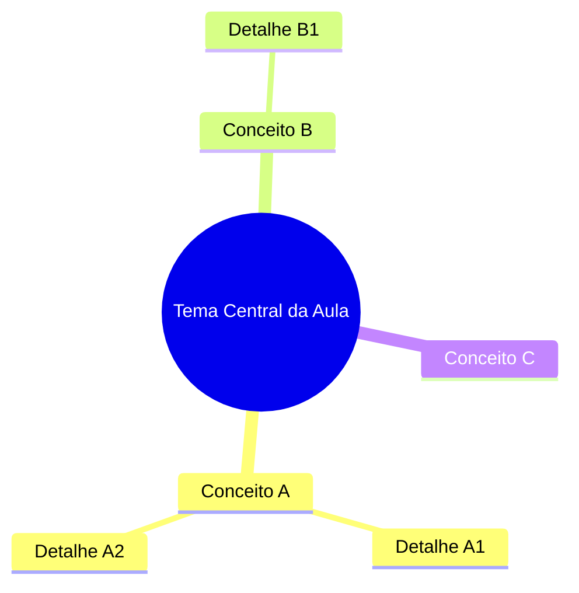

<!--
GABARITO ESTRUTURAL DE AULA — vive fora de docs/, não é publicado no site.
Use como referência de seções obrigatórias ao remodelar uma aula. A ordem importa:
ela foi desenhada para intercalar teoria com prática de memorização em vez de
empilhar tudo no fim. Nem toda aula terá conteúdo para todas as seções (ex.: aulas
que são só atividade/prova pulam mapa mental e flashcards) — use bom senso e,
na dúvida, pergunte ao professor em vez de forçar uma seção vazia.
-->

# Aula NN — [Título da Aula]

**Disciplina:** Banco de Dados e Aplicações (IBD951)
**Professor:** Ronan Adriel Zenatti · ronan.zenatti@cps.sp.gov.br
**Fatec Jahu — 2º Semestre/2026**

---

## 🎯 Objetivos da Aula

Ao final desta aula você deverá ser capaz de:
- [objetivo 1, verbo de ação: explicar/aplicar/identificar/...]
- [objetivo 2]
- [objetivo 3]

---

## 🗺️ Mapa Mental da Aula

Visão geral dos conceitos antes de entrar no detalhe — ajuda a criar a "moldura" onde o
conteúdo que vem a seguir vai se encaixando.

---

## 1. [Primeiro bloco de conteúdo]

[Mantém a didática já usada nas aulas do 1º semestre: parte de um problema/situação
concreta antes de nomear o conceito teórico. Use tabelas, exemplos em SQL e diagramas
Mermaid (`flowchart`, `erDiagram`) onde ajudar a visualizar.]

## 2. [Segundo bloco de conteúdo]

[...]

---

## 🃏 Flashcards de Revisão

Bloco colapsado por padrão — o aluno tenta responder mentalmente antes de clicar para
revelar. Usar 3 a 6 flashcards por aula, cobrindo os conceitos mais prováveis de cair
em prova ou de serem esquecidos primeiro.

??? question "Pergunta objetiva sobre o Conceito A?"
    Resposta direta e curta — 1 a 3 frases. Pode incluir um mini-exemplo.

??? question "Pergunta objetiva sobre o Conceito B?"
    Resposta direta e curta.

??? question "Pegadinha comum ou erro típico sobre o tema desta aula?"
    Explicação de por que é um erro e qual o raciocínio correto.

---

## ✅ Quiz de Fixação

3 a 5 perguntas cobrindo os pontos que mais importam da aula. Pelo menos uma pergunta
de múltipla resposta (checkbox) para variar o formato.

<quiz>
[Pergunta 1]?
- [ ] Alternativa incorreta
- [x] Alternativa correta
- [ ] Alternativa incorreta
- [ ] Alternativa incorreta

[Feedback explicando por que a resposta certa é certa — não só "Correto!".]
</quiz>

---

## 📝 Resumo

[3 a 5 frases amarrando os conceitos principais da aula — o que o aluno deve levar
consigo, não uma repetição do conteúdo.]

---

## 🏆 Conquista da Aula

!!! success "Selo desbloqueado: [Nome temático do selo, ex. \"Normalizador Iniciante\"]"
    Você completou a Aula NN. [Uma frase curta conectando esta aula à próxima —
    reforço de progresso, não apenas decoração.]

---

## 🔗 Navegação

⬅️ [Aula NN-1 — Título anterior](Aula_NN-1_Titulo.md) · ➡️ [Aula NN+1 — Título seguinte](Aula_NN+1_Titulo.md)

---

*Fatec Jahu · IBD951 · Prof. Ronan Adriel Zenatti · 2026*
